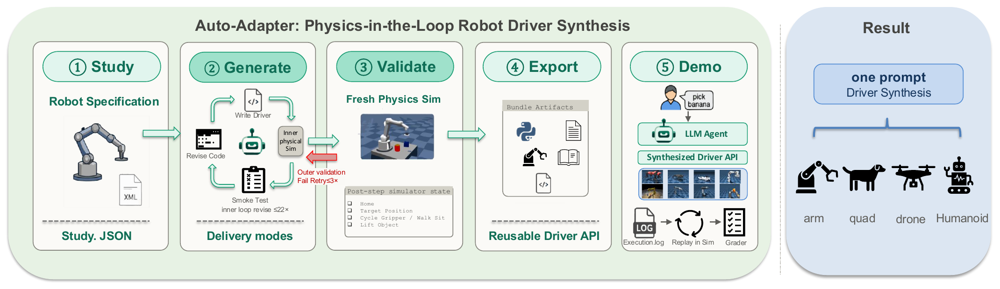

# Auto-Adapter

This is our maintained copy of the imported Auto-Adapter code, tracked as a
normal `AA1/` directory in the parent AutoAdapter 2.0 repository. Changes belong
to the parent repository and must never be pushed to AA1's original upstream.
See the [repository map](../README.md) for the other components. Commands and
paths below are relative to `AA1/` unless stated otherwise.

For the recent capability integration work, start with the
[diagnostic guide](autoadapter_bench/CAPABILITY_DIAGNOSTICS.md) and
[15-robot diagnostic report, 2026-09-10](autoadapter_bench/diagnostics/capability_update_20260909/FULL_REPORT_20260910.md).
The paper, quick facts and reproduction instructions below describe the earlier
AA1 research artifact; they are separate from the MSc thesis and its future
formal experiments.

**An LLM agent that synthesizes deployable robot drivers from a formal
specification (MJCF/URDF), validated in physics simulation.**



Auto-Adapter takes a robot description in MJCF/URDF and runs a closed-loop
LLM-agent loop (STUDY → GENERATE → VALIDATE → EXPORT → DEMO) to produce a
self-contained Python driver implementing high-level skill primitives
(`move_cartesian`, `gripper_close`, `get_object_position`, ...). Downstream
tool-using LLMs (our ReAct loop, Code-as-Policies, etc.) consume the
synthesized driver to execute natural-language tasks.

## Quick facts

- **8 robot embodiments tested**: SO-101, Piper, Franka Panda, UR5e,
  KUKA iiwa14, Unitree Go2, Unitree A1, ANYbotics ANYmal-C
- **Average synthesis cost**: 7.8 ± 1.6 min wall clock, $2.98 ± $0.84 per robot
- **Cross-skill benchmark**: SO-101 LLM tool-use 100% on Reach + Pick;
  per-skill PPO and DP capped at 70%/20% own/cross; OpenVLA-7B zero-shot
  on this OOD embodiment 0/50

See [docs/HANDOFF.md](docs/HANDOFF.md) for the co-author handoff (repo map,
reproduce, status), [docs/ONBOARDING.md](docs/ONBOARDING.md) for a
plain-language intro, and [docs/RESULTS_MASTER.md](docs/RESULTS_MASTER.md) for
the results index; [paper/](paper/) holds the EMNLP 2026 Industry Track draft.

## Repository layout

```
auto-adapter/
├── auto_adapter/         # Synthesis pipeline (orchestrator, ReAct agent, skeletons)
├── autoadapter_bench/    # Benchmark: eval.py, baselines/, task specs, BENCHMARK.md, stats.py
├── paper/                # EMNLP 2026 Industry Track paper
│   ├── latex/            #   LaTeX source (main.tex + sections/) → main.pdf
│   └── results/canonical.yaml   # single source of truth for every number
├── artifacts/            # Synthesized driver workspaces (per robot / model run;
│                         #   bulk recordings+traces are gitignored, see HF dataset)
├── assets/{mjcf,urdf}/   # Vendored robot scenes + object meshes
├── real_robot/           # SO-ARM101 hardware bring-up (Track B)
├── scripts/run/          # Synthesis + eval runners (see scripts/run/README.md)
├── docs/                 # Project docs — START HERE
│   ├── ONBOARDING.md     #   plain-language intro + diagrams
│   ├── HANDOFF.md        #   co-author handoff (repo map, reproduce, status)
│   ├── RESULTS_MASTER.md #   results navigation index
│   ├── FINDINGS_*.md     #   grasp-verification integrity audit
│   ├── CLEANUP_LOG.md    #   repo cleanup history
│   └── HF_DATASET_README.md   # HuggingFace dataset card (bulk media + traces)
└── archive/              # Local provenance (gitignored)
```

## Relation to `vector-os-nano`

Auto-Adapter is split from the vector-os-nano hardware
SDK as a sibling repo. The two have different audiences:

- **vector-os-nano**: hardware SDK for natural-language robot control,
  ROS2 integration, real-robot deployment.
- **auto-adapter** (this repo): research artifact for LLM-driven driver
  synthesis. Uses MJCF/URDF assets vendored from vector-os-nano's
  `hardware/sim/` and `hardware/urdf/` (see [assets/](assets/)). No code
  dependency on vector-os-nano — just data assets.

## Setup

```bash
# Create a venv with Python 3.10+
python -m venv .venv
source .venv/bin/activate

# Install base deps
pip install -e .

# Optional: RL baselines (PPO, Diffusion Policy)
pip install -e ".[rl]"

# Optional: VLA baseline (OpenVLA — needs separate Python 3.11 + transformers 4.40)
pip install -e ".[vla]"
```

### AWS Bedrock credentials (required)

The agent and all LLM evals call **Amazon Bedrock** (default region `us-east-1`,
overridable via `--region` / `aws_region`). You need:

1. **AWS credentials** on the standard chain — `aws configure` (or `aws sso login`,
   or `AWS_ACCESS_KEY_ID`/`AWS_SECRET_ACCESS_KEY` env vars). Nothing here reads a
   custom profile; it uses the default boto3 chain.
2. **Bedrock model access** enabled for the models you run (Console → Bedrock →
   Model access): the Claude family plus Nova/DeepSeek/etc. for the leaderboard.
   Model IDs are inference-profile form, e.g. `us.anthropic.claude-sonnet-4-6`.
3. **For driver *synthesis* only** (`auto_adapter/orchestrator_from_scratch.py`):
   **`bedrock-agentcore`** code-interpreter must be enabled in the account — it
   runs the generated driver in a sandbox. Eval/baseline replay (the paper tables)
   does **not** need agentcore, only `bedrock-runtime`.

Quick check: `aws bedrock list-foundation-models --region us-east-1` should succeed.

## Reproducing the paper

Each cell in the paper's tables cites a JSON file under
`autoadapter_bench/baselines/`. The single source of truth is
`paper/results/canonical.yaml`. To rerun:

```bash
# Cross-skill PPO matrix on SO-101
python autoadapter_bench/baselines/eval_cross_skill.py \
    --workspace artifacts/auto_adapter_so101_v2_artifacts \
    --ppo-reach autoadapter_bench/baselines/rl/trained/so101_reach_multi_taskcond.zip \
    --ppo-pick  autoadapter_bench/baselines/rl/trained/so101_pick_taskcond.zip \
    --n-episodes 10 \
    --output autoadapter_bench/baselines/cross_skill_eval_taskcond.json

# DP cross-skill matrix
python autoadapter_bench/baselines/eval_dp_cross_skill.py \
    --workspace artifacts/auto_adapter_so101_v2_artifacts \
    --dp-reach autoadapter_bench/baselines/dp/trained/dp_so101_reach_taskcond.pt \
    --dp-pick  autoadapter_bench/baselines/dp/trained/dp_so101_pick_taskcond.pt \
    --n-episodes 10 \
    --output autoadapter_bench/baselines/dp_cross_skill_eval.json
```

See [docs/HANDOFF.md](docs/HANDOFF.md) §3 (repo map) for the eval scripts and
result JSON layout.

## License

Apache 2.0 (see [LICENSE](LICENSE)).

## Citation

To be added once the paper is accepted.
