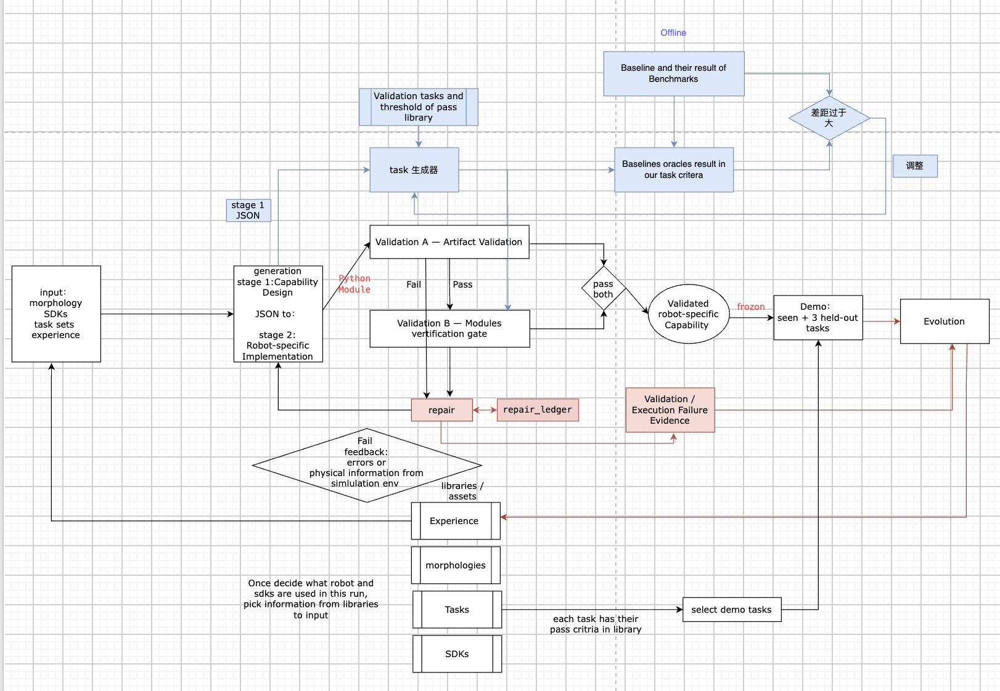

# AutoAdapter 2.0 Project Description and Research Map

> **Document ID:** `AA2-AUTH`  
> **Authority status:** `ACTIVE` — sole normative project document  
> **Normative language:** English  
> **Chinese text:** auxiliary reading support only  
> **Document revision:** `0.14.0`
> **Effective date:** 2026-08-11
> **Current project state:** General Demo foundation implementation and source-evidence probes exist; two-robot integration contracts are frozen and authorized for implementation; formal Library/RIM admission and Readiness execution remain pending

This file is the sole authority for the current AutoAdapter 2.0 project description, research
design, system boundaries, approved requirements, and implementation conformance. Its main body
explains what the project is and how its parts work together. Decision, requirement, and open-
question identifiers appear only in local traceability indexes after the substantive section they
govern; those indexes support the description and never replace it. Historical code, prompts,
schemas, experiments, and notes do not create current requirements unless this file explicitly
adopts them.

**中文辅助说明。** 本文件是 AutoAdapter 2.0 当前唯一权威文档。英文是规范文本；中文只用于
帮助理解较长或容易混淆的说明，不独立产生要求。正文首先负责把项目、组件及流程讲清楚；
每节末尾的 DEC、REQ 和 Open Questions 只用于追踪状态，不能代替正文说明。历史代码、prompt、
schema 和实验记录除非被本文件明确采纳，否则不能决定 General Demo。

---

## 0. Document Governance

### 0.1 Authority and conflict handling

English is the normative language for concepts, decisions, requirements, headings, identifiers,
and tables. Chinese may accompany longer explanations as a reading aid. Chinese text must not add,
remove, or alter a requirement. If the two languages diverge, the English clause governs and the
Chinese aid must be corrected.

Only substantive content indexed locally as `APPROVED` or `FROZEN`, together with frozen
requirements, may guide implementation.
When the active project description and the preserved architecture image appear to conflict, the
affected implementation is blocked until the current description explicitly states the intended
override or is corrected.

### 0.2 Decision, realization, and evidence states

These state axes are independent.

| Axis | States | Meaning |
|---|---|---|
| Decision maturity | `OPEN → APPROVED → FROZEN` | `APPROVED` fixes intent; `FROZEN` is precise enough to implement and objectively accept |
| Realization | `NOT_STARTED → IMPLEMENTED → VERIFIED` | Code existence and verification state; it does not change decision maturity |
| Evidence level | `NONE → PILOT → INDEPENDENT_VALIDATION → FORMAL_EXPERIMENT` | Strength of evidence supporting an implementation or scientific claim |

Formal integration records use additional operational states that are independent of document
decision maturity:

| Axis | States | Meaning |
|---|---|---|
| Record admission | `NOT_ADMITTED → ADMITTED → REVOKED` | Whether the exact immutable Library or integration record has passed its owning admission checks |
| RIM activation | `INACTIVE ↔ ACTIVE` while admitted | Whether an admitted Robot Integration Manifest may be selected for a new run; admission `REVOKED` is a separate terminal state that takes precedence |
| Readiness attempt | `NOT_RUN`, `FAIL`, or `PASS` | Result for one immutable attempt on one exact selected combination; it never changes the record's decision or admission state |

Admission, activation, and revocation are effective states computed from Framework-owned,
append-only event records; they are never trusted as mutable self-claims inside the subject
record. `UNKNOWN` may appear only in source-probe metadata and is not a formal Readiness-attempt
state. `FROZEN`, `ADMITTED`, `ACTIVE`, and Readiness `PASS` are not synonyms. Together they may
produce an `INTEGRATION_READY` receipt for the selected route, but they are not by themselves
sufficient to start Stage 1. The later composite run gate issues `READY_FOR_STAGE1` only after all
other applicable frozen run-input, granularity, observation, Generation, and experiment-profile
conditions also pass. `FROZEN_FIXTURE` is a test-only marker rather than a formal decision state;
it can never satisfy a formal run gate.

`validated` is reserved for a candidate capability layer that passes the applicable independent
Validation gates. It is not a document-decision state.

### 0.3 Approval workflow

1. Discuss one unresolved question at a time.
2. Establish exact English terminology and logic.
3. Add Chinese assistance when a longer explanation would otherwise be difficult to review.
4. Obtain explicit user approval.
5. Revise the substantive project description in the section that owns the topic.
6. Update that section's trailing traceability index.
7. Create a `REQ-*` record only when inputs, outputs, boundaries, failure behavior, and acceptance
   criteria are precise enough to implement.
8. Implement only `FROZEN` requirements.
9. Link implementation and verification evidence without replacing the project explanation with a
   status record.

Unreviewed candidate answers do not enter this file. An `OPEN` record may name the unresolved
question and its blocking scope, but it must not smuggle in a preferred answer. When an approved
design changes, the active description and its revision are updated; obsolete decision records are
removed rather than preserved in the authority document.

### 0.4 What belongs here

| Material | Authoritative location |
|---|---|
| Current project description, research design, system invariants, and acceptance requirements | Substantive sections in this file |
| Decision, requirement, and open-question status | Local traceability index at the end of the section that owns the topic |
| Exact schemas, prompts, configs, registries, and executable modules | General Demo implementation, referenced here after freeze |
| Tasks, robot assets, SDK dossiers, and Experience records | Their versioned Libraries, referenced here after admission |
| Tests, run reports, videos, hashes, and statistical outputs | Evidence manifests, referenced here |
| Historical implementations and results | Never a current design source by existence alone |

Each tracker record has one primary section home. Cross-references point to the substantive section,
not to a detached global ledger. Obsolete design decisions are removed from this authority rather
than retained as a historical catalog.

### 0.5 Canonical terminology

| Canonical English term | Usage boundary |
|---|---|
| robot-specific capability layer | Layer synthesized for one selected robot configuration |
| capability-layer synthesis | Scientific operation spanning Generation Stage 1 and Stage 2 |
| Generation subsystem | Framework module name; use synthesis for the scientific capability |
| capability-layer use / downstream use | A task Consumer acts through a given layer |
| layer-synthesizing model / producer | Model that produces a candidate layer |
| task-executing Consumer | LLM Agent, planner, learned or scripted policy, program, or other high-level component that uses an interface on downstream tasks |
| producer × consumer matrix | Separates layer quality from Consumer ability |
| frozen, validated capability layer | `validated` and `frozen` are distinct states |
| first-pass validated capability-layer yield / `pass@0` | Fraction of all runs whose initial Stage 2 candidate passes Validation A and B before any Validation-guided Repair |
| cumulative conformance yield / `pass@k` | Fraction of all runs that achieve their first complete A+B pass by at most implementation-Repair invocation `k`, including `pass@0`, for `0 ≤ k ≤ 10` |
| Repair gain at `k` | `pass@k − pass@0`; the additional fraction of all runs brought to conformance through adaptive same-suite Repair by attempt `k` |
| conditional Repair success at `k` | Fraction of initial `pass@0` failures that achieve a complete A+B pass by Repair attempt `k`; its denominator excludes initial passes |
| validated capability-layer yield | Umbrella end-to-end yield within the declared maximum Repair budget; it must always be decomposed into `pass@0`, cumulative `pass@k`, and Repair gain |
| validation-gate pass rate | Local A- or B-gate metric, not end-to-end yield |
| run-to-run reliability | Repeatable production of valid layers under frozen conditions; byte identity is not required |
| downstream task utility | Task-level value after Validation; not synonymous with Validation |
| agent-facing capability abstraction granularity | Framework representation variable associated with G1–G3 |
| governed long-term experience memory | Cross-run Experience route with reviewed admission, recipient-specific declassification, immutable versions, and frozen future-run snapshots; exact schemas and authorities remain open |
| Description-Visible, Criterion-Private Fixed Demo | Fixed Demo protocol in which task descriptions are visible but pass criteria and evaluation-only data remain private to an external harness |
| Demo Consumer | Declared LLM or non-LLM task-executing component that operates through the typed Router view of the frozen generated capability layer |
| Demo Evaluation Harness | Framework-side program external to the Consumer and generated artifact that collects evaluation evidence and owns the task verdict without exposing private criteria |
| Framework Evaluation Video | Mandatory Harness-controlled, content-addressed external-view recording of every formal Validation B case/repetition and every Demo task trial/repetition; it is private audit evidence, not a robot sensor, model/Consumer input, or verdict source |
| SDK Entry | Immutable, versioned project dossier for one approved robot-facing public surface of a real upstream SDK artifact |
| SDK Entry version | Version of the project-authored dossier; it is distinct from the upstream package version and changes when the dossier or its admitted facts change |
| pinned upstream SDK artifact | Exact external SDK distribution/release identified by package version plus commit or artifact hash and installed for real execution rather than reimplemented by the Framework |
| SDK Entry Admission | Library-level process that verifies the pinned upstream artifact, its provenance, and the evidence-backed SDK description without testing MuJoCo integration |
| SDK Overview Projection | Generated recipient view containing high-level operations, observations, limits, and unsupported behavior selected from one canonical SDK Entry |
| Public SDK Implementation Projection | Generated recipient view containing the exact admitted public API, types, units, errors, and minimal examples needed for robot-specific implementation |
| Framework Administrative Record | Framework-private SDK Entry material containing artifact pins, provenance, admission evidence, and administrative state; it is not Generation input |
| Agent Scaffold | Model-independent orchestration that applies stage instructions, tool permissions, budgets, iteration and termination rules, output checks, and logging around a selected LLM backbone |
| stage-scoped context | Context assembled for one stage invocation from only that stage's frozen authorized inputs; it does not imply a different LLM backbone or a separate multi-agent system |
| Capability Design Contract | The robot-independent, versioned Stage 1 contract that defines the structure and semantics of a robot-specific Capability Design Artifact without prescribing its implementation |
| Capability Design Artifact | The frozen `capability_design.json` instance produced for one synthesis run, consumed first by the private Blue Line Validation-Spec Generator and then, only after a private Validation B suite is sealed, by Stage 2 |
| Stage 1 Conformance Check | Non-promotional Generation-internal check that validates a Capability Design Artifact against its schema and deterministic semantic rules before Blue Line generation and any Stage 2 release |
| Stage 1 Conformance Repair | Bounded pre-seal revision of the Stage 1 working Design using only public schema and semantic-conformance diagnostics; it ends once a Design passes and is sealed or the Stage 1 budget terminates |
| public requirement reference | Run-local opaque identifier attached to a task description for design-coverage traceability without disclosing its Tasks Library identity or metadata |
| Project Validation Standards Reference | Human-authored project evaluation examples and criteria approved for reuse within declared robot, capability, and experimental scopes; it is not an industry or universal standard |
| Frozen Validation Standards Snapshot | Comparison-specific, content-addressed selection of exact Project Validation Standards Reference records available to Blue Line generation without live retrieval or current-run modification; after first use in a local passage it may be shortened to `Standards Snapshot` |
| Private Measurement Catalog | Framework-private inventory of trusted physical measurements, robot or simulator entities, frames, units, and adapters that the Validation B Harness is permitted to use |
| Blue Line Validation-Spec Generator | One fixed implementation-blind LLM, running in an isolated context with at most three inference calls, that turns a sealed Capability Design and frozen references into a structured Blue Line Validation Spec |
| Blue Line Validation Spec | Structured private specification describing capability success, trusted measurements, numerical and temporal criteria, false-pass guards, validation cases, aggregation, and `COPIED`/`ADAPTED`/`PROPOSED` standard lineage |
| Blue Line Generation Policy | Frozen prompt, output schema, structural/reference checks, privacy rules, model identity, and call budget governing one Blue Line formal comparison |
| Blue Line Manifest | Content-addressed record binding the sealed Design, Blue Line model and prompt, Validation Standards Snapshot, Measurement Catalog, Generation Policy, call log, output status, and suite hash |
| Validation Execution Binding Overlay | Candidate-specific, content-addressed mapping from an immutable sealed semantic suite to the symbols and arguments verified by Validation A; it references suite and Implementation Manifest hashes and cannot copy or modify private case or criterion content |
| Stage 2 SDK-Grounded Development Sandbox | Optional, LLM-invoked development tool inside Generation Stage 2 that executes a candidate through the admitted real-SDK simulation path and returns controlled non-verdict feedback without exposing MuJoCo directly |
| Development Feedback Projection | Controlled diagnostic returned from a public development probe; it may summarize execution and physical effects but excludes raw privileged state, private criteria, and independent-validation content |
| Python Binding Contract | Framework-generated, run-specific, deterministic language binding from the sealed semantic Design to the public Python symbols, arguments, and result envelope that `capability.py` must implement |
| Framework-derived Implementation Manifest | Framework-authored record derived from the sealed Design, Python Binding Contract, submitted content-addressed candidate source bytes, verified symbols/signatures, pinned SDK Entry, and dependency environment; it is not a Stage 2 model claim |
| Stage 2 inference call | One accounted invocation of the selected LLM during Stage 2; a Sandbox tool execution is not itself an inference call, while a later model invocation that consumes its result is |
| Capability Router | Framework-owned typed boundary through which layer-present Consumers invoke semantic capabilities; it validates schemas, serializes, routes, and mediates lifecycle but contains no robot behavior |
| implementation Repair invocation | One Validation-guided Repair episode under the Repair-specific budget; it may contain multiple LLM inference calls and submit at most one new `capability.py` revision, while the initial Stage 2 submission is not a Repair invocation |
| adaptive conformance retesting | Validation A followed, when A passes, by the same pre-sealed Validation B protocol after candidate-visible diagnostic feedback; it is distinct from initial independent `pass@0` validation |
| independent Validation boundary | Organizational, information, and authority separation of the Framework-owned suite/Harness from Generation and the candidate; this boundary remains after Repair feedback |
| independent first-pass estimate | Initial `pass@0` result obtained before the candidate has received any Validation diagnostic; later same-suite retesting is adaptive rather than a new independent estimate |
| State-Provided Control Condition | Current General Demo observation regime in which typed public task/world state is supplied explicitly alongside real-SDK robot observations so that the experiment measures capability planning and control rather than visual perception |
| Repair context mode | Predeclared RQ2 factor selecting `continued_context` or `fresh_snapshot` while holding the authorized visibility, diagnostic, tool, and resource conditions fixed |
| pinned real robot SDK | The pinned upstream SDK artifact selected through an admitted SDK Entry; its public application-layer code must execute in the formal simulation path |
| SDK-grounded MuJoCo simulation | Simulation in which the generated capability layer calls the pinned real robot SDK and a robot-specific virtual-device boundary translates SDK I/O to and from MuJoCo |
| SDK-specific MuJoCo Translation Layer | Framework-private adapter below the real SDK's public application logic that replaces only the selected device/transport boundary and maps SDK I/O to MuJoCo control and state |
| Simulation Session Runner | Minimal Framework-private execution manager that owns simulation lifecycle, clock, limits, isolation, and traces without creating a public robot-control API |
| Simulation Integration Readiness Check | Pre-Generation infrastructure check proving that one selected SDK–translation–MuJoCo route is operational; it is not capability Validation |
| Robot Integration Manifest | Thin, versioned binding record that identifies one robot model's project-approved fixed configuration and pins references to its compatible Morphology, simulation profile, admitted SDK Entry, and SDK-specific Translation Layer without copying those assets |
| canonical admitted MJCF model | The single version-pinned MJCF entrypoint used for formal execution of one admitted robot morphology entry; URDF and other formats may remain source evidence but are not converted at run time |
| environment asset | Versioned robot-independent physical or visual asset such as an object, fixture, terrain element, or arena component |
| environment template | Reusable environment layout and coordinate-frame definition that references environment assets but contains no task goal, private criterion, or per-trial state |
| robot embodiment | Broad physical realization including structure, actuation, and sensing |
| robot morphology | Structural and kinematic topology |
| robot configuration | Concrete DoF, end effectors, sensors, and simulation realization within an embodiment; the current project admits one active fixed configuration per covered robot model rather than composing configurations at run time |
| applicability across robots | Preferred RQ3 term; does not imply direct transfer of one layer |

`driver layer` is used only for the prior benchmark. AutoAdapter 2.0 studies a complete
`robot-specific capability layer`; the terms are not interchangeable.

### 0.6 Section status and traceability

| Type | ID | State | Revision | Tracked scope |
|---|---|---|---:|---|
| Decision | `DEC-GOV-001` | `FROZEN` | 2 | Single English-first authority and descriptive-body-first organization |
| Decision | `DEC-GOV-002` | `FROZEN` | 2 | Review before authority and local tracker workflow |

---

## 1. Project Identity, Scope, and Coverage

### 1.1 Project identity

| Field | Current value |
|---|---|
| Project name | Robot Capability Framework |
| Framework name | AutoAdapter |
| Contribution type | Robot and embodied-AI system/framework |
| Primary publication unit | Master's thesis; a conference paper may follow |
| Main experimental route | MuJoCo simulation |
| General Demo realization | `NOT_STARTED` |

### 1.2 Problem statement and central hypothesis

High-level embodied systems need a robot-specific capability layer that translates task-level
intent into executable behavior. This layer is repeatedly hand-built for individual robots and
experiments, duplicating engineering effort and producing interfaces that are difficult to reuse,
compare, and improve. AutoAdapter investigates how structured morphology, SDK and
simulation-integration information, task descriptions, and accumulated execution experience can be
used to construct and maintain such layers automatically.

The central hypothesis is that AutoAdapter can synthesize executable robot-specific capability
layers whose independent validity, downstream utility, and robot-specific engineering requirements
can be measured. The outcome is jointly shaped by the LLM backbone, the AutoAdapter framework, and
the target robot. RQ1–RQ3 form a controlled decomposition of those three factors.

**中文辅助说明。** 高层具身系统需要一个机器人特定能力层，将任务意图转化为可执行行为。
AutoAdapter 研究如何利用结构化 Morphology、SDK 与仿真集成信息、任务描述和累积经验自动构建并
维护这一层。最终结果不是只由 LLM 决定，而是由 LLM backbone、Framework 设计和 target
robot 三类因素共同决定；三个 RQ 分别控制这三类因素。

### 1.3 Confirmed resources

| Resource class | Confirmed resource |
|---|---|
| Physical robot | SO-ARM101 |
| Sensor | Intel RealSense D405 |
| Edge compute | NVIDIA Jetson Orin Nano |
| Remote compute | DGX GPU system |
| Simulation | MuJoCo |
| Target SDK for the available physical robot | LeRobot |

A sensor change creates a distinct robot configuration. For example, SO-ARM101 and
SO-ARM101 + D405 are different synthesis targets. Within a frozen experiment, only one fixed
configuration is active for a covered robot model; a materially different configuration cannot be
substituted within the run.

### 1.4 Planned LLM coverage

Inclusion means planned RQ1 scope; it does not mean that exact provider identifiers, revisions,
endpoints, inference settings, or budgets have been frozen.

| Model | Vendor | Protocol status |
|---|---|---|
| Sonnet 4.6 | Anthropic | Exact identifier pending |
| Opus 4.8 | Anthropic | Exact identifier pending |
| Haiku 4.5 | Anthropic | Exact identifier pending |
| Nova Pro | Amazon | Exact identifier pending |
| DeepSeek V3.2 | DeepSeek | Exact identifier pending |
| Ministral 8B | Mistral | Exact identifier pending |
| Qwen3 32B | Alibaba | Exact identifier pending |

### 1.5 Asset and robot coverage status

Inclusion in a coverage inventory does not claim that the corresponding Libraries, SDK–simulation
integration, capability layer, or experimental evidence already exist or have passed admission.

The following source entries already existed in AutoAdapter 1.0:

| # | Source entry | Source form |
|---:|---|---|
| 1 | `anybotics_anymal_c` | Directory |
| 2 | `franka_panda` | Directory |
| 3 | `go2` | Directory |
| 4 | `h1` | Directory |
| 5 | `kuka_iiwa_14` | Directory |
| 6 | `piper` | Directory |
| 7 | `pushbench` | Directory |
| 8 | `robotstudio_so101` | Directory |
| 9 | `skydio_x2` | Directory |
| 10 | `unitree_a1` | Directory |
| 11 | `universal_robots_ur5e` | Directory |
| 12 | `so101` | Directory |

| # | Asset package | Coverage status | General Demo Library status |
|---:|---|---|---|
| 1 | ALOHA 2 | Planned | Not yet claimed |
| 2 | Hello Robot Stretch 2 | Planned | Not yet claimed |
| 3 | Boston Dynamics Spot with Arm | Planned | Not yet claimed |
| 4 | LEAP Hand | Planned | Not yet claimed |
| 5 | Unitree G1 | Planned | Not yet claimed |
| 6 | Google Barkour vB | Planned | Not yet claimed |
| 7 | Kinova Gen3 | Planned | Not yet claimed |
| 8 | UFACTORY xArm7 | Planned | Not yet claimed |

An asset inventory is not automatically a count of unique robots: an entry may represent a robot,
benchmark or scene bundle, or another asset representation. The unique robot count remains open
until each prior entry is classified and mapped to AutoAdapter 2.0 robot-model and configuration
identifiers.

**中文辅助说明。** 前作资产按上表完整记录，新增 8 个资产包另表保存。这里暂时不把两张表
直接相加称为机器人总数，因为 asset entry 与独立 robot 不一定一一对应；后续仍需逐项确认
机器人模型、场景/benchmark 资产及配置映射。

### 1.6 Target audience and non-goals

The primary audience comprises researchers in embodied AI, robot learning, agentic robotics, and
robot software systems who construct capability interfaces for LLMs, VLMs/VLAs, learned policies,
planners, and programs. The project is not a new foundation model, a new low-level controller, or a
generic software API generator.

### 1.7 Section status and traceability

| Type | ID | State | Revision | Tracked scope |
|---|---|---|---:|---|
| Decision | `DEC-PROJ-001` | `APPROVED` | 1 | Project and contribution identity |
| Decision | `DEC-PROJ-002` | `APPROVED` | 1 | Research problem and three-factor hypothesis |
| Decision | `DEC-COV-001` | `APPROVED` | 1 | Coverage means planned evaluation rather than completed integration |
| Decision | `DEC-COV-002` | `FROZEN` | 1 | AutoAdapter 1.0 source-asset inventory |
| Decision | `DEC-COV-003` | `FROZEN` | 1 | AutoAdapter 2.0 extension asset packages |
| Open question | `OQ-COV-001` | `OPEN` | — | Classification of each source asset and the resulting unique-robot count |

---

## 2. Core Concepts and Lifecycle

### 2.1 Robot capability

A robot capability is a reusable, optionally parameterized unit of behavior through which a robot
system achieves, maintains, or observes a class of physical or informational outcomes, and which a
higher-level Consumer can identify, select, invoke, or compose.

**中文辅助说明。** 机器人能力是可复用、可选参数化的行为单元；机器人通过它实现、维持或
观察某类物理或信息结果，高层 Consumer 可以识别、选择、调用或组合该单元。Consumer 不限于
LLM Agent，也可以是 VLM/VLA、学习策略、规划器、程序或其他高层组件。

### 2.2 Robot-specific capability layer

At the confirmed architectural level, a robot-specific capability layer contains at least:

1. the Capability Design produced by Generation Stage 1; and
2. the Robot-Specific Implementation produced by Generation Stage 2.

The Capability Design owns the language-independent semantic public contract. For the first
General Demo Python profile, the Framework deterministically derives a run-specific Python Binding
Contract, a starter skeleton, and later an Implementation Manifest, while Stage 2 authors the
executable `capability.py`. Layer-present Consumers invoke the resulting layer only through the
Framework-owned Capability Router. The exact symbol layout, skeleton, result envelope, private
helper policy, manifest schema, and router adapters remain open. Historical Demo choices do not
define them. `skill` is not a formal generated-artifact term except when citing external work that
uses it.

### 2.3 High-level lifecycle

| State | Entry condition | Consequence |
|---|---|---|
| Working Stage 1 Design | A model-authored Design body exists but has not passed Conformance and been sealed | Bounded Stage 1 Conformance Repair may revise it |
| Sealed Capability Design | Stage 1 Conformance passes and the exact artifact is released to the private Blue Line | Design, task descriptions, granularity condition, and requirement coverage are immutable for the run; Stage 2 has not begun |
| Sealed private Validation suite | The Blue Line returns `READY` and seals the exact Validation Spec, suite, and Blue Line Manifest before the first Stage 2 invocation | The sealed Design and Framework-generated Binding Contract may be released to Stage 2 while Blue Line contents remain private |
| Blue Line review disposition | The Blue Line returns `NEEDS_REVIEW` because a proposed or materially adapted standard requires approval, or because bounded structural/reference repair did not succeed | No formal suite is released; the run stops before Stage 2 without counting a candidate or Stage 2 failure |
| Generated candidate | A sealed private suite exists and a Stage 2 `capability.py` revision is submitted | Framework derives the manifest and the candidate may enter Validation A |
| Under Validation | Validation A/B are pending or executing | No validated layer exists yet |
| Validated capability layer | Validation A and Validation B both pass | Layer may be promoted |
| Frozen capability layer | A validated layer is fixed for Demo use | Demo must consume the frozen artifact |
| Demo/Evolution evidence | Downstream execution or failure evidence exists | Evidence may inform later analysis or future-run Experience |

After a candidate-attributable failure, at most ten implementation Repair invocations may produce
new `capability.py` revisions. A downstream design/contract gap or exhaustion without a complete
A+B pass terminates the current run. Exact machine state identifiers, packaging, and transition
schemas remain open.

### 2.4 Section status and traceability

| Type | ID | State | Revision | Tracked scope |
|---|---|---|---:|---|
| Decision | `DEC-CONCEPT-001` | `APPROVED` | 1 | Robot capability definition |
| Decision | `DEC-CONCEPT-002` | `APPROVED` | 2 | Semantic Design, first-profile Python implementation, Framework binding/manifest, and typed Consumer routing |
| Decision | `DEC-CONCEPT-003` | `APPROVED` | 4 | Pre-seal Design work, sealed Design, pre-Stage-2 Blue Line `READY`/`NEEDS_REVIEW` disposition and suite seal, implementation revisions, validated/frozen states, and terminal gaps |
| Decision | `DEC-CONSUMER-001` | `APPROVED` | 1 | LLM and non-LLM Consumers through one typed Capability Router in layer-present conditions, with implementation and SDK isolation |
| Open question | `OQ-CONSUMER-001` | `OPEN` | — | Exact router schema, LLM-tool and policy/program adapters, worker/IPC isolation, lifecycle, concurrency, and error propagation |

---

## 3. Research Questions and Evaluation Logic

### 3.0 Controlled decomposition

The three research questions are a controlled decomposition of the same end-to-end outcome rather
than independent themes. RQ1 varies the LLM backbone while holding the Framework and robot–task
benchmark fixed; RQ2 varies Framework design while holding the prespecified producer and Consumer
configurations and benchmark fixed; RQ3 varies the target robot while holding the selected producer
and Consumer configurations, Framework configuration, and benchmark protocol fixed.

**中文辅助说明。** 三个 RQ 研究同一个端到端结果，但分别改变 model、Framework 和 robot。
RQ1 建立 LLM benchmark；RQ2 研究 AutoAdapter 本身；RQ3 研究不同机器人本体、配置和接口
约束。只有这样，三个结果才能联系起来，又不会把不同因素混成同一个解释。

| RQ | Primary manipulated factor | Primary controls | Explanatory level |
|---|---|---|---|
| RQ1 | LLM backbone and layer-use condition | Frozen Framework configuration and representation, Validation Standards Snapshot and Blue Line policy, robot–task benchmark, Agent scaffold, evaluation protocol, and budget | Model capability |
| RQ2 | Framework components and design choices | Prespecified producer backbone and Consumer configurations, robot–task benchmark, evaluator, project-standard condition, seeds, and budget | Framework reliability and mechanism |
| RQ3 | Robot embodiment, configuration, and interface constraints | Selected producer and Consumer configurations, frozen Framework configuration, predeclared robot-scoped Validation Standards and measurement protocol, and benchmark protocol | Applicability across robots |

Shared outcomes include first-pass `pass@0`, cumulative conformance `pass@k`, Repair gain and
conditional Repair success, Validation-gate results, run-to-run reliability, downstream
physics-task success, safety violations, failure modes, and time/token/tool/simulation/cost
resources.
Task-generalization language must match the finally approved Demo and formal-evaluation split.

### 3.1 RQ1 — Benchmarking LLM Backbones for Capability-Layer Synthesis and Use

> Under a fixed AutoAdapter configuration, robot–task benchmark suite, Agent scaffold, evaluation
> protocol, and resource budget, how do LLM backbones differ in (a) initial `pass@0` under
> candidate-independent sealed-suite Validation and, separately, conformance reached through
> adaptive same-suite implementation Repair, and (b) using a given frozen, validated capability
> layer to complete downstream tasks? To what extent are synthesis and use separable capabilities,
> and how reliably can capability layers be reused across producer and Consumer backbones?

**中文辅助说明。** 在固定 AutoAdapter、机器人—任务 benchmark、Agent scaffold、评测协议和
预算后，RQ1 分开报告初始候选的 `pass@0` 与同一封存 suite 上经 Repair 后的累计 `pass@k`，再
比较不同 LLM 使用冻结能力层的能力，并通过跨 producer 与 Consumer 的复用判断合成与使用能力
是否可分离。

| Condition | Consumer-visible interface | Primary purpose |
|---|---|---|
| C0 — Raw SDK / No Layer | Selected pinned real SDK public surface, using its admitted low-level interface where applicable | Establish the no-layer baseline |
| C1 — Shared Frozen Validated Layer | Same frozen first-pass-validated reference layer for every Consumer | Hold layer quality fixed and compare downstream use |
| C2 — Model-Synthesized Layer | Producer layer created from the same frozen inputs and budget and admitted through the declared Framework-owned Validation-and-Repair protocol | Measure synthesis and end-to-end delivery |

C2 synthesis failure counts as end-to-end failure. Task success conditional on passing Validation
is secondary diagnostic evidence, not the primary score. Layer-present conditions use a producer ×
Consumer matrix; C0 is a separate paired baseline because it has no layer producer. Planner/scaffold
comparisons such as ReAct versus CaP cannot substitute for the layer/no-layer comparison.
In C1 and C2, every LLM, planner, learned policy, scripted policy, or programmatic Consumer uses the
same semantic Capability Router. An LLM adapter may expose router operations as tools, while a
policy/program adapter invokes the same typed operations directly. C0 remains the explicit raw-SDK
exception.

RQ1 reporting separates end-to-end producer results from an isolated Stage 2 backbone comparison.
The isolated comparison freezes one exact sealed Capability Design for which the Blue Line returned
`READY`, together with its capability set,
Binding Contract, Blue Line Validation Spec, Blue Line Manifest, and sealed suite for every backbone;
only the Stage 2 model changes. End-to-end comparisons may produce different Designs, Validation
Specs, and suites and are
therefore reported under their own controlled protocol rather than interpreted as this isolated
Stage 2 effect.

### 3.2 RQ2 — Reliability and Design Effects of the AutoAdapter Framework

> With prespecified layer-synthesizing LLM backbones, declared task-executing Consumer
> configurations, and a robot–task benchmark suite held fixed, can AutoAdapter reliably synthesize
> robot-specific capability layers, as measured separately by initial `pass@0` and cumulative
> conformance `pass@k`, and freeze them for reuse? How do its Generation, Validation, Repair,
> agent-facing representation and Evolution/Experience mechanisms affect synthesis
> validity, run-to-run reliability, downstream task utility, failure behavior, and cost?

**中文辅助说明。** RQ2 不再做一次模型排名，而是在模型和机器人—任务 benchmark 固定后，
研究 AutoAdapter 跨独立 run 的初始 `pass@0`、经同一 suite 自适应 Repair 后的 `pass@k`，以及
Generation、Validation、Repair、能力表示和 Evolution/Experience 等组件分别产生什么影响。

Agent-facing capability abstraction granularity belongs to RQ2 Framework experimental design. It is
not a standalone RQ and is not an intrinsic robot property.

RQ2 also treats **Repair context mode** as an explicit, predeclared Framework factor with two
configurations. Because post-Validation Repair is implementation-only, `continued_context` resumes
the authorized Stage 2 implementation context and appends the sanitized Repair Diagnostic.
`fresh_snapshot` starts a new implementation invocation from the exact frozen Stage 2 Bundle,
sealed Design and Binding Contract, failed `capability.py`, bounded Repair Ledger summary, and the
same sanitized diagnostic. A comparison holds the producer backbone, visibility boundary, Sandbox
contract, diagnostic, resource limits, and termination policy fixed; the manipulated factor is
context inheritance itself. Neither configuration receives raw Validation evidence or broader
information authority.

### 3.3 RQ3 — Effects of Robot Embodiment and Configuration

> With the selected layer-synthesizing LLM backbones, declared task-executing Consumer
> configurations, frozen AutoAdapter configuration, and benchmark protocol held fixed, how do
> target-robot morphology, kinematic
> complexity, actuation and end-effector configuration, sensing configuration, and SDK and
> simulation-integration constraints affect capability-layer synthesis, initial and post-Repair
> Validation outcomes, and downstream task
> performance on functionally matched task families? What empirical limits do these factors impose
> on AutoAdapter's applicability across robots?

**中文辅助说明。** RQ3 固定选定的 model、AutoAdapter 配置和评测协议，只改变机器人侧因素，
研究 Morphology、运动学、执行器、末端工具、传感器以及 SDK 与仿真集成约束如何影响能力层合成、
独立验证与下游任务结果。如果每种形态只有一台机器人，结论只能称为跨机器人 case study，
不能直接声称识别了 morphology 的因果效应。

RQ3 freezes one comparison-level Validation Standards Snapshot with predeclared robot-scoped
partitions and applicability rules before any condition begins. Different robots may legitimately
use different project standards within those registered partitions, but no robot condition
receives post-outcome standard changes or an unregistered partition. Exact partition construction
remains open.

Cross-robot Validation yields are compared directly only for matched semantic effects whose
criteria have been pre-harmonized or explicitly equated under the protocol. Otherwise, results are
reported per robot and interpreted as system-level applicability case studies rather than a pure
embodiment effect.

### 3.4 Section status and traceability

| Type | ID | State | Revision | Tracked scope |
|---|---|---|---:|---|
| Decision | `DEC-RQ-000` | `APPROVED` | 1 | Model–Framework–Robot controlled decomposition |
| Decision | `DEC-RQ1-001` | `APPROVED` | 4 | RQ1 wording with separate isolated Stage 2 backbone using one shared sealed Blue Line spec/suite, end-to-end producer, initial `pass@0`, adaptive `pass@k`, and downstream-use outcomes |
| Decision | `DEC-RQ1-002` | `APPROVED` | 2 | C0/C1/C2, producer × Consumer separation, and shared typed Router for layer-present LLM/policy Consumers |
| Decision | `DEC-RQ2-001` | `APPROVED` | 2 | RQ2 wording with initial and adaptive conformance outcomes and declared Consumer configurations |
| Decision | `DEC-RQ2-002` | `APPROVED` | 2 | Implementation-Repair context mode as a controlled `continued_context` versus `fresh_snapshot` Framework factor |
| Decision | `DEC-RQ3-001` | `APPROVED` | 3 | RQ3 wording with initial/post-Repair outcomes, declared Consumer configurations, and a predeclared robot-scoped Validation Standards Snapshot protocol |
| Open question | `OQ-RQ1-001` | `OPEN` | — | Exact producer model identifiers/endpoints, Consumer models or policies and training/freeze points, isolated-Stage-2 versus end-to-end allocation, fixed Capability Design/capability-set/suite selection, stage/Consumer budgets, repetitions, tasks, seeds, and reference-layer freeze |
| Open question | `OQ-RQ3-001` | `OPEN` | — | Robot sampling hierarchy, functionally matched task families, and frozen multi-robot Validation Standards Snapshot partition protocol |

---

## 4. AutoAdapter 2.0 — Robot Capability Synthesis Framework

Section 4 is the normative home for architecture, component responsibilities, data contracts,
state transitions, and implementation-level technical decisions. Only the approved high-level
topology is currently active; detailed schemas and protocols remain open unless recorded below.

### 4.0 Framework-wide concepts and authoritative baseline

The user-provided image is the confirmed high-level architecture baseline. It constrains the
components and routes it explicitly depicts but does not silently freeze schemas, prompts, Agent
lifecycles, call counts, file layouts, evaluator implementations, or authority assignments. The
current project description deliberately excludes the image's complete candidate-conditioned
offline-reference, calibration, discrepancy-adjustment, and candidate-feedback branch while
retaining the rest of the confirmed topology. This exclusion does not prohibit pre-experiment
human authoring or approval of project-scoped Validation Standards under Section 4.2.2.



Image SHA-256: `43f7812dc3649b74c1ce46c31f3fb692f52a5477d5f06e9875940c148316445d`

**中文辅助说明。** 原图约束明确画出的组件和高层路由，但图中没有定义的 schema、prompt、
Agent 生命周期、evaluator、预算、权限和文件结构仍然必须逐项审核。历史实现也不能替原图补答案。
原图中根据候选表现进行 reference/discrepancy calibration、调整标准并反馈的完整分支不属于当前
Framework；这不禁止正式实验前独立整理、审核和冻结项目级 Validation Standards。

The accepted shared concepts are:

- capability-layer synthesis spans Generation Stage 1 and Stage 2;
- Generation is the Framework subsystem performing those stages;
- the target output is a robot-specific capability layer;
- generated, under-Validation, validated, and frozen are distinct states.

#### 4.0.1 Overall system boundary

AutoAdapter separates three system paths that share a selected run identity but have different
responsibilities and information authority. The robot portion of that identity is resolved from
one admitted Robot Integration Manifest; its Morphology, simulation profile, real SDK, and
Translation Layer cannot be selected independently within the run.

1. **Run Input Path.** The Framework selects the relevant records from the four Libraries and
   supplies recipient-specific views to Generation and later stages. Private evaluation criteria
   and privileged simulator state are not run input for Generation or a task Consumer.
2. **Simulation Execution Path.** In a layer-present condition, the Consumer issues typed semantic
   calls through the Framework-owned Capability Router to an isolated generated layer. That
   robot-specific capability layer invokes the public interface of the selected pinned real robot
   SDK. The SDK's own application-layer code executes, then a robot-specific SDK-to-MuJoCo
   Translation Layer replaces the lowest suitable device/transport boundary, maps SDK commands to
   MuJoCo actuator control, and maps MuJoCo state and permitted sensor outputs back into
   SDK-compatible observations. The Router does not contain robot behavior and exposes neither the
   implementation object nor SDK object to the Consumer.
3. **Private Evaluation Path.** Trusted Validation and Demo evaluation code may acquire the
   privileged MuJoCo state and private evaluation data required for a verdict. That path is
   inaccessible to Stage 1, the Blue Line LLM, Stage 2, Sandbox model context, the generated
   capability layer, Repair, and the task Consumer. Mandatory Framework Evaluation Video capture,
   its external evaluation cameras, raw frames/media, and manifests belong to this path and are
   Harness-owned evaluation infrastructure. They are not RIM content, a robot-mounted or admitted
   sensor, an environment observation, an SDK output, a State-Provided value, or a Sensor-Grounded
   perception path.

The Frozen Validation Standards Snapshot, Private Measurement Catalog, Blue Line Generation Policy,
Blue Line Validation Spec, Blue Line Manifest, sealed private suite, and Validation Execution Binding Overlay are
Framework-private assessment artifacts. They are not a fifth Run Input Library, are never a
Generation Stage Bundle, and are distinct from the governed Experience snapshot. The Blue Line may
use private target and simulator measurement references only to define trusted Harness checks;
Stage 1 and Stage 2 continue to receive only their authorized projections.

```mermaid
flowchart LR
    I["Run Input Path<br/>resolved Manifest + selected Library views"] --> G1["Generation Stage 1<br/>sealed semantic Design"]
    E["Frozen Blue Line inputs<br/>Standards Snapshot + Measurement Catalog + Generation Policy"] --> B["Isolated Blue Line LLM<br/>generate spec + compile and seal suite"]
    G1 --> B
    I -->|resolved robot/config + Morphology/SDK/observation facts| B
    B -->|READY + suite seal| G2["Generation Stage 2<br/>implementation"]
    I --> G2
    subgraph R["Framework-private Simulation Session Runner"]
        C["Generated robot-specific<br/>Capability Layer"]
        S["Pinned real robot SDK<br/>public application logic executes"]
        T["SDK-specific MuJoCo<br/>Translation Layer"]
        M["MuJoCo<br/>actuator input → physics step → state"]
        C -->|public SDK calls| S
        S -->|device / transport I/O| T
        T -->|actuator control| M
        M -->|state and permitted sensors| T
        T -->|SDK-compatible readback| S
        S -->|observations and results| C
    end
    G2 --> C
    B -. sealed suite .-> H
    M -. privileged simulator state .-> H["Trusted Validation / Demo<br/>Evaluation Harness"]
    M -. private external-view render .-> V["Framework Evaluation Video<br/>private recorder"]
    H -. recorder lifecycle control .-> V
    V -. content-addressed audit artifact;<br/>not verdict input .-> A["Private audit artifact store"]
```



The selected robot morphology and simulation configuration instantiate the MuJoCo model and state
before execution. During execution, the Translation Layer supplies actuator input and the
Simulation Session Runner advances the physics; MuJoCo then updates positions, velocities,
contacts, and sensor state. A robot configuration is therefore an initialization dependency of
the simulation, not a terminal object changed after MuJoCo.

The formal AutoAdapter 2.0 execution scope is simulation only. No real-hardware execution branch is
defined at this stage. Generated code must not bypass the selected real SDK by importing MuJoCo,
calling the Translation Layer, or accessing privileged simulator state directly. Reimplementing
the SDK's public robot API above the Translation Layer is an SDK-compatible mock and cannot replace
the real SDK in formal Validation or Demo execution; mocks remain permissible as test fixtures.

The Translation Layer is robot- and SDK-specific Framework infrastructure. It must preserve the
real SDK application logic above the selected device/transport seam, translate accepted commands
to the MuJoCo actuator semantics defined by that robot's simulation model, and return
SDK-compatible readback. A normal execution step applies control through MuJoCo's actuator/control
mechanism and advances physics; it must not produce motion by directly overwriting simulated robot
state.

This path improves fidelity to the deployed SDK and software control path: it exercises the real
package's public API, data handling, units, clipping, lifecycle, and implemented error behavior.
It does not by itself reproduce physical transport, firmware, servo inner loops, latency and
packet loss, calibration error, backlash, compliance, wear, thermal behavior, or unmodelled sensor
and contact effects. Results from this path are therefore described as **SDK-grounded simulation**,
not hardware-equivalent validation or evidence of sim-to-real transfer.

The current General Demo uses the **State-Provided Control Condition**. For task/world facts needed
to invoke capabilities, the Framework supplies a typed, explicitly public structured-state view in
declared frames and units alongside robot observations returned by the real SDK. This public view
is not inserted into the SDK under an invented observation key and does not provide a MuJoCo query
handle, criterion, score, or verdict. The trusted Harness independently retains exact private
MuJoCo truth for Validation and Demo evaluation. A future Sensor-Grounded Condition may replace
public object state with admitted SDK-compatible rendered sensors, but that perception path is
deferred and is not implemented by the current General Demo.

For the first General Demo, each declared public structured object pose is the exact selected
MuJoCo pose projected into its declared public frame and units. The Framework adds no measurement
noise, applies zero observation latency relative to the public snapshot timestamp, and updates the
view deterministically according to one frozen update rule. This is an explicit control-only
experimental assumption and must not be reported as visual localization or perception performance.

**中文辅助说明。** 三条路径需要分开理解。Input Path 决定本次运行可以使用哪些项目知识；
Simulation Execution Path 强制生成的能力层真正调用目标机器人的 SDK，再由该 SDK 下方的专用
Translation Layer 驱动 MuJoCo；Private Evaluation Path 则只供可信 Harness 读取私有判定信息。
Translation Layer 提高的是 SDK 和软件调用路径的真实性，并不会自动使 MuJoCo 等同于真实硬件。

#### 4.0.2 Section status and traceability

| Type | ID | State | Revision | Tracked scope |
|---|---|---|---:|---|
| Decision | `DEC-FW-001` | `APPROVED` | 5 | High-level architecture, its interpretation boundary, exclusion of candidate-conditioned baseline/calibration feedback, and allowance for pre-experiment authoring and approval of project-scoped Validation Standards |
| Decision | `DEC-FW-002` | `FROZEN` | 2 | Run Input, SDK-grounded Simulation Execution, and Private Evaluation paths with simulation-only scope, including mandatory Harness-owned Evaluation Video infrastructure outside robot sensors, public observation, Generation, Repair, and Consumer paths |
| Decision | `DEC-SIM-001` | `FROZEN` | 1 | Real-SDK execution, device/transport-level translation, bidirectional control/state mapping, and fidelity-claim boundary |
| Decision | `DEC-OBS-001` | `APPROVED` | 2 | State-Provided Control Condition with exact structured pose, no added noise, zero latency, deterministic update, private-truth separation, and deferred Sensor-Grounded execution |
| Open question | `OQ-OBS-001` | `OPEN` | — | Exact structured-state schema, entity selection, frames/units, numeric serialization and precision, snapshot timestamp, and frozen deterministic update cadence |

### 4.1 Run Input and the Four Libraries

The Libraries are maintained project knowledge; a run does not ingest every stored record. It
first selects one admitted Robot Integration Manifest, resolves its fixed robot configuration and
integration references, then assembles the relevant Morphology, SDKs, Tasks, and Experience
information into run input. Missing robot-specific Library entries are the only accepted initial
population gap within these four Run Input Libraries for the General Demo. A missing entry does not
justify removing any Framework stage from the executable path. Separately, a Blue Line
`NEEDS_REVIEW` result is a legitimate pre-Stage-2 terminal disposition; it is not permission to
omit the Blue Line. General Demo verification must include at least one run that actually reaches
Blue Line status `READY` and continues through the complete downstream path.

| Library | Project responsibility | How it contributes to a run |
|---|---|---|
| Morphology | Describe the selected robot's embodiment and simulation-relevant physical assets | Supplies robot/configuration and environment information |
| SDKs | Maintain reproducible, evidence-backed dossiers for the real upstream SDK surfaces approved by the project | Resolves the admitted SDK Entry and derives recipient-specific public SDK projections without exposing integration or evaluation internals |
| Tasks | Maintain downstream task descriptions, classifications, and private pass criteria | Supplies task context to Generation and the fixed Demo task set |
| Experience | Maintain governed long-term experience accepted from prior runs | Supplies relevant prior experience to future run input |

##### General Demo v1 integration-record contract

This subsection freezes only the first General Demo's Morphology, SDK, Robot Integration Manifest,
Translation, runtime, and Simulation Integration Readiness contracts. It does not freeze Tasks,
the exact G2 profile, State-Provided observation, Generation, Blue Line, Validation, Repair,
Consumer, Demo, or Evolution contracts.

The finalized Authority document used by this integration version has external exact identity
`kind: authority-document`, `id: autoadapter-2-authority`, and `version: 0.14.0`. Its
`content_hash` is SHA-256 over the exact stored UTF-8 Markdown bytes after finalization; the
document never embeds that hash in itself. Every `authority_document_ref` in the schema package,
bootstrap, registry configs, subjects, and reports must use that identity and externally computed
hash. A revision string without this exact-byte hash is not an Authority reference.

Every formal cross-record reference is the exact tuple `kind`, `id`, `version`, and
`content_hash`, where `version` is immutable SemVer and `content_hash` is
`sha256:<64 lowercase hexadecimal characters>` over the owning canonical record. Floating
versions, mutable branches, unresolved paths, path-only references, and omitted hashes are
invalid.

For this frozen integration-v1 scope, every formal subject record, event, receipt, schema-package
manifest, and JSON schema is a JSON value serialized as UTF-8 without BOM using RFC 8785 JSON
Canonicalization Scheme (JCS); its `content_hash` is the lowercase SHA-256 digest of those exact
JCS bytes with the `sha256:` prefix. Boolean values are never accepted as numbers, and NaN,
positive/negative infinity, duplicate object keys, and values outside the RFC 8785/I-JSON domain
are rejected before hashing. Non-JSON payloads, including source YAML, MJCF, meshes, archives, and
licence text, are hashed over their exact stored bytes and are referenced as payloads; they are
never implicitly converted into formal JSON records. A source YAML view may aid review but cannot
replace its formal `record.json` subject.

The first integration schema package is `general-demo-integration-schemas@1.0.0`. It owns the
version-`1.0.0` logical schemas `exact-reference`, `schema-bootstrap`, `subject-record`, `admission-report`,
`admission-event`, `rim-activation-event`, `morphology-entry`, `sdk-entry`,
`morphology-facts`, `simulation-profile`, `sdk-artifact`, `sdk-public-api`, `sdk-sources`,
`translation-manifest`, `translation-mapping`, `translation-protocol`,
`translation-conformance-report`, `robot-integration-manifest`, `compatibility-report`,
`runtime-profile`, `readiness-profile`, `registry-config`, `integration-selection`,
`resolved-combination`,
`readiness-report`, `readiness-receipt`, and
`integration-gate-receipt`. A `schema_ref` contains exactly an exact `schema_package_ref` plus
`logical_schema_id`, `logical_schema_version`, and `logical_schema_content_hash`; all four values
must match one member of that exact package manifest. The last schema covers only `RIM_RESOLVED` and
`INTEGRATION_READY`; the later composite `READY_FOR_STAGE1` receipt remains owned by the still-open
run-state contract. All frozen schemas use JSON
Schema Draft 2020-12, close objects recursively with `additionalProperties: false`, reject Boolean
values where numbers are required, reject non-finite numbers, and require every field described
by its owning contract in this section. The implementation must produce canonical schema bytes,
capture their package hash, pass schema contract tests, and admit that exact package before a
formal loader may accept records; a `PROPOSED` schema or a schema with no admitted exact hash is
never loadable. All ordinary formal records, including admission/event records, carry an exact
reference to the registered package and logical schema.

Authority revision 0.14.0 freezes the schema contract and acceptance rules, not imaginary schema
bytes. Bootstrap order is exact: (1) finalize and externally hash this Authority document; (2)
generate the schema package, the only artifact exempt from prior schema validation, and
independently verify it against the field table and acceptance vectors below; (3) write one
schema-bootstrap record containing its exact `schema_ref`, canonical identity, exact package ref,
exact Authority-document ref, review-evidence refs, and trusted bootstrap issuer identity; (4) validate the five registry-config
records with that now-admitted schema package and bind them directly to the exact Authority ref;
and only then (5) create operational admission, activation, Readiness, and integration-gate logs.
Registry configs are exempt only from admission through the log they govern, not from schema
validation. The generated schema package remains `NOT_ADMITTED` until step 3 succeeds.

The schemas are closed-world contracts with these required fields; an implementation may factor
shared definitions through `$defs` but may not add an undeclared field or relax a type, enum, or
transition:

| Logical schema | Required content |
|---|---|
| `exact-reference` | strings `kind`, `id`, immutable SemVer `version`, and patterned `content_hash` |
| `schema-bootstrap` | exact `schema_ref`; `kind: schema-bootstrap`, `id`, `version`; exact `schema_package_ref` and `authority_document_ref`; ordered non-empty `review_evidence_refs`; `issuer_id`; no self/package-hash field beyond the exact package ref |
| `subject-record` | a discriminator `oneOf` union over the closed concrete subject schemas below, keyed by each schema's `kind: const`; every concrete schema fully expands exact `schema_ref`, `kind`, `id`, immutable SemVer `version`, enum `decision_state: FROZEN`, Boolean `fixture_only`, and object `authority_binding` containing exact `authority_document_ref` plus non-empty unique `requirement_ids`; no closed base-schema `allOf` trap and no second type-specific ID/version alias |
| `admission-report` | exact `schema_ref`; `kind: admission-report`, `id`, `version`; enum `purpose: ADMISSION|REVOCATION`, `subject_ref`, `verifier_ref`; ordered non-empty `checks` of `{check_id, verdict: PASS|FAIL, evidence_refs}`; overall `verdict: PASS|FAIL`; conditionally required `reason_code` for revocation; `started_at`, `ended_at` RFC 3339 timestamps |
| `admission-event` | exact `schema_ref`; `kind: admission-event`, `id`, `version`; `registry_id`, non-negative integer `sequence`, nullable exact `previous_registry_event_ref` and `previous_subject_event_ref`, exact `subject_ref` and `report_ref`, enum `action: ADMIT|REVOKE`, `issuer_id`, `issued_at` |
| `rim-activation-event` | exact `schema_ref`; `kind: rim-activation-event`, `id`, `version`; `registry_id`, non-negative integer `sequence`, nullable exact `previous_registry_event_ref` and `previous_activation_event_ref`, exact `rim_ref` and `admission_event_ref`, enum `action: ACTIVATE|DEACTIVATE`, `issuer_id`, `issued_at` |
| `morphology-entry` | common subject fields plus `robot_model_id`, `robot_configuration_id`, enum `base_type: fixed|free`, positive integer `actuated_dof`, exact `morphology_payload_ref`, `simulation_profile_ref`, `provenance_ref`, and non-empty unique `license_refs` |
| `morphology-facts` | exact `schema_ref`; `kind/id/version`; `robot_model_id`, `robot_configuration_id`, base type; ordered body/joint groups; ordered joints with name/type/finite axis/unit/finite limits; ordered actuators, end effectors, sensors and public frames; canonical units; no SDK, behavior, task or criterion field |
| `simulation-profile` | common subject fields plus `robot_configuration_id`, `mujoco_version: 3.3.6`, exact `mjcf_ref`, ordered exact `asset_refs`, finite positive `physics_timestep_s` and `control_period_s`, ordered unique `joint_names`, `actuator_names`, `sensor_names`, exact finite `reset_qpos/reset_qvel/reset_ctrl`, and `reset_abs_tolerance: 1e-9` |
| `sdk-entry` | common subject fields plus exact `artifact_ref`, `public_api_ref`, `sources_ref`, and `runtime_profile_ref`; no admission status |
| `sdk-artifact` | exact `schema_ref`; `kind/id/version`; upstream package/distribution/version/commit and exact artifact hashes; install/runtime constraints; source URL and licence; no mutable branch or placeholder hash |
| `sdk-public-api` | exact `schema_ref`; `kind/id/version`; ordered canonical imports, types, constructors and operations with typed parameters/results/errors/lifecycle; ordered actions/observations with shapes, units, ranges, frames and freshness; explicit unsupported operations and recipient visibility tags |
| `sdk-sources` | exact `schema_ref`; `kind/id/version`; unique claim records containing claim ID, exact source ref, locator, extracted fact, applicability and recipient tags; every admitted API fact has at least one matching claim |
| `translation-manifest` | common subject fields plus exact `sdk_entry_ref`, `morphology_ref`, `simulation_profile_ref`, `runtime_profile_ref`, `implementation_ref`, `mapping_ref`, `protocol_ref`, and strings `entrypoint`, `hook_type`; no conformance-report ref |
| `translation-mapping` | exact `schema_ref`; `kind/id/version`; ordered command and observation map entries with source field/index, destination name/index, source/destination unit, finite scale/offset, sign, clipping/quantization rule and timing/freshness; destinations are unique and dimensions exact |
| `translation-protocol` | exact `schema_ref`; `kind/id/version`; lifecycle states/operations, hook type, accepted transport subset, input-validation/error behavior, apply-before-step rule, stale rule, reset-only state restoration and cleanup obligations; no capability behavior |
| `translation-conformance-report` | exact `schema_ref`; `kind: translation-conformance-report`, `id`, `version`; exact final `translation_ref`, ordered non-empty typed checks/evidence, and overall `verdict: PASS|FAIL` |
| `robot-integration-manifest` | the exact RIM fields enumerated in Section 4.1.1 and no compatibility/admission/activation field |
| `compatibility-report` | exact `schema_ref`; `kind: compatibility-report`, `id`, `version`; exact final `rim_ref`, ordered non-empty `checks` of `{check_id, verdict: PASS|FAIL, evidence_refs}`, and overall `verdict: PASS|FAIL` |
| `runtime-profile` | common subject fields plus enums/strings `os`, `architecture: amd64`, `python_version`, `mujoco_version: 3.3.6`, optional exact-version `cyclonedds_version`; exact non-placeholder `oci_image_ref`, `interpreter_build_ref`, `dependency_lock_ref`, and `platform_fingerprint_ref` |
| `readiness-profile` | common subject fields with `id: general-demo-integration-readiness`, the six exact ordered `check_ids`, integer wall limits `60/180/2/5`, finite `max_probe_simulation_s: 1.0`, SO and Go2 tolerance objects, `reset_abs_tolerance: 1e-9`, and `hidden_retry_count: 0` |
| `registry-config` | exact `schema_ref`; `kind/id/version`; enum `registry_type: schema|admission|rim_activation|readiness|integration_gate`, exact `authority_document_ref`, `issuer_id`, Framework-private storage class, append/write-owner policy, and recipient denylist; `registry_type: schema` additionally requires exact `schema_bootstrap_ref`; operational registry configs are bootstrap trust anchors and are never admitted through the registry they govern |
| `integration-selection` | exact `schema_ref`; `kind/id/version`; `run_id`; exact `rim_ref`, `runtime_profile_ref`, and `readiness_profile_ref`; exact `admission_registry_config_ref`, `rim_activation_registry_config_ref`, `readiness_registry_config_ref`, and `integration_gate_registry_config_ref`; no later run-input/G2/observation claim |
| `resolved-combination` | exact `schema_ref`; `kind/id/version`; exact `selection_ref`, `rim_ref`, ordered unique `dependency_refs`, external `compatibility_report_ref`, and exact admission/activation registry heads used for resolution |
| `readiness-report` | exact `schema_ref`; `kind: readiness-report`, `id` equal to the attempt identity, `version`; `run_id`, exact `selection_ref`, `rim_ref`, `rim_resolved_receipt_ref`, `readiness_profile_ref`, ordered `resolved_refs`, exact `resolved_combination_ref`, `runtime_lock_ref`, `platform_fingerprint_ref`, copied limits, six ordered typed check results, evidence refs, `started_at`, `ended_at`, enum `overall_verdict: PASS|FAIL`, and typed `cleanup_result` |
| `readiness-receipt` | an append-only Readiness-registry event containing exact `schema_ref`; `kind: readiness-receipt`, `id`, `version`; `registry_id`, non-negative integer `sequence`, nullable exact `previous_registry_event_ref`, `issuer_id`, `issued_at`, `run_id`, exact `selection_ref`, `rim_ref`, `rim_resolved_receipt_ref`, `resolved_combination_ref`, `runtime_lock_ref`, `readiness_profile_ref`, `private_report_ref`, and `verdict: PASS`; its external exact ref is the new log head and is never stored inside itself |
| `integration-gate-receipt` | an append-only integration-gate-registry event containing exact `schema_ref`; `kind: integration-gate-receipt`, `id`, `version`; `registry_id`, exact `integration_gate_registry_config_ref`, non-negative integer `sequence`, nullable exact `previous_registry_event_ref`, enum `status: RIM_RESOLVED|INTEGRATION_READY`, `run_id`, exact `selection_ref`, `rim_ref`, `resolved_combination_ref`, exact admission/activation registry IDs and head refs, `issuer_id`, `issued_at`; `INTEGRATION_READY` additionally requires exact `rim_resolved_receipt_ref`, `readiness_receipt_ref`, and Readiness-registry head ref; its external exact ref is the new integration-gate log head |

Every exact reference object is validated by `exact-reference`; all arrays above are fixed-order
where order is semantic and duplicate-free where they are sets. `PASS` aggregation is strict
conjunction. The detailed robot-specific values and Readiness checks later in this section further
constrain these fields and are not optional defaults.

For v1, an owning subject's typed child-record IDs are deterministic and all use version `1.0.0`:
Morphology facts use `<morphology-entry-id>-facts`; SDK artifact/API/source records use
`<sdk-entry-id>-artifact`, `<sdk-entry-id>-public-api`, and `<sdk-entry-id>-sources`; Translation
mapping/protocol records use `<translation-id>-mapping` and `<translation-id>-protocol`.
Compatibility and Translation-conformance report IDs use `<rim-id>-compatibility` and
`<translation-id>-conformance` for their first report version. Implementations may not substitute
an alias for these IDs. New evidence that changes a record creates a new immutable version rather
than a second same-version identity.

For every formal JCS record, `schema_ref.logical_schema_id` selects the same concrete schema as the
record's `kind`, and an exact reference's `kind/id/version` must equal the referenced record's
canonical identity. The formal compatibility checker reads only these typed JCS records; YAML
review views are generated from or checked against them and are never its semantic authority.

The schema-package root is itself a JCS JSON manifest containing exactly `kind: schema-package`,
`id: general-demo-integration-schemas`, `version: 1.0.0`, exact `authority_document_ref`,
`json_schema_draft`, and `members`. Its external exact reference therefore uses the same canonical
`kind/id/version` identity as the root rather than a package-specific alias.
`members` is sorted
by `(logical_schema_id, schema_version)` and is an exact-set bijection with the logical-schema list
frozen above: every listed schema occurs exactly once at version `1.0.0`, with no missing, extra,
or duplicate member. Each member contains exactly
`logical_schema_id`, `schema_version`, `relative_path`, and the member's JCS `content_hash`.
Every `relative_path` is normalized, relative to the package root, contains no `..`, absolute path,
symlink traversal, or duplicate resolved destination. The member JSON Schema's `$id`, logical ID,
and version must equal its manifest row; swapping two schema payloads therefore fails even when
both hashes are otherwise valid.
The root manifest contains no self/package-hash field; the package hash is the SHA-256 of its JCS
bytes, which already commit to every member hash. Registry and event records likewise contain no
self-hash field: their external exact reference is computed from JCS bytes, and every event carries
`sequence`, `previous_registry_event_ref` (null only for registry sequence zero), and `issuer_id`.
Admission events additionally carry `previous_subject_event_ref`; RIM activation events carry
`previous_activation_event_ref`; each is null only for that subject's first corresponding event. An append
transaction accepts only the current canonical head, so forks, cycles, skipped sequence numbers,
and replayed non-head events fail closed. A run configuration pins the registry identity and
issuer/write-authority policy, not a pre-run content head that would make later Readiness append
events invisible. Each gate receipt binds the exact event/log-head reference observed when it was
issued and proves the chain from the pinned trust anchor to that head.

Admission events, RIM activation events, Readiness receipts, and integration-gate receipts use
four distinct append-only logs and therefore four distinct global sequences/heads. A
`previous_registry_event_ref` always
points within the same `registry_id`. `RIM_RESOLVED` binds the exact admission and activation heads
used for resolution. For one exact `selection_ref`, the first and only initial gate event is
`RIM_RESOLVED`; the only permitted successor is one `INTEGRATION_READY`, which binds that exact
same-selection `RIM_RESOLVED` receipt through `rim_resolved_receipt_ref` and is terminal for that
selection. Direct `INTEGRATION_READY`, duplicate status events, cross-selection predecessors, and
post-ready events fail closed. `INTEGRATION_READY` additionally binds the exact Readiness receipt event and
the Readiness-log head from which membership was verified; no single head is allowed to stand in
for all three state axes.

An immutable subject record contains an exact admitted `schema_ref`, canonical `kind`, `id`, and
immutable SemVer `version`, `decision_state`, `fixture_only`, exact owned payload references and
hashes, and an `authority_binding` with the exact finalized Authority-document reference and
governing frozen requirement IDs. The Authority document is hashed externally after its bytes are
finalized and never embeds its own hash. The subject does **not** contain a
mutable admission or activation state, its own admission-report reference, or later
supersession/revocation fields. Its content hash therefore never changes when its operational
status changes and cannot participate in a report↔subject hash cycle.

Admission and RIM activation are separate immutable records:

- an `admission-report` binds the exact subject reference, verifier/configuration references,
  evidence references, check results, and verdict;
- an append-only `admission-event` binds that subject and report, an `ADMIT` or `REVOKE` action,
  the prior event when present, and the trusted issuer identity; and
- a RIM-only append-only `rim-activation-event` binds the exact admitted RIM, the effective
  admission event, an `ACTIVATE` or `DEACTIVATE` action, the prior activation event when present,
  and the trusted issuer identity.

The first admission event for a subject must be `ADMIT` with no prior subject event and must refer
to a same-subject `purpose: ADMISSION`, `verdict: PASS` report. The only subsequent admission
action is terminal `REVOKE`, referencing that subject's current event and a same-subject
`purpose: REVOCATION`, `verdict: PASS` report with a reason code. RIM
activation begins effectively `INACTIVE`; `ACTIVATE` changes it to `ACTIVE`, `DEACTIVATE` changes
it back to `INACTIVE`; `ACTIVATE` is legal only from `INACTIVE` and `DEACTIVATE` only from
`ACTIVE`, always referencing the current activation head while the RIM remains admitted. Admission
revocation takes precedence and prevents further
activation events. The registry append transaction also enforces at most one effectively active
RIM per `robot_model_id`.

Formal gates resolve effective `ADMITTED`/`REVOKED` and `ACTIVE`/`INACTIVE` states only from the
Framework-owned append-only registry whose identity and issuer policy are fixed in the run
configuration. They verify the full
event chain and issuer policy and never accept a caller-supplied event, seal, hash, or payload
self-claim as proof of state. Formal run-selectable subjects require `decision_state: FROZEN`, an
effective `ADMITTED` event, and `fixture_only: false`; the selected RIM additionally requires an
effective `ACTIVE` event. A preparation record may remain unadmitted but cannot enter a formal
selection. The existing source probes remain `SOURCE_EVIDENCE_ONLY` and `NOT_ADMITTED`; their
`UNKNOWN` readiness metadata does not constitute a formal attempt.

The schema-bootstrap record is itself a JCS JSON record with canonical `kind: schema-bootstrap`,
`id`, and immutable `version`, no self-hash, and an external exact reference computed from its JCS
bytes. The schema-registry configuration binds its exact `schema_bootstrap_ref`; changing the
package or bootstrap evidence therefore requires a new bootstrap record and configuration version.

Minimum schema-package acceptance vectors are frozen: semantically identical JSON objects with
different input key order must produce identical JCS bytes/hash; duplicate keys, NaN/Infinity,
Boolean-as-number, extra fields, wrong enum, wrong logical-schema member hash, and tampered package
member hash must fail. Missing, extra, duplicate, path-traversing, and ID/version-swapped schema
members must also fail. A report/subject mismatch, `ADMIT` from a failed report, registry fork,
event cycle, skipped sequence, stale per-subject prior, replayed receipt, and caller-supplied
untrusted issuer must fail. A Readiness report or receipt issued before its referenced
same-selection `RIM_RESOLVED` event must fail. Direct or duplicate `INTEGRATION_READY`, a wrong-selection
`rim_resolved_receipt_ref`, and a readiness profile mismatch among selection, private report, and
receipt must fail. Positive tests must cover one complete admission/activation/deactivation chain
and one matching `RIM_RESOLVED` then Readiness issuance then `INTEGRATION_READY` chain.

For this Demo, registry trust is local and deliberately small: only the Framework-private
Admission Authority process may append under the issuer ID pinned by the registry configuration;
Stage 1, Blue Line, Stage 2, Sandbox, candidate code, Repair and Consumers have neither the registry
path nor write capability. Gate callers provide only a run/selection request. The gate itself
loads the pinned registry identity/trust anchor, resolves the current canonical head, and
recomputes the chain; an `issuer_id` string in an unowned file is not a trust credential.

The exact v1 registry identities are `general-demo-schema-registry@1.0.0`,
`general-demo-admission-registry@1.0.0`, `general-demo-rim-activation-registry@1.0.0`, and
`general-demo-readiness-registry@1.0.0`, plus
`general-demo-integration-gate-registry@1.0.0`; their sole local issuer/write-authority identity is
`general-demo-local-integration-authority@1.0.0`. Their bootstrap configurations are
Framework-private trust anchors bound directly to Authority revision 0.14.0 and installed outside
all model/candidate workspaces. Changing an identity, issuer policy, or bootstrap configuration
requires a new version and invalidates receipts derived from the prior trust anchor.

#### 4.1.1 Robot Integration Manifest

For each covered `robot_model_id`, AutoAdapter maintains one active **Robot Integration Manifest**
that identifies the project-approved fixed `robot_configuration_id`. The Manifest is the binding
record used to resolve a coherent robot integration before run input is assembled; it is not a
fifth Library, a generated artifact, or a robot-control interface.

The Manifest contains robot identity plus exact, versioned references to:

- the selected fixed robot configuration in the Morphology Library;
- the compatible robot morphology assets;
- the compatible MuJoCo simulation profile;
- the exact admitted SDK Entry in the SDKs Library;
- the corresponding SDK-specific MuJoCo Translation Layer; and
- the frozen runtime profile.

An external compatibility report and Admission evidence make the bound combination eligible to
enter the Readiness Check; neither is a Manifest field and neither proves that readiness has
passed. The Manifest does not copy the referenced SDK,
MJCF/URDF, meshes, simulation assets, or Translation Layer implementation. Their owning Library or
Framework integration location remains the sole source of their content. A run resolves the
Manifest's references to exact versions and payload hashes, then applies the Simulation Integration
Readiness Check to the resulting combination.

The Manifest does not contain Tasks, private pass criteria, Experience, a generated capability
layer, Validation or Demo Harness logic, privileged simulator state, credentials, or per-run
randomized scene state. Tasks and accepted Experience are selected separately during run-input
assembly. The Manifest exposes one fixed approved integration for a robot model; it is not a
mechanism for dynamically combining grippers, sensors, actuators, or simulation backends.

The first General Demo freezes these two RIM identities at version `1.0.0`:

- `so-arm101-follower-stock-gripper-mujoco`; and
- `unitree-go2-stock-12dof-mujoco`.

Each RIM contains only `schema_ref`, `kind: robot-integration-manifest`, `id`, `version`, `robot_model_id`,
`robot_configuration_id`, exact `morphology_ref`, exact `simulation_profile_ref`, exact
`sdk_entry_ref`, exact `translation_layer_ref`, exact `runtime_profile_ref`, exact
`decision_state`, `fixture_only`, and exact `authority_binding`. Admission, activation, and the compatibility report are
external to the RIM subject. The compatibility report binds the final exact RIM subject reference
and is included as evidence by the RIM's external admission report, which avoids a report↔RIM hash
cycle and prevents reuse against another RIM. It passes only when every RIM reference resolves by
exact hash; all dependencies are frozen and effectively admitted; robot/configuration and
SDK/Translation identities agree; action, observation, joint, actuator, and sensor dimensions and
units agree; and every Translation source and destination exists in the resolved records.

Only an effectively `ADMITTED` RIM may receive an `ACTIVATE` event. Exactly one RIM may be
effectively active for each of the two robot models in this Demo. Admission revocation and RIM
activation/deactivation are append-only catalog events and never mutate a referenced version. A
revoked or deactivated RIM cannot start a new run but remains resolvable for audit of old runs.

Fixture and formal gates are separate. The fixture gate accepts only records with
`decision_state: FROZEN` and `fixture_only: true` and can never issue a formal readiness receipt or formal
`READY_FOR_STAGE1` admission. The formal selection gate rejects every fixture, requires a frozen,
effectively admitted, active, non-fixture RIM and recursively verifies its exact dependencies and
the compatibility evidence bound through its trusted admission event. Successful selection issues
only `RIM_RESOLVED`. A separate formal
readiness gate may issue only `INTEGRATION_READY` after resolving a Framework-issued receipt from
the trusted Readiness registry and verifying its private report, issuer, `run_id`, exact
integration-selection reference, exact RIM reference, exact resolved-combination reference,
runtime lock, and Readiness profile against the
current run. It never accepts an arbitrary receipt supplied by a caller. A later composite run
gate may issue `READY_FOR_STAGE1` only after `INTEGRATION_READY` and every other applicable frozen
run condition pass. A frozen but unadmitted record, inactive RIM, missing or stale receipt,
wrong-run receipt, wrong payload hash, untrusted issuer, or fixture receipt terminates before
Stage 1.

**中文辅助说明。** Robot Integration Manifest 是一个很薄的绑定清单，而不是把机器人相关文件
全部复制到一起的大包。它只说明本项目为某个 robot model 选定了哪一个固定 configuration，以及
应当使用哪些精确版本的 Morphology、simulation profile、真实 SDK 和 Translation Layer。Tasks、
criteria、Experience、生成物和 Harness 都不属于它。

#### 4.1.2 Tasks Library

The Tasks Library is populated through robot-specific research curation rather than by copying one
global benchmark. For every covered robot model and configuration, Codex gathers candidate tasks
and task collections from publicly accessible robotics benchmarks and published or otherwise
public research. The prior AutoAdapter benchmark is one permitted source where applicable.
Curation aims for more than 20 tasks per covered robot when public coverage and the robot's
physical applicability support that target.

The reviewed human-readable catalog is maintained in [`TASKS_LIBRARY.md`](TASKS_LIBRARY.md). Only
task records explicitly approved by the user are admitted to that catalog. Because the catalog
contains private criteria as well as descriptions, it is not exposed wholesale to Generation or
the Demo Consumer; the Framework derives the permitted task view for each recipient. Its first
admitted batch contains 28 reviewed tasks for the fixed-base SO-ARM101 configuration with the
stock gripper.

Candidate tasks are adapted and normalized for the target robot, then organized by task type or
family and by difficulty for the exact robot configuration. An upstream benchmark's difficulty
label is not inherited. Difficulty belongs to a `task × robot_configuration` pairing: the same
task may therefore have different difficulty on Franka and SO-ARM101. For each pairing, Codex
drafts a difficulty label and a robot-specific rationale; the user reviews, modifies when needed,
and confirms the annotation before it is admitted to the Library. SO-ARM101 uses task families
appropriate to a fixed-base manipulator.

Every admitted task has an authored pass criterion. The catalog is not partitioned into
Generation-visible and held-out tasks. When a task record is supplied to Generation, Generation
receives its description but not its pass criterion. During Demo, the Demo Consumer likewise
receives the current task description but not the criterion or evaluation-only data. After the
capability layer has passed the declared Validation-and-Repair protocol and is frozen, only the
trusted external Demo Evaluation Harness may load those private fields and apply the criterion.

A separately reviewed subset of five admitted tasks will be designated as the fixed `demo_tasks`
collection. The Demo executes every task in that collection and does not select a subset at run
time. When results from these tasks are accepted into Evolution/Experience, the same five tasks
become a continuing regression suite and are not described as untouched evaluation.

The Tasks Library is a downstream application-task catalog, not the capability-validation suite.
The separate capability-validation flow is defined in Section 4.2.2 and does not select, create,
or replace the fixed Demo tasks.

**中文辅助说明。** Tasks Library 的建设链路是：从公开机器人 benchmark 和研究任务集中，
按机器人收集候选任务（条件允许时目标超过 20 个），针对具体 robot configuration 适配和
规范化，再按任务类型及机器人条件化难度分类。难度由 Codex 提议、用户人工复核；所有正式
任务都有私有 pass criterion。Generation 与 Demo Consumer 只看任务 description，外部可信
Harness 才读取 criterion。这个下游任务库不等同于 capability-validation suite；后者的完整
输入、生成器与 Validation B 路由只在第 4.2.2 节定义。

#### 4.1.3 Morphology Library

The Morphology Library owns the versioned physical and MuJoCo simulation description of each
project-approved fixed robot configuration, together with reusable environment assets and
environment templates. It uses three object classes rather than independent registries for robot
models, components, robot configurations, and simulation profiles:

```text
libraries/morphology/
├── catalog.yaml
├── robots/
│   └── <robot_model_id>/<morphology_version>/
│       ├── record.json              # formal JCS subject
│       ├── morphology_facts.json    # formal typed physical facts
│       ├── simulation/
│       │   └── record.json          # formal JCS simulation-profile subject
│       ├── source_views/            # review only; never formal authority
│       │   ├── manifest.yaml
│       │   ├── morphology.yaml
│       │   └── simulation.yaml
│       ├── model/
│       │   ├── robot.xml
│       │   ├── source.urdf          # optional source/interoperability evidence
│       │   ├── meshes/
│       │   └── textures/
│       ├── provenance.yaml
│       └── licenses/
└── environments/
    ├── assets/
    │   └── <asset_id>/<version>/
    │       ├── manifest.yaml
    │       ├── asset.yaml
    │       ├── model/
    │       ├── provenance.yaml
    │       └── licenses/
    └── templates/
        └── <environment_id>/<version>/
            ├── manifest.yaml
            ├── environment.yaml
            ├── world.xml            # optional base MJCF
            └── provenance.yaml
```

`catalog.yaml` is a generated discovery index over entry identifiers, versions, effective status, and
record locations. It is not a second metadata authority. For the frozen integration-v1 subset,
`record.json`, `morphology_facts.json`, and `simulation/record.json` are the formal typed JCS inputs
and bind non-JSON payloads by exact raw-byte hash. Files below `source_views/` aid human review but
cannot replace formal records. Effective status is resolved from the external registry and is
never copied into a subject or review view.

##### First General Demo frozen robot entries

The first General Demo freezes these exact identities:

| Identity | SO-ARM101 | Unitree Go2 |
|---|---|---|
| `robot_model_id` | `so-arm101` | `unitree-go2` |
| `robot_configuration_id` | `so-arm101-follower-stock-gripper` | `unitree-go2-stock-12dof` |
| Morphology entry | `so-arm101-follower-stock-gripper@1.0.0` | `unitree-go2-stock-12dof@1.0.0` |
| Simulation profile | `so-arm101-follower-stock-gripper-simulation@1.0.0` | `unitree-go2-stock-12dof-simulation@1.0.0` |

Their fixed facts are:

1. `so-arm101-follower-stock-gripper`: fixed base; five arm joints plus the stock actuated
   gripper; no admitted camera, optional end effector, or payload. Its canonical upstream source is
   TheRobotStudio `SO-ARM100` commit
   `7629d2ad9853d10fb903093a33ef6114099d97e5`, path
   `Simulation/SO101/so101_new_calib.xml`, source-file SHA-256
   `d75253eb568e8a7214db9c631ab7bed4217f608a26f7276ebe9a7636cac82580`, plus the exact
   resolved asset closure recorded at admission.
2. `unitree-go2-stock-12dof`: free base; twelve stock actuated leg joints; joint position,
   velocity and estimated-torque state plus body IMU state; no admitted arm, wheel, payload,
   camera, depth sensor, or lidar. Its canonical upstream source is Unitree
   `unitree_mujoco` commit `ae6a8403e272733e9996ef59990880330496177f`, path
   `unitree_robots/go2/go2.xml`, source-file SHA-256
   `2014a3d76e30f17ab9447d8a67bd015291f74fa4d71ae30d005f1a32bd693d4b`, plus the exact
   resolved asset closure recorded at admission. The upstream obstacle scene is source material,
   not part of the fixed robot entry.

Both formal simulation profiles pin `mujoco==3.3.6`. Formal `morphology_facts.json` records base type, body and
joint groups, every joint name/type/axis/unit/limit, actuator groups, end effectors, admitted
sensors, public physical frames, and canonical units. Formal `simulation/record.json` records the exact MuJoCo
package pin, canonical MJCF entrypoint and complete asset hashes, resolved physics and control
timesteps, exact reset keyframe or vectors, and required MuJoCo joint, actuator, and sensor names.

Admission requires complete provenance and licence records, matching hashes, successful loading of
the complete model closure under MuJoCo 3.3.6, exact declared/model name and dimension agreement,
finite numeric data, and two consecutive resets whose qpos and qvel match the declared reset with
absolute tolerance `1e-9`. This proves model integrity and repeatable reset only; it does not prove
the real-SDK route.

##### Robot morphology entries

One `robots/<robot_model_id>/<morphology_version>/` entry describes the single fixed embodiment
currently approved for that robot model. Formal `morphology_facts.json` records form-independent physical facts,
including base or mobility type, body and joint groups, DoF and limits, coordinate frames and
units, end effectors, onboard sensors, and the composition of multi-arm, multi-hand, mobile,
legged, or aerial systems. It must not assume an arm-plus-gripper topology.

Fixed onboard components are represented inside the robot entry. The current design does not
create top-level `components/`, `robot_configurations/`, or `simulation_profiles/` registries and
does not expose component composition at run time. A shared component registry may be introduced
only if a component is later reused by multiple admitted robot entries and requires independent
licensing or versioning; its existence is not part of the current design.

Morphology entries contain physical and simulation facts, not robot behavior. They must not contain
IK procedures, grasp or manipulation steps, trajectory recipes, task strategies, capability
implementations, or Experience.

##### Canonical MuJoCo realization

`model/robot.xml` is the single canonical admitted MJCF entrypoint for formal execution. An
upstream URDF may be retained as `source.urdf` for provenance or interoperability, but formal runs
must not convert URDF or select between model formats at run time. Any conversion, repair, or
parameter change is completed before admission and recorded in provenance.

Formal `simulation/record.json` records the MJCF entrypoint, tested MuJoCo version, physics and control timestep,
default keyframe or reset, and the required MuJoCo joint, actuator, and sensor names. Mapping real
SDK fields, units, commands, and observations to those MuJoCo names remains the responsibility of
the SDK-specific MuJoCo Translation Layer and is not stored as Morphology behavior.

The `morphology_ref` and `simulation_profile_ref` in a Robot Integration Manifest resolve,
respectively, to the admitted robot entry and its formal simulation-profile record. The Manifest does not
duplicate these assets or metadata.

##### Environment assets and templates

`environments/assets/` stores reusable robot-independent objects, fixtures, terrain, and arena
components, including their visual, collision, and physical assets. Examples include blocks,
trays, tables, doors, buttons, stairs, terrain segments, and obstacles.

`environments/templates/` stores reusable world layouts and coordinate-frame definitions such as
tabletop, room, kitchen, terrain, and flight-arena templates. A template references environment
assets but does not contain a task goal, private pass criterion, Demo verdict logic, per-trial
random seed or randomized state, privileged simulator state, Runtime builder, SDK hook, or
Translation Layer. Concrete task initial conditions and evaluation-only state belong to the Tasks
Library and trusted Harness boundary. Environment selection is separate from the fixed robot
integration bound by the Robot Integration Manifest.

##### Provenance, versioning, and admission

AutoAdapter 1.0 may be used as a traceable Morphology source, but its folders and classifications
are not inherited. Every imported asset is reclassified by its current semantic role and records
its source repository, pinned commit or revision, original path, license, original hash, every
conversion or patch, and admitted payload hashes. A source entry is not counted as a robot merely
because it appeared below a prior `mjcf/` directory.

Published Morphology entry versions are immutable. A change affecting geometry, inertial
properties, joints, actuators, sensors, canonical reset, or physics produces a new morphology
version rather than mutating an admitted entry.

Before admission, an entry must have complete source and license records; matching payload hashes;
a canonical MJCF that loads in the pinned MuJoCo version with all meshes and textures resolved;
joint, actuator, and sensor declarations consistent with the model; and a stable default reset.
These checks establish asset integrity and simulator loadability. The real-SDK bidirectional
control path remains the separate Pre-Generation Simulation Integration Readiness Check.

**中文辅助说明。** Morphology Library 只保留 `robots`、environment `assets` 和 environment
`templates` 三类对象。每个 robot model 只有一个固定、版本化的 robot entry；复杂机器人可以在
entry 内声明多个组成部分，但 Framework 不在运行时自由组装。正式执行统一使用提前审核的
canonical MJCF，URDF 只作为来源或互操作证据。环境模板不包含具体任务目标、私有判定标准或
运行时代码，从而把 robot/world assets、Tasks 和可信 Harness 的责任分开。

#### 4.1.4 SDKs Library

The SDKs Library is a collection of versioned **SDK dossiers**. It does not reimplement the SDK,
wrap it behind a Framework-defined universal robot API, or serve as the SDK source-code repository.
Each SDK Entry describes one project-approved robot-facing public surface and pins the real
upstream artifact whose application-layer code will execute. The real package is installed in an
isolated execution environment and verified against its pin; it is not replaced by a locally
authored API-compatible facade. One upstream package may support several robot-specific SDK
Entries when it exposes materially different robot classes or public surfaces.

The Library has the following approved layout:

```text
libraries/sdks/
├── catalog.yaml
└── entries/
    └── <sdk_entry_id>/<entry_version>/
        ├── record.json              # formal JCS subject
        ├── artifact.json            # formal exact upstream artifact record
        ├── public_api.json          # formal public API record
        ├── sources.json             # formal claim/evidence record
        ├── source_views/            # review only; never formal authority
        │   ├── manifest.yaml
        │   ├── artifact.yaml
        │   ├── public_api.yaml
        │   └── sources.yaml
        ├── examples/
        └── licenses/
```

`catalog.yaml` is a generated discovery index and must not duplicate the substantive metadata held
by an Entry. The formal immutable records are `record.json`, `artifact.json`, `public_api.json`,
and `sources.json`; YAML files below `source_views/` are human-review projections and none contains
admission status. `artifact.json` pins the real upstream SDK using its package
ecosystem and distribution, exact version or release, commit or artifact hash, installation
specification, supported runtime/platform constraints, source, and licence. `sources.json` links
the admitted API facts to version-matched official documentation, package metadata, release
material, or source. Minimal checked examples are stored under `examples/`. A colocated
admission report is forbidden as subject-owned state; admission authority and audit evidence come
only from the external trusted report/event registry.

##### First General Demo frozen SDK Entries and runtime profiles

The SO-ARM101 Entry is `lerobot-so101-follower@1.0.0`. It pins:

- `lerobot==0.6.0`, official source commit
  `30da8e687a6dfc617fcd94afc367ac7071c376ce`, wheel SHA-256
  `b38a564fbc441d98380576863bf68635dde5fc2c42ddc2a39d0486640dc9e9a8`;
- `feetech-servo-sdk==1.0.0`, sdist SHA-256
  `d4d3832e4b1b22a8222133a414db9f868224c2fb639426a1b11d96ddfe84e69c`; and
- runtime profile `so-arm101-linux-amd64@1.0.0`: Linux amd64, Ubuntu 24.04, CPython 3.12,
  and MuJoCo 3.3.6.

Its admitted application surface is the real `SO101Follower`/`SOFollower` implementation,
including construction, connect/disconnect, `send_action`, `get_observation`, and the real
`FeetechMotorsBus`. The admitted action and observation fields are `shoulder_pan.pos`,
`shoulder_lift.pos`, `elbow_flex.pos`, `wrist_flex.pos`, `wrist_roll.pos`, and `gripper.pos`.
Arm-joint values use the pinned SDK degree convention; gripper values use the pinned SDK normalized
range `0..100`. Cameras are excluded.

The Go2 Entry is `unitree-sdk2-go2-lowlevel@1.0.0`. It pins official
`unitree_sdk2_python` commit `65691c8a8bc53b98d3976dba4dbf9d5d20b2e7f5`, distribution
`unitree_sdk2py==1.0.1`, `cyclonedds==0.10.2`, and runtime profile
`unitree-go2-linux-amd64@1.0.0`: Linux amd64, Ubuntu 22.04, CPython 3.10, MuJoCo 3.3.6, and
CycloneDDS 0.10.2. Its admitted surface is the real SDK2 `ChannelPublisher` and
`ChannelSubscriber`, publishing `LowCmd` and subscribing to `LowState` plus read-only
`SportModeState`. The DDS message containers have twenty motor slots; the Go2 integration uses
only the first twelve in the exact order frozen under Translation.

`SportClient.Sit`, `SportClient.StandUp`, `SportClient.Move`, other high-level Sport request
services, gait behavior, and posture behavior are not admitted simulator surfaces. Reusable G2
behavior may later be synthesized in `capability.py`; it must not be added to the SDK Entry or
Translation Layer.

The runtime coordinates above are frozen, but an OCI image digest, CPython build identity, native
library identity, and complete dependency artifact hashes are recorded only after the actual
environment is built and verified. No placeholder or guessed digest may satisfy Admission.

The SDK Entry version and upstream artifact version are separate identities. The Entry version
tracks the project-authored dossier and may change when a unit, error condition, example, evidence
link, or other admitted description is corrected even when the upstream code does not change. A
change to the upstream SDK version, release, commit, or artifact hash requires a new immutable Entry
version and a new Admission. Formal references pin both identities; floating versions such as
`latest` and unresolved version ranges are not valid run inputs.

##### Canonical public API record

Formal `public_api.json` records only the approved public SDK surface, but it describes that surface with
enough semantics to support correct implementation. For every applicable symbol or operation it
may contain:

- canonical imports, public symbols, constructors, methods, properties, signatures, and public
  types;
- configuration fields, types, defaults, and preconditions without embedding deployment secrets
  or device-specific private values;
- action and observation keys, data shapes, data types, units, valid ranges, coordinate or
  reference frames, and freshness semantics;
- lifecycle rules, blocking or asynchronous behavior, timing expectations, side effects,
  clipping, return-value semantics, and other behavioral guarantees;
- exceptions or error codes, their trigger conditions, recoverability, and permitted retry
  behavior; and
- behavior explicitly classified as unsupported or not guaranteed by the pinned artifact.

Every consequential API fact carries evidence rather than being inferred from an unverified
assumption. Evidence labels have the following meanings:

| Evidence label | Meaning |
|---|---|
| `documented` | Supported by official, version-matched documentation or release material |
| `source_verified` | Checked against the exact pinned official source or distributed artifact |
| `probe_verified` | Confirmed by a bounded executable probe of the pinned artifact |

A fact may carry more than one label. Official sources are the normative starting point;
third-party tutorials may help discover a fact but cannot establish its admitted semantics. An
unresolved contradiction among documentation, source, and probe evidence blocks admission of the
affected claim or causes the operation to be marked unsupported; the Framework must not guess a
convenient interpretation.

Examples call the pinned real SDK public surface and demonstrate only the smallest correct API
usage. They do not call the Translation Layer or MuJoCo and must not contain task solutions, inverse
kinematics, planning, trajectory recipes, collision logic, or other capability assistance. When
both appear, Framework-owned lifecycle setup and Agent-callable public operations are identified
separately so that an example does not silently expand generated-code authority.

##### Canonical record and recipient projections

The Library maintains one canonical SDK Entry rather than manually duplicating
`design_view`, `implementation_view`, and `framework_private_view` files. The Run Input assembler
derives recipient-specific projections from the admitted canonical record:

1. the **SDK Overview Projection** contains selected high-level operations, observation and action
   modes, important limits, and unsupported behavior;
2. the **Public SDK Implementation Projection** contains the selected exact public API, types,
   units, errors, lifecycle semantics, and minimal examples needed for implementation; and
3. the **Framework Administrative Record** contains artifact pins, provenance, admission evidence,
   and administrative status and is never a Generation view.

These projection types are approved here; the exact fields visible to Generation Stage 1, Stage 2,
and implementation Repair are defined separately under Generation Visibility. Generated code may import and call
the installed pinned SDK public surface during execution, but a documentation projection does not
grant access to Framework-private integration or evaluation state.

##### SDK Entry Admission

SDK Entry Admission establishes that the real upstream artifact and the dossier describing it are
reproducible and sufficiently supported. Admission checks, at minimum, that:

1. upstream identity, source, licence, and payload hashes are complete;
2. the exact real artifact installs in a clean, declared environment;
3. the installed distribution, version, commit or artifact hash matches formal `artifact.json`;
4. declared imports and public symbols exist;
5. recorded signatures and public types agree with version-matched evidence;
6. consequential unit, return, clipping, lifecycle, and error semantics have documented,
   source-verified, or probe-verified support;
7. minimal examples pass the applicable static or non-device checks; and
8. unresolved contradictions are either resolved or make the affected operation explicitly
   unsupported rather than silently assumed.

Only an admitted SDK Entry may be referenced by an active Robot Integration Manifest. SDK Entry
Admission does not load a robot MJCF, install a Translation Layer, issue a MuJoCo command, or claim
that a complete simulation route works. Those combination-level facts belong to the separate
Simulation Integration Readiness Check in Section 4.1.7. An Admission failure is an SDK Library
preparation failure; a Readiness failure is an integration-infrastructure failure. Neither is
counted as an LLM synthesis or candidate-capability failure.

##### Ownership and exclusion boundary

The Robot Integration Manifest's `sdk_entry_ref` resolves to an exact admitted Entry version in
this Library. Its `translation_layer_ref` resolves separately to Framework-private integration
infrastructure. The following material does not belong to the SDKs Library:

| Excluded material | Owning location or subsystem |
|---|---|
| MJCF, URDF, meshes, robot and environment assets | Morphology Library |
| SDK hook, device/transport interception, command/state mapping, and MuJoCo actuator mapping | SDK-specific MuJoCo Translation Layer |
| Simulation lifecycle, stepping, reset, deadlines, isolation, and traces | Simulation Session Runner |
| Task descriptions and pass criteria | Tasks Library, with private criterion use controlled by the Demo Evaluation Harness |
| Private criterion logic, evaluation data, and privileged simulator state | Trusted Validation or Demo Evaluation Harness |
| Generated capability code and accepted cross-run experience | Generation artifacts and Experience Library respectively |
| Hardware ports, serial numbers, credentials, and private calibration values | Deployment-private configuration; outside the current simulation-only project path |

This ownership boundary does not remove these components from AutoAdapter. It prevents the SDK
dossier or its Generation projections from exposing the MuJoCo bridge, private verdict inputs, or
semantic assistance that would let a generated capability bypass the pinned real SDK.

**中文辅助说明。** SDKs Library 不是新的 wrapper，也不是把上游源码复制进项目，而是为正式
执行的真实 SDK 建立一份可复现、可审核的档案。项目维护的 Entry version 与真实 SDK 的 upstream
version 分开固定；`public_api.json` 中重要的 API 语义必须有官方文档、精确源码或运行 probe 证据。
SDK Admission 只证明“SDK 与说明档案可信”，Simulation Readiness 才证明“该 SDK 与专用
Translation Layer、MJCF/MuJoCo 的组合能双向运行”。Translation、MuJoCo 和私有评价数据都属于
系统的其他边界，不进入 SDK Entry，也不会因为建立投影视图而暴露给 Generation。

#### 4.1.5 Experience Library

The Experience Library is the project's Governed Long-Term Experience Memory. Evolution may turn
eligible evidence from closed Validation, Repair, Demo, and failure-analysis runs into proposed
experience for future runs. Generation-facing admitted records are recipient-specific: **design Experience** may
enter a future Stage 1 Design Bundle, while **implementation Experience** may enter a future Stage 2
Bundle only when it matches the exact SDK Entry and other declared applicability. The first version
does not send Experience directly to the Demo Consumer.

A later run retrieves only immutable, admitted versions selected for its recipient, robot and fixed
configuration, SDK Entry when applicable, granularity condition, capability/effect scope, and
observation condition. The selected snapshot is frozen before the run and cannot refresh during
Generation, Validation, Repair, or Demo. Experience is therefore a governed cross-run route, not an
unreviewed way to modify a current artifact or feed current-run evidence back into Repair.

#### 4.1.6 SDK-specific MuJoCo Translation v1

A formal Translation package exposes only the Framework-private lifecycle and simulator-step
protocol required to install its device or transport hook, start, validate transport input, map
accepted input to MuJoCo actuator control, publish SDK-compatible state after physics stepping,
reset, report route health/evidence, and close. It exposes no public robot-control API. Choosing
targets, poses, trajectories, gaits, task actions, or recovery behavior is generated capability
logic and is forbidden in Translation.

The SO-ARM101 Translation is `lerobot-so101-feetech-pty-mujoco@1.0.0` and follows exactly:

```text
real SO101Follower
  -> real FeetechMotorsBus
  -> raw Feetech serial packets
  -> Linux PTY virtual STS3215 boundary
  -> MuJoCo position actuators and physics
  -> Present_Position registers
  -> the same FeetechMotorsBus and SO101Follower observation path
```

The admitted virtual-device subset is limited to the packet instructions and exact register widths
exercised by the pinned application path, including ping, individual and sync read/write,
checksum/error handling, model/firmware identity, calibration/homing/configuration,
`Goal_Position`, and `Present_Position`. Bad checksums, unknown IDs, unsupported or read-only
writes, unknown registers, wrong widths, and malformed packets do not alter actuator control.
Motor IDs map exactly as follows: `1 shoulder_pan`, `2 shoulder_lift`, `3 elbow_flex`,
`4 wrist_flex`, `5 wrist_roll`, and `6 gripper`. The simulation calibration uses drive mode zero,
homing offset zero, and raw range `0..4095`. Arm ticks use the pinned LeRobot degree conversion and
then radians at MuJoCo. The gripper uses one admission-time affine mapping between SDK `0..100` and
the MJCF endpoints; endpoint jaw aperture determines and freezes its direction. A goal writes an
actuator target, never simulated position directly; `Present_Position` derives from current
MuJoCo state. The most recent valid target remains latched until reset or replacement.

The Go2 Translation is `unitree-sdk2-go2-dds-mujoco@1.0.0` and follows exactly:

```text
real SDK2 ChannelPublisher/ChannelSubscriber
  -> CycloneDDS domain 1 on loopback and rt/lowcmd
  -> headless Session-Runner-clocked bridge derived from pinned unitree_mujoco
  -> twelve MuJoCo actuators and physics
  -> rt/lowstate and read-only rt/sportmodestate
  -> the same real SDK2 subscriber path
```

The bridge source is derived from Unitree `unitree_mujoco` commit
`ae6a8403e272733e9996ef59990880330496177f`, source path
`simulate_python/unitree_sdk2py_bridge.py`, SHA-256
`3ddb54ddddc6a20255e9bb77760537774b2eb77ce50073bf1f4a69bfaa77b599`.
The twelve active indices are, in order, FR hip/thigh/calf, FL hip/thigh/calf, RR hip/thigh/calf,
and RL hip/thigh/calf. For each active motor, Translation applies only:

```text
ctrl = tau + kp * (q_target - sensed_q) + kd * (dq_target - sensed_dq)
```

using the valid `LowCmd`. `LowState` maps q, dq, estimated actuator torque, and available IMU
quaternion/gyroscope/accelerometer. `SportModeState` maps only the MuJoCo IMU-site
`frame_position` and `frame_linear_velocity`; these are not claimed as hardware COM or universal
base truth, and the state topic does not imply simulated SportClient request support. The bridge is
headless and has no viewer, keyboard, gamepad, standing/sitting pose, trajectory, phase scheduler,
gait generator, balance controller, or task policy. One Go2 DDS integration session runs per
process. The newest valid command is applied before the next physics step. After `0.100`
simulation seconds without a valid `LowCmd`, all controls become zero and command health is
`STALE` until a new valid command or reset.

For this controlled route, a valid command is exactly the pinned Go2 DDS `LowCmd_` type with 20
`motor_cmd` slots. The Translation manifest statically maps active indices exactly `0..11` to the
frozen actuator order above; admission rejects a reordered, missing, duplicated, or unknown
destination because the DDS array itself carries no motor identity at runtime. Each active slot
requires `mode: 0x01`, and its `q`, `dq`, `kp`, `kd`, and `tau` fields must be finite real numbers.
Slots `12..19` are never
applied and must retain the pinned safe-stop initialization (`mode: 0x01`, `q: 2.146e9`,
`dq: 16000.0`, `kp: 0`, `kd: 0`, `tau: 0`). The message CRC must match the pinned SDK2 CRC
calculation. Wrong DDS type or width, wrong active mode, a changed inactive slot, invalid CRC, or
any non-finite active field is rejected before actuator controls are computed. Rejection does not
modify current controls and does not refresh the stale-command timer; the previous valid control
remains in force only until replacement, reset, or the frozen stale limit. These checks are an
AutoAdapter controlled-Translation safety boundary; they are not attributed to the upstream
example bridge, which itself consumes only the five active motor fields in the equation above.

Every Translation manifest binds its exact SDK Entry, Morphology, simulation and runtime profiles;
implementation source hash; hook and entrypoint; complete command/state mapping; units, signs,
clipping, quantization, timing, stale and reset rules; supported transport subset; and conformance
obligations. Its external conformance report binds the final exact Translation-subject reference
and is evidence of the external admission report; it is not a field or owned payload of the
Translation subject. Admission requires complete one-to-one mapping, exact dimensions,
malformed/stale-input tests, a real-SDK bidirectional round trip, clean closure, and evidence that
ordinary stepping writes actuator control rather than qpos/qvel. Direct qpos/qvel restoration is
permitted only for reset.

#### 4.1.7 Pre-Generation simulation-integration readiness

Before a Generation run is admitted for a selected robot, the Framework resolves the selected
Robot Integration Manifest and performs a **Simulation Integration Readiness Check** on that exact
SDK–Translation Layer–MuJoCo combination. Its `sdk_entry_ref` must first resolve to an admitted SDK
Entry. SDK Entry Admission does not exercise MuJoCo, while Readiness does not redefine the SDK's
public semantics. The check must establish that:

1. the loaded real SDK artifact matches the Entry's pinned distribution, version, and immutable
   commit or artifact hash and loads successfully;
2. the robot-specific device/transport hook or adapter can be installed;
3. execution evidence shows that the real SDK's public application-layer methods actually run;
4. one minimal command travels from the real SDK through the Translation Layer to MuJoCo;
5. resulting state travels from MuJoCo through the Translation Layer and returns as an
   SDK-compatible observation; and
6. the simulation session can reset and close correctly.

Failure blocks that robot integration from the Generation run and is recorded as an infrastructure
readiness failure, not as an LLM synthesis or candidate-capability failure. The check does not
exercise generated capabilities, judge capability behavior, or replace Validation A or B.

The **Simulation Session Runner** executes this check and later manages the same admitted route for
the Stage 2 SDK-Grounded Development Sandbox, Validation B, and Demo. It loads the MuJoCo model,
installs the SDK-specific hook, constructs and lifecycle-manages the real SDK object supplied to
candidate capability code, manages `connect → reset → execute → close`, advances the simulation
clock, enforces execution deadlines and resource limits, isolates privileged state, and records
execution traces.
It must not provide IK, motion or trajectory planning, collision avoidance, task recovery, or
capability semantics, and it does not expose a universal robot-control interface to generated
code.

The frozen Readiness profile is `general-demo-integration-readiness@1.0.0`. It runs in a fresh
process on the exact frozen Linux runtime profile; macOS and source-only probes can provide
development evidence but cannot issue formal `PASS`. Its six ordered checks are:

1. `sdk_identity_load`;
2. `hook_install`;
3. `real_sdk_application_execution`;
4. `sdk_to_mujoco_command`;
5. `mujoco_to_sdk_observation`; and
6. `reset_close`.

Each check has a 60-second wall-time limit; the full attempt has a 180-second wall-time limit; one
blocking transport operation has a 2-second wall-time limit; the command/state probe advances no
more than 1.0 simulation second; and cleanup has a 5-second wall-time limit. No hidden retry is
permitted. SO-ARM101 serial values must round-trip within one servo tick and MuJoCo conversion
within one tick-equivalent plus `1e-6` radians. Go2 q, dq, torque, quaternion, gyroscope,
accelerometer, frame-position, and frame-linear-velocity mappings use absolute tolerance `1e-5`
and relative tolerance `1e-6`; the commanded joint must change by at least `1e-5` radians during
the effect probe. Reset qpos and qvel use absolute tolerance `1e-9`.

The immutable private report binds its canonical attempt identity, `run_id`, exact selection
reference, exact same-selection `RIM_RESOLVED` receipt reference, exact Readiness-profile
reference, all resolved exact references, exact
resolved-combination reference, runtime lock and
platform fingerprint, deadlines, six
ordered results, evidence references, start/end times, overall verdict, and cleanup result. Each
failed check records one infrastructure category. A failed attempt remains immutable; a corrected
rerun uses a new attempt ID. Only six checks plus cleanup all passing may produce a non-sensitive,
sealed `PASS` receipt. The private report is the verdict source; the receipt binds its exact hash
and is issued into the Framework-owned append-only Readiness registry by the configured trusted
issuer. A hash or seal made outside that registry has no gate authority. Any change to RIM,
Morphology, simulation profile, SDK Entry or installed artifact, Translation source/configuration,
runtime lock, MuJoCo version, or Readiness profile invalidates that receipt.
The trusted issuer and integration gate require the selection, private report, and receipt to bind
the same exact Readiness-profile reference and require the private report, Readiness receipt, and
`INTEGRATION_READY` event to bind the same prior `RIM_RESOLVED` receipt for the same run,
selection, RIM, and resolved combination. Copied numeric limits or an unreferenced earlier event
are not sufficient.

**中文辅助说明。** Readiness Check 发生在 Generation 之前，但它不是能力验证。它只证明本次
选定的真实 SDK、专用 Translation Layer 和 MuJoCo 基础路径可以双向运行，避免把集成故障错误
计入 LLM 的合成失败。Simulation Session Runner 只是管理加载、reset、时钟、限制、日志和关闭；
生成代码看到并调用的仍然是真实 SDK，而不是一个新的通用 Runtime API。

#### 4.1.8 Section status and traceability

| Type | ID | State | Revision | Tracked scope |
|---|---|---|---:|---|
| Decision | `DEC-LIB-001` | `APPROVED` | 3 | Run-input assembly and the four top-level Library families |
| Decision | `DEC-RIM-001` | `FROZEN` | 2 | Exact v1 RIM identities and fields; exact-reference compatibility; admission, activation, supersession and revocation; one active fixed configuration per robot model |
| Decision | `DEC-TASK-001` | `FROZEN` | 4 | Public benchmark/research sourcing, robot-specific curation, the 28-task SO-ARM101 batch, and its reviewed robot-conditioned D1–D4 scale |
| Decision | `DEC-TASK-002` | `FROZEN` | 3 | Authored criteria, description-only visibility, fixed five-task designation, and separation from capability-validation tasks |
| Decision | `DEC-TASK-003` | `FROZEN` | 1 | Reviewed-only human-readable Tasks Library catalog and recipient-specific projections |
| Decision | `DEC-MORPH-001` | `FROZEN` | 4 | Three-class layout plus exact SO-ARM101/Go2 v1 configurations, source/model pins, MuJoCo 3.3.6 realization, reset threshold and admission boundary |
| Decision | `DEC-SDK-001` | `FROZEN` | 2 | Exact SO-ARM101/Go2 v1 SDK Entries and runtime coordinates, upstream/distribution pins, public surfaces, exclusions, projections and admission boundary |
| Decision | `DEC-EXP-001` | `APPROVED` | 3 | Governed recipient-specific design/implementation Experience, immutable admitted versions, frozen future-run snapshots, no current-run feedback, and no direct Experience-to-Demo-Consumer route |
| Decision | `DEC-TRANS-001` | `FROZEN` | 1 | Exact SO Feetech-PTY and Go2 DDS Translation routes, command/state mappings, timing/stale/reset rules, and prohibition on capability behavior |
| Decision | `DEC-SIM-002` | `FROZEN` | 2 | Minimal Framework-private Session Runner, fresh-process formal runtime, simulator stepping and prohibited semantic assistance |
| Decision | `DEC-READY-001` | `FROZEN` | 2 | Exact Readiness profile, six checks, numerical/time limits, immutable attempts, receipt and invalidation contract |
| Decision | `DEC-INTEG-GATE-001` | `FROZEN` | 2 | Immutable subjects plus trusted admission/activation/Readiness event registries; separate fixture and formal gates; `RIM_RESOLVED` before Readiness, `INTEGRATION_READY` from a matching trusted PASS receipt, and later composite `READY_FOR_STAGE1` only after all run gates pass |
| Open question | `OQ-TASK-001` | `OPEN` | — | Cross-robot difficulty comparability, infeasible/inapplicable-task representation, machine-readable record schema, and review fields |
| Open question | `OQ-TASK-002` | `OPEN` | — | Catalogs for the remaining robot configurations, cross-catalog type taxonomy, exact five SO-ARM101 Demo tasks, and executable pass-criterion schema |
| Open question | `OQ-MORPH-001` | `OPEN` | — | Environment-composition rules beyond the two fixed v1 robot entries and future shared-component promotion criteria |

### 4.2 Capability-Layer Generation

Generation transforms the selected run input into a candidate robot-specific capability layer.
After Stage 1, the private Blue Line uses one fixed isolated LLM to generate a Validation Spec,
runs deterministic checks, and compiles and seals the applicable Validation B suite before Stage 2
begins. The Blue Line is not a third Generation stage: it is an implementation-blind assessment
gate that consumes the sealed semantic Design. Only a run with Blue Line status `READY` may release
that same Design to Stage 2; Stage 2 and the candidate can never influence the already sealed suite.

Generation visibility is a synthesis-time information boundary, distinct from the authority of
generated code during execution. Canonical Library records are not mounted wholesale into an
Agent workspace. The Run Input assembler deterministically derives a frozen, recipient-specific
Stage Bundle from the exact Robot Integration Manifest, admitted Library entry versions, accepted
Experience records, and versioned projection rules. The Framework records the Bundle contents and
hashes so that a run does not silently refresh its inputs after Generation begins.

Stage 1 and Stage 2 use the same model-independent **Agent Scaffold** and the same selected LLM
backbone for a synthesis run, but execute as separate stage invocations with stage-scoped
contexts. This is not a requirement for two different models, Agent programs, or a multi-agent
system. The Scaffold applies the stage-specific instructions, tool permissions, budgets,
iteration and termination rules, output checks, and logging. Only the conformed, sealed Stage 1
artifact crosses into Stage 2; the Stage 1 conversation, tool history, and hidden reasoning do not.

**中文辅助说明。** Agent Scaffold 是包围所选 LLM 的通用执行框架，负责 prompt、tools、预算、
循环、终止、输出检查和日志。当前采用同一个 Scaffold 与同一个 backbone，但 Stage 1、Stage 2
分别获得只属于自己的 context；这不等于建立两个独立 Agent。Library 原始目录不会直接挂给模型，
而是先生成本次 run 内冻结、可追踪的 Stage Bundle。

Stage 1：提出要生成哪些 Capability
Blue Line：用固定隔离 LLM、机器人/测量事实和冻结人工标准定义怎样测、怎样算通过，并在 Stage 2 前封存 suite
Stage 2：实现 Capability
Validation B：按照 Blue Line 的标准检验实现

#### 4.2.1 Generation Stage 1 — Capability Design Contract

Stage 1 produces one robot-specific **Capability Design Artifact**, `capability_design.json`. It
describes the capability layer that is to be implemented and independently tested. Its output
first conditions implementation-blind Blue Line construction and, only after a `READY`
private suite is sealed, the robot-specific implementation stage.

The Artifact is governed by one Framework-owned `capability_design.schema.json`. The Schema is
robot-independent, immutable within a version, and pinned for the run; it is not generated or
modified by the Stage 1 model. A new robot, task family, or granularity condition supplies new
input data or a new versioned profile, not a robot-specific copy of the base Schema. The prompt may
explain the contract but is never an additional source of structural rules.

The Stage 1 Design Bundle contains only the information needed to decide what the capability layer
must provide:

- a public target-identity projection for the selected robot model and its one fixed
  configuration, plus a non-sensitive receipt that integration readiness has passed;
- a Morphology Design Projection containing embodiment topology, body and joint groups, DoF,
  effectors, sensors, public frames and units, physical limits, and other approved design-level
  facts, but no raw MJCF, simulator-internal names, reset state, or Translation mapping;
- the SDK Overview Projection, containing the admitted high-level control and observation
  inventory, lifecycle constraints, limits, and unsupported behavior without exact imports,
  signatures, field names, exceptions, or code examples;
- the selected Tasks Library descriptions. The Run Input assembler may attach a run-local opaque
  public requirement reference to each description solely for coverage traceability. It does not
  reveal the corresponding Tasks Library identifier, source, type, difficulty, rationale,
  fixed-Demo membership, criterion, threshold, trial data, or verdict evidence; and
- relevant, accepted, design-level Experience that has been cleared for Generation and contains
  no private criterion, raw privileged evidence, or task solution.

Each run selects one versioned agent-facing granularity condition. The Artifact describes the one
capability layer synthesized under that condition; it does not expose G1, G2, and G3 together by
default. This prevents a Consumer's within-layer choice among multiple granularities from
contaminating the RQ2 treatment. It does not by itself prove a pure granularity effect: that stronger
attribution also requires prespecified matching and matched semantic-effect coverage across
conditions. The base Schema therefore does not hard-code G1/G2/G3 meanings, counts, arm-specific
capability families, or robot-specific validation effects.

`OQ-GRAN-001` owns the generic one-profile-per-run envelope/resolution contract and the exact G2
profile required by the first architecture Demo. `OQ-EXP-001` does not block that first Demo: it
owns the later G1/G3 profiles and the additional matching, coverage, metrics, and ablation contract
needed for the formal RQ2 comparison.

The Artifact is the explicit semantic interface between the stages. It freezes stable capability
identities; language-independent public inputs and outputs with their logical types, shapes,
units, frames, ranges, and required/optional semantics; invocation and temporal semantics;
preconditions, intended observable effects, invariants, termination and truthful-reporting
limits; required public action and observation affordances; public failure behavior; composition
relations; assumptions, unsupported scope, and traceable design-requirement coverage. A capability
may represent action, observation, state maintenance, or reusable composition; the Contract must
not assume a fixed-base arm, a single end effector, one-shot execution, or an action-only layer.

Stage 1 freezes the exact **semantic public contract**, not a programming-language binding. Python
symbols, argument names, result fields, package layout, exact SDK methods and fields, algorithms,
controllers, private helpers, and dependencies are outside the Stage 1 model's authority. For the
first General Demo Python profile, the Framework deterministically derives a run-specific Python
Binding Contract and starter `capability.py` skeleton after the semantic Design is sealed. Stage 2
must implement that binding without deleting, adding, or silently reinterpreting the Design. The
exact binding, skeleton, and Implementation Manifest schemas remain General Demo contracts to be
developed and tested.

Task coverage is design traceability, not task-specific API generation and not a Validation
result. Stage 1 may consolidate multiple opaque public requirement references into reusable design
requirements and show which capabilities cover them. Every supplied requirement must be covered,
explicitly unsupported, or associated with a declared blocking gap. The Framework privately retains
the mapping from each opaque reference to the original task record; neither the reference nor the
Artifact exposes criterion-private content or fixed-Demo membership.

Stage 1 may state public behavioral effects and safety constraints, but it does not choose private
Validation cases, scenes, seeds, metrics, pass thresholds, dwell requirements, trial counts,
private criterion logic, expected trajectories, or solutions. It also does not contain exact SDK imports or
signatures, Translation/MuJoCo identifiers, implementation algorithms, Demo criteria, or privileged
evidence. A public tolerance that is genuinely part of a caller-facing interface remains distinct
from the private threshold used by the independent Validation Harness.

The Framework assembles the final Artifact from two ownership regions: immutable run binding and
lineage supplied by the Framework, and the model-authored design body. The model does not invent or
copy run hashes, exact integration references, schema versions, or administrative provenance, and
the Framework does not silently rewrite the submitted design. Canonical normalization may change
serialization only, not meaning.

Before the Artifact is sent to the Blue Line, it must pass a **Stage 1
Conformance Check**. JSON Schema validation checks structure and local field constraints. A
versioned deterministic semantic checker verifies reference resolution and uniqueness,
unit/frame/type compatibility, dependency integrity, compatibility of required affordances with
the frozen public projections, granularity-profile conformance, requirement coverage and blocking
gaps, and the absence of forbidden private or implementation namespaces. This check neither runs
robot physics nor validates a capability layer; Validation A later checks the complete
design-to-implementation binding, and Validation B independently checks behavior.

Conformance is a bounded pre-seal loop. If the working Design fails JSON Schema or deterministic
semantic checks, Stage 1 Conformance Repair may revise only the model-authored Design body using
public, structured schema or semantic diagnostics. It cannot change the task descriptions,
granularity condition, observation condition, Library snapshots, Framework-owned binding
profile/schema, or any other frozen input, and it never receives private Validation information.
The loop either produces one conformed Artifact or terminates the run under the Stage 1 budget.
The run records Stage 1 checker issues, pre-seal revision count, inference calls, and other declared
resources separately; these revisions are neither `pass@k` attempts nor post-Validation Repair.

Once Conformance passes, the Framework content-addresses and seals the Artifact and releases it to
the private Blue Line. From that point onward, the Design, requirement coverage, task-description
set, and granularity condition are immutable for the current run. Stage 2 begins only if the Blue
Line returns `READY` and seals the private suite. Validation and post-Validation Repair
cannot reopen Stage 1. If Stage 2 or repeated Validation later reveals a genuine design/contract
gap rather than an implementation defect, the current run terminates without a validated layer;
the evidence may enter Evolution and a new independent run, but it cannot revise the sealed
current-run Design.

The complete field-level Schema, semantic vocabularies, checker implementation, and language-level
binding contract will be developed through exploratory General Demo design fixtures and pilot runs
and may be adjusted in response to observed operation. Provisional versions are design artifacts,
not authoritative formal-evaluation contracts. Such adjustments remain within the approved
boundaries above, are versioned, and the selected exact version must be separately reviewed and
frozen before conformance implementation or formal model comparisons. Changing these approved
ownership, visibility, independence, or granularity boundaries requires renewed approval.

**中文辅助说明。** Stage 1 的正式产物仍只有一个 `capability_design.json`；固定版本的通用
Schema 由 Framework 提供。模型决定“Agent 在语义上可以调用什么、传入什么、得到什么以及能力
承诺什么”。Conformance 未通过时可在 Stage 1 的公开诊断下有限修正；一旦通过并封存，Design
先交给私有 Blue Line。只有 Blue Line 形成并封存可用于 conformance 的 suite 后，Framework 才把
同一 Design 和确定性产生的 Python Binding Contract 交给 Stage 2。完整字段将在 General Demo
真实运行中形成并微调，但不能借字段调整改变这里已经批准的边界。

#### 4.2.2 Blue Line — Isolated LLM validation-spec generation and suite sealing

The Blue Line is a Framework-private, implementation-blind validation-specification generator
built around **one fixed LLM in an isolated context**. It converts a sealed Stage 1 Capability
Design into a private, project-level Validation B specification and, after deterministic checks,
into a sealed executable suite. It is a small assessment component rather than a separate research
program: it is not Generation Stage 3, a task Consumer, a multi-agent debate, an RL or active-
learning system, or a process for discovering a universal robotics standard.

Human-authored or human-approved **project standards** govern the experiment. These standards are
accepted evaluation rules for AutoAdapter's declared robot, capability, and benchmark scope; they
do not claim to be industry standards or uniquely correct definitions for all robots.

##### Inputs and independence

For one run, the Blue Line receives only:

- the conformed and sealed `capability_design.json`;
- the resolved robot/configuration identity and the frozen Morphology, SDK, observation-condition,
  and simulation facts needed to interpret that Design;
- a Framework-private Measurement Catalog listing trusted entities, signals, frames, units,
  metrics, and Harness adapters that may be used by Validation B;
- a Frozen Validation Standards Snapshot selected from the Project Validation Standards
  Reference, including the human-authored criteria adopted for the declared project scope; and
- the frozen Blue Line Generation Policy: model and prompt configuration, output schema,
  structural/reference rules, case and aggregation limits, privacy policy, and call budget.

It does not receive Stage 2 code or context, Sandbox output, candidate behavior, Validation or
Repair history, Demo evidence, producer identity, or a candidate-authored success claim. It does
not browse the web during a formal run. Public research or manual additions may inform future
versions of the Project Validation Standards Reference, but admission and freezing happen before
the affected formal comparison and are not part of the run-time Blue Line loop.

The Blue Line does not execute a candidate, move a robot, or run MuJoCo. It specifies what trusted
physical state Validation B will later read and how the Harness will judge it. Candidate execution
and private-state acquisition remain Validation B responsibilities.

##### Generation procedure

The fixed Blue Line LLM performs one structured task for every capability in the sealed Design:

1. state what successful behavior means at the capability's declared semantic level;
2. select the physical or interface measurements needed to observe that behavior, including the
   correct entity, joint/body/object, frame, unit, metric, and temporal observation;
3. reason about plausible **false-pass scenarios** and add guards or negative cases—for example,
   a quadruped becoming lower by falling, a command receipt being mistaken for physical arrival,
   a stale observation, the wrong joint or unit, a transient target crossing, or a self-reported
   `success=true` without the promised effect;
4. apply the appropriate project standard for thresholds, dwell/timeout rules, repetitions, and
   aggregation; and
5. output a structured `blue_line_validation_spec.json` covering every Design capability.

The Blue Line may use trusted SDK traces for claims that are explicitly about interface behavior.
A physical-effect claim, however, cannot be passed solely by an SDK receipt, a submitted command,
or a candidate status. Its decisive evidence must include the trusted physical state identified by
the Measurement Catalog.

##### Project standards and human review

Every criterion in the generated spec records one of three provenance labels:

- `COPIED`: the applicable value and rule are copied from an exact record in the frozen Standards
  Snapshot;
- `ADAPTED`: a nearby frozen project standard is adjusted for the declared capability or robot,
  with the source record and adaptation rationale recorded; or
- `PROPOSED`: no suitable frozen standard exists and the Blue Line proposes a new project-level
  candidate for review.

A purely mechanical, policy-defined conversion of representation, such as an exact unit
conversion, is not a material adaptation. Changing a threshold, comparator, target entity,
semantic effect, dwell or timeout rule, repetition rule, aggregation policy, robot or configuration
scope, capability/effect scope, source protocol, observation condition, or intended use is material.
Every `PROPOSED` criterion and every material `ADAPTED` criterion requires one-time human review
before formal use. Approval creates a new versioned Project Validation Standards Reference record
and a new frozen Snapshot; the Blue Line is then run again from that Snapshot. Rejection or lack of
review leaves the result `NEEDS_REVIEW`. Neither the reviewer nor the LLM may change a standard
after seeing the current candidate or its Validation, Repair, or Demo outcomes.

`VALIDATION_TASK_GENERATION_REFERENCE_LIBRARY.md` is the initial human-authored source for these
project standards. Only reviewed records selected into the exact Frozen Validation Standards
Snapshot govern a formal comparison; editing the source file later does not change an existing
snapshot.

##### Bounded LLM loop and deterministic checks

The Blue Line receives one initial LLM generation call. If deterministic checks report structured
errors, the same fixed LLM may receive those errors and revise its output at most twice. The total
is therefore at most **three accounted Blue Line LLM inference calls**: one initial call plus no
more than two correction calls. This budget is independent of the Stage 2 thirty-call ceiling and
the separate implementation-Repair budget. It is not a license for an open-ended conversation or
several judging Agents.

The deterministic checker verifies at least:

1. JSON Schema validity and complete coverage of every Design capability;
2. resolution of capability, resource, entity, joint/body/object, frame, unit, measurement, metric,
   and standard references against the frozen inputs, including exact applicability to the declared
   robot/configuration, capability/effect, Morphology, observation condition, source protocol, and
   intended experimental use;
3. finite and well-typed thresholds, durations, timeouts, case values, and aggregation fields;
4. conformance to the frozen case/trial/repetition and resource limits;
5. a provenance label and source or review state for every criterion;
6. absence of Stage 2, candidate, Sandbox, Repair, Validation-result, or Demo-result information;
7. no use of candidate self-report or an SDK receipt as the sole truth for a physical-effect claim;
8. at least one explicit false-pass analysis and at least one validation case for each capability;
   and
9. no public API, capability, input/output, promised effect, invariant, or implementation
   requirement added beyond the sealed Design. Every measurement, guard, and case must trace to a
   Design obligation, while the historical runtime/driver columns of the human reference are
   ineligible as standards.

The checker may reject malformed or disallowed content, but it does not invent, reinterpret, or
adjust a threshold. After at most two correction calls, any remaining schema, coverage, reference,
privacy, or policy failure produces `NEEDS_REVIEW`.

##### Outputs, status, and sealing

The Blue Line has three principal private artifacts:

- `blue_line_validation_spec.json`: the structured LLM-authored specification;
- `validation_b_suite.json`: for a `READY` result only, the deterministic compilation of that
  specification into exact private cases, measurements, criteria, seeds, temporal rules, and
  aggregation; and
- `blue_line_manifest.json`: the lineage record binding Design, Blue Line model/prompt/config,
  Standards Snapshot, Measurement Catalog, Generation Policy, call log, spec hash, top-level
  status, reason code, and suite hash. A `READY` Blue Line Manifest requires a suite hash; for
  `NEEDS_REVIEW`, the suite hash is absent or explicitly `null`.

The high-level status is deliberately limited to:

- `READY`: all required standards are approved for the exact scope, all deterministic checks pass,
  and the spec, suite, and Blue Line Manifest are content-addressed and sealed before Stage 2; or
- `NEEDS_REVIEW`: a `PROPOSED` or material `ADAPTED` rule needs approval, an applicable standard or
  measurement reference is missing, or the bounded correction loop did not pass.

`NEEDS_REVIEW` stops the current run before Stage 2 and is not a candidate or Stage 2 failure. Its
Blue Line Manifest records a reason code that distinguishes at least pending proposed/adapted-standard
review, missing standard or measurement coverage, and exhausted structural/reference correction.
A subsequent human decision can create a new standards version and a new run; it cannot retroactively
alter a sealed formal run. The new Blue Line/formal run may reuse the same sealed Design when the
predeclared experiment protocol permits; it does not necessarily repeat Stage 1. Only `READY`
authorizes release of the sealed Design and Python Binding Contract to Stage 2.

After Validation A, a trusted binder produces a separate candidate-specific Validation Execution
Binding Overlay from the immutable suite and Framework-derived Implementation Manifest. The
Overlay may bind semantic capability, argument, and result identifiers to verified concrete
symbols, but it cannot copy or modify private cases, measurements, thresholds, seeds, horizons, or
aggregation. The Validation B Harness joins the Overlay with the sealed suite, executes the
candidate through the admitted SDK-grounded path, reads trusted private evidence, and owns the
authoritative verdict.

##### Fair comparison boundary

Before a formal comparison, the Framework freezes the Blue Line model/version, prompt and decoding
configuration, Validation Standards Snapshot, Measurement Catalog, Morphology/SDK/observation and
simulation facts, Generation Policy, schema/checker/compiler versions, and three-call budget. The
suite seal must precede the first Stage 2 inference.

An isolated Stage 2 backbone comparison runs the Blue Line once for the shared sealed Design and
uses the exact same Validation Spec, Blue Line Manifest, and suite for every Stage 2 model. Stage 1,
end-to-end, or G1/G2/G3 comparisons may legitimately produce different Designs and therefore
different specs and suites; those comparisons hold all Blue Line configuration and reference
inputs fixed and report capability coverage plus any prespecified matched-effect analysis. No
condition receives a candidate- or outcome-specific standard update.

**中文辅助说明。** Blue Line 是项目中的一个小型私有环节：一个固定、隔离且看不到 Stage 2
实现的 LLM，根据 Stage 1 Design、机器人/测量事实和冻结的人工项目标准，写出“测什么、怎样
避免明显误判、什么条件算通过”的结构化规范。它最多调用三次，不采用 multi-agent、RL 或在线
研究。人工标准可直接复制、适配或由 LLM 提议；新提议和实质性适配必须在正式实验前一次审核并
形成新版本。Blue Line 本身不运行机器人；Validation B Harness 才按照已封存 suite 读取私有物理
状态并判定。

#### 4.2.3 Generation Stage 2 — Robot-Specific Implementation

Stage 2 may start only after the Blue Line has returned `READY` and the corresponding Validation
Spec, Blue Line Manifest, and private-suite seals have been recorded. It starts from a new stage-scoped
context and uses the
conformed, sealed Stage 1 Capability Design together with a Stage 2 Implementation Bundle. Stage 2
receives only a non-sensitive authorization receipt that the pre-Stage-2 gate completed, never the
suite identity, hash, or private contents. The Implementation Bundle contains the Public SDK
Implementation Projection, the public robot-side kinematic, frame, limit, sensor, and geometry
facts required to implement the Design, and relevant accepted implementation-level Experience
compatible with the exact SDK Entry. It does not reintroduce Tasks Library records or task
descriptions. Task needs
reach Stage 2 only through the explicit Capability Design, preventing Stage 2 from bypassing the
design stage and writing task-specific solutions.

For the first General Demo Python profile, the Framework deterministically generates the
run-specific Python Binding Contract and starter skeleton from the sealed Design before Stage 2
begins. On success, `capability.py` is the sole **Stage 2 model-authored executable deliverable**
submitted to Validation A. This does not deny that `capability_design.json`, tool requests, or earlier
candidate revisions are model outputs; it fixes the executable submission boundary. Stage 2 does
not author a package manifest, dependency file, administrative lineage, or Implementation Manifest.
Private helper code, when allowed by the later exact profile, must remain inside `capability.py`.

After each submission, the Framework derives the Implementation Manifest from the sealed Design,
Python Binding Contract, exact submitted content-addressed source hash, verified concrete symbols
and signatures, pinned SDK Entry, and approved dependency environment. It does not infer semantic bindings from
names, docstrings, or model-authored claims. A missing, duplicate, or mismatched symbol produces an
invalid binding for Validation A rather than a best-effort manifest. If Stage 2 cannot implement the
sealed contract, it may return a structured `IMPLEMENTATION_BLOCKED` outcome instead of inventing or
silently weakening the Design; the exact gap schema remains open.

The implementation must call the selected pinned real SDK's approved public surface. For every
execution, the Simulation Session Runner starts an isolated candidate worker, constructs and
connects the actual upstream SDK object, injects it through the Framework Binding Contract, and
retains ownership of reset and close. This does not create a Framework-defined public Runtime API.
The Consumer never receives the SDK object or the candidate's Python implementation object.
Candidate code may use the permitted public SDK members and approved dependencies, but it must not
construct or connect another SDK object, import or call the SDK-specific Translation Layer or
MuJoCo, inspect Libraries or Framework-private files, access real hardware, or receive privileged
simulator or evaluation state. Stage 1 design and Stage 2 implementation together form the
generated candidate capability layer that enters Validation.

##### Optional SDK-grounded development sandbox

Stage 2 may use an optional **SDK-Grounded Development Sandbox** while authoring the implementation.
The Sandbox is an LLM-invoked tool, not an automatic action after every reasoning step or code
edit. Within the frozen Stage 2 budget, the LLM may call it zero, one, or multiple times and may
revise its working candidate between calls. Whether it calls the tool, the number of calls, and the
resources consumed are recorded as part of Stage 2 behavior.

Stage 2 permits at most **30 accounted LLM inference calls** and may stop earlier. A model response
that requests a Sandbox tool execution counts as its LLM inference call. The Sandbox execution
itself does not count as another LLM call; any later model invocation that consumes the returned
feedback does. Thus the approved number is not “30 Sandbox calls.” Provider retries, cache behavior,
tool continuations, token accounting, and failed-call treatment require the later resource-accounting
contract.

The common 30-inference ceiling is an invocation limit, not by itself proof of equal total compute
across model providers. Cross-backbone comparisons additionally report the token, cache/retry,
wall-time, tool, simulation, and cost quantities available under the later accounting contract.

The Stage 2 budget is separate from the Repair budget. Stage 2 consumption cannot reduce Repair's
authorized allowance, and unused Stage 2 allowance is not transferred to Repair. In addition to the
30-call ceiling, Sandbox calls and episodes, simulated time or control steps, candidate revisions,
tool-output volume, tokens, wall time, and recorded cost are separately measured and will receive
their exact caps in the later budget contract.

Each Sandbox call runs the working candidate under the Simulation Session Runner through the same
admitted route used later for formal execution:

```text
working candidate capability
→ pinned real SDK application layer
→ SDK-specific MuJoCo Translation Layer
→ MuJoCo rollout
→ SDK-compatible observation and controlled development feedback
```

Stage 2 never receives a MuJoCo handle or direct simulator API. The Sandbox uses a separate,
public, versioned development-probe set owned by the Generation subsystem. These probes are not
Tasks Library tasks or the fixed Demo set, and they do not reuse the Frozen Validation Standards
Snapshot, Blue Line prompt outputs, Validation Spec, Blue Line Manifest, sealed Validation suite, or any of
their private criteria, exact trials, or seeds.

The current General Demo Sandbox follows the State-Provided Control Condition and does not require
an LLM-visible rendered-sensor or third-person visualization path. Any later Sensor-Grounded
development condition is outside the current implementation scope.

The Development Feedback Projection may contain bounded candidate build/import results, public SDK
calls, returns and exceptions, SDK-visible observations, execution termination, and declared,
sanitized, non-verdict summaries of physical effects in public development probes. It must not
contain a private pass/fail result, score, target-error metric, expected solution, Validation or
Demo criterion, raw privileged MuJoCo state, simulator-internal identifiers, Translation Layer
implementation details, or Harness/Blue Line criterion information. Full private traces may be retained by the
Framework for audit but are not returned to Stage 2.

Sandbox activity is development evidence only. It cannot validate, freeze, or promote the
candidate. When Stage 2 submits its candidate revision, that artifact is sealed for first-pass
Validation A and B; the completed Stage 2 invocation cannot continue adapting it from Validation
outcomes, and only a separately accounted implementation Repair invocation may submit a later
revision. Sandbox calls, candidate revisions, simulated time or control steps, LLM/tool tokens,
wall time, outputs, failure attribution, and candidate/probe/response hashes are all charged to and
recorded under the frozen synthesis budget. Sandbox availability and budget are Framework design
factors for RQ2; RQ1 comparisons hold the tool contract and limits fixed across backbones while
allowing each model to decide whether to use the available tool.

**中文辅助说明。** Stage 2 Sandbox 是可选工具，不是每一步自动运行。LLM 可以完全不调用，也
可以在最多 30 次 LLM inference call 内执行“写代码—调用公开 development probe—查看脱敏反馈—
修改代码”。30 指 LLM 调用，不是 Sandbox 调用；Sandbox 资源另行计量并等待精确上限。
候选始终经过真实 SDK、专用 Translation Layer 和 MuJoCo，Stage 2 不能直接访问 MuJoCo。开发
probe 与独立 Validation、固定 Demo 完全分离；Sandbox 只帮助开发，不给正式 verdict。

#### 4.2.4 Section status and traceability

| Type | ID | State | Revision | Tracked scope |
|---|---|---|---:|---|
| Decision | `DEC-GEN-001` | `APPROVED` | 5 | Stage 1 Design sealing, pre-Stage-2 Blue Line `READY` gate and spec/suite/Blue Line Manifest seal, Stage 2 implementation, and convergence at Validation |
| Decision | `DEC-BLUE-005` | `APPROVED` | 1 | One fixed isolated Blue Line LLM; project-level human Validation Standards with `COPIED`/`ADAPTED`/`PROPOSED` lineage and pre-experiment review; at most three LLM calls; minimum physical-truth and false-pass checks; deterministic checking/compilation; `READY`/`NEEDS_REVIEW`; and pre-Stage-2 private-suite sealing with Harness-owned verdict |
| Decision | `DEC-GEN-002` | `FROZEN` | 1 | Stage 2 targets the pinned real SDK public surface and cannot access the Translation Layer, MuJoCo, or privileged state |
| Decision | `DEC-GEN-003` | `APPROVED` | 1 | Recipient-specific Stage 1/2 visibility, description-only Tasks exposure, same Scaffold with stage-scoped contexts, deterministic frozen Bundles, and generated-code authority |
| Decision | `DEC-GEN-004` | `APPROVED` | 3 | Optional LLM-invoked SDK-grounded Stage 2 development loop, independent probe boundary, non-verdict feedback, at most 30 accounted Stage 2 LLM inference calls, separate Sandbox accounting, separate Stage 2 budget, and separation from Validation |
| Decision | `DEC-GEN-005` | `APPROVED` | 3 | Robot-independent Capability Design Contract, one granularity condition per run, opaque requirement coverage, semantic-not-language interface, bounded pre-seal Conformance Repair, pre-Blue-Line sealing, and no downstream current-run Design Repair |
| Decision | `DEC-GEN-006` | `APPROVED` | 1 | First-profile `capability.py` executable submission, Framework-generated Python Binding Contract and skeleton, Framework-derived non-heuristic Implementation Manifest, and Runner-injected SDK lifecycle |
| Open question | `OQ-GEN-001` | `OPEN` | — | Exact Stage Bundle projections, complete Capability Design fields/JSON Schema and semantic checker, Stage 1 Conformance Repair budget, Python Binding Contract/skeleton and Implementation Manifest schemas, Stage 1/Stage 2 prompts, dependency/isolation policy, inference retry/cache/token accounting, artifact binding, exploratory tuning/freeze protocol, canonicalization, and byte-level reproducibility |
| Open question | `OQ-GRAN-001` | `OPEN` | — | Generic granularity-profile ID/version/schema and resolver; exactly-one-profile-per-run enforcement; exact robot-independent G2 semantics, Design conformance and composition boundary for the first two-robot architecture Demo; campaign rejection of G1/G3 and multi-granularity layers while preserving the generic future profile extension point |
| Open question | `OQ-SANDBOX-001` | `OPEN` | — | Development-probe manifest and selection, tool request/response schema, feedback declassification/redaction, Sandbox calls/episodes/simulated-time/control-step/output/wall-time caps distinct from the 30-inference ceiling, failure accounting, and audit evidence |
| Open question | `OQ-BLUE-001` | `OPEN` | — | Exact Project Validation Standards Reference and Frozen Validation Standards Snapshot, Private Measurement Catalog, Validation Spec, suite, Blue Line Manifest, and Binding Overlay schemas; fixed model identifier, prompt and decoding configuration; reference matching, adaptation format, and machine-readable encoding/enforcement of the approved material-change review rule; exact case/trial/repetition limits; deterministic checker/compiler and privacy enforcement; machine-readable review/version records and workflow mechanics consistent with the approved pre-experiment review-and-freeze boundary; canonicalization, hashing, sealing, and provider retry/cache/token accounting within the approved three-accounted-call ceiling |

### 4.3 Independent Validation, Repair, and Promotion

Validation independently determines whether the generated candidate can be promoted.

#### 4.3.1 Validation A — Artifact Validation

Validation A consumes the sealed Capability Design, Framework-generated Python Binding Contract,
submitted `capability.py`, and Framework-derived Implementation Manifest. Before any private
behavioral simulation, it checks at least:

1. one-file submission and source-hash integrity, syntax, compilation, and isolated import;
2. exact one-to-one binding from every Design capability and semantic input/output to the required
   public symbol, argument, and result field;
3. declared type, shape, unit, frame, required/optional, serialization, and public error-envelope
   compatibility;
4. imports and dependencies against the approved environment and allowlist;
5. use of the Framework-injected pinned SDK object, with no SDK construction, second connection,
   real-hardware route, or candidate-owned lifecycle;
6. absence of direct Translation Layer, MuJoCo, private Library, Harness, criterion, privileged
   state, shell, dynamic-loading, or unauthorized network access; and
7. absence of prohibited import-time side effects and completeness of the Framework-derived
   manifest and lineage.

Validation A does not decide whether the robot physically achieves the declared capability. Exact
AST rules, dependency allowlists, isolated-import probes, dynamic guards, serialization fixtures,
and evidence fields remain open. A pass is required before the revision may enter Validation B.

#### 4.3.2 Validation B — SDK-Grounded Module Verification

A candidate that passes Validation A enters Validation B, the Module Verification Gate.

Whenever Validation B executes generated capability code in simulation, it uses the admitted
SDK-grounded path defined in Section 4.0.1 and the same resolved Robot Integration Manifest that
passed the Pre-Generation Simulation Integration Readiness Check. Validation B must not substitute an
SDK-compatible mock or permit the candidate to bypass the real SDK. The precise Validation B
Harness, private evidence inputs, repetitions, and aggregation remain part of the Validation
contract still under review.

Validation B consumes the sealed `validation_b_suite.json` produced by Section 4.2.2. Its Harness
executes and evaluates that suite but must not author, replace, relax, or fill a missing sealed
measurement, criterion, threshold, dwell/timeout rule, case, seed, or aggregation rule. A missing
rule is a Framework/Blue Line defect that should have produced pre-Stage-2 `NEEDS_REVIEW`, never an
invitation for Validation B to improvise one or a candidate failure.
For each candidate revision, the Harness joins the immutable suite with that revision's
Validation-A-verified Execution Binding Overlay; the Overlay is not part of the suite seal and has
no authority to change assessment semantics.

Current Validation B cases use the State-Provided Control Condition: declared public task/world
state may be supplied as typed capability inputs, while robot state is observed through the real
SDK. The Harness separately uses private exact MuJoCo truth for its verdict. Public structured
state never includes the criterion, score, or verdict.

Validation B also verifies from execution traces that the candidate actually invokes the pinned
real SDK application layer and that command and observation traffic follows the admitted
SDK-specific Translation route. Candidate self-reports or returned success statuses never replace
the private Harness verdict.

Every formal Validation B case execution and every repetition, for the initial candidate and all
Repair revisions, must produce Framework Evaluation Video evidence. The trusted Harness activates
and owns one or more Framework-controlled external evaluation cameras; candidate code cannot start,
stop, configure, read, or suppress the recorder. At least one continuous recording must contain a
post-reset pre-invocation view, the capability invocation and physical execution interval, and the
terminal observation, timeout, candidate exception, or other declared trial termination. Recording
must continue for every started case even when the candidate fails or times out. The frozen camera
configuration must frame the evaluated robot and the physical resource or scene relevant to the
case. The recorder must not alter simulator stepping, SDK/control ordering, candidate inputs, or
verdict inputs. Each video manifest binds the run, candidate
revision, case and repetition, sealed suite, resolved Robot Integration Manifest and simulation
profile, camera configuration, simulation-time/frame timestamps, media content hash, and recorder
completion status.

Framework Evaluation Video is mandatory audit evidence but is not an assessment Oracle. Validation
B still decides from the sealed criterion and trusted structured evidence; a human impression of a
video cannot override the Harness verdict. The recording is not a robot camera, rendered-sensor
observation, State-Provided public value, SDK observation, Stage 1/Stage 2/Repair input, or candidate
feedback. It remains Framework-private by default; only a separately governed redacted or
declassified derivative may be published. The recording must not embed criterion, threshold, score,
expected solution, privileged numeric-state/debug overlays, or model reasoning. A missing,
undecodable, hash-mismatched, truncated, or otherwise incomplete required recording invalidates that
case execution as an infrastructure/evidence-acquisition failure. Any partial media is retained with
an incomplete status when possible. The execution is neither a candidate pass nor a candidate
failure, produces no candidate diagnostic, consumes no Repair invocation, and must be rerun under
the frozen suite and infrastructure-failure policy. Each rerun is a new append-only infrastructure
execution attempt under the same logical candidate revision, case, and repetition identity; it
cannot overwrite the failed attempt's manifest, partial media, traces, or evidence.

This mandatory-video scope begins with physical Validation B execution. Validation A performs
static/dynamic contract and binding checks rather than a robot episode and therefore has no required
evaluation video; a development or Sandbox recording cannot substitute for the required formal
Validation B recording.

#### 4.3.3 Dual-Gate Promotion and Failure Routing

Both Validation A and B must pass before a validated robot-specific capability layer exists.

The first A+B execution of the initial Stage 2 candidate is the run's independent first-pass
validation and is reported as `pass@0`. Candidate-attributable failure may route only to
implementation Repair. The sealed Design, Python Binding Contract, Stage Bundles, Library
snapshots, Frozen Validation Standards Snapshot, Private Measurement Catalog, Blue Line model,
prompt and Generation Policy, Validation Spec, Blue Line Manifest, validation suite, task
descriptions, observation condition, and granularity condition remain unchanged. A design/contract
gap terminates the current run rather than reopening Stage 1.

There is no separate screening suite or one-time final-promotion holdout in the current protocol.
After candidate-visible diagnostic feedback, each repaired revision re-enters Validation A and,
only if A passes, the same pre-sealed Validation B protocol. These later executions are
**adaptive conformance retesting**; each run records the first-passing Repair index, and experiment
results aggregate cumulative `pass@k`, Repair gain, and conditional Repair success. They are not
described as new independent validation estimates or evidence of unseen-suite generalization. The
first revision that completely passes A and B is promoted. The Framework does not choose a
retrospectively “best” revision from several candidates.

Validation and execution also produce Framework-private Failure Evidence for audit and Evolution.
Runner, Translation, SDK-service, or simulator infrastructure failure follows its predeclared
infrastructure retry/exclusion rule and does not become or consume a candidate Repair invocation.
Framework Evaluation Video acquisition or integrity failure is one such infrastructure failure: the
invalid execution is excluded from `pass@0`, `pass@k`, Repair-success, and candidate-failure counts,
produces no candidate diagnostic, and reruns the same immutable candidate revision under the frozen
infrastructure retry policy. The invalid execution itself contributes no metric observation; only a
valid rerun may contribute at that same Repair index `k`.

#### 4.3.4 Repair Inputs, Visibility, and Diagnostics

After the initial Stage 2 submission, a run permits at most **ten Validation-guided implementation
Repair invocations**. The initial submission is not a Repair, so a run can contain at most one
initial candidate plus ten repaired `capability.py` revisions. Repair may replace only
`capability.py`; it cannot modify the sealed Design, Binding Contract, suite, Framework code, SDK
Entry, Translation Layer, Tasks, or other frozen inputs. Each replacement receives a new content
hash and parent-revision link and is sealed before Validation A. The Framework regenerates its
Implementation Manifest before A and, only after A passes, generates a new content-addressed
Validation Execution Binding Overlay before Validation B. The immutable semantic suite and its
hash do not change across candidate revisions.

Repair is not a higher-privilege Generation stage. It receives the failed `capability.py`, the
exact frozen Stage 2-authorized inputs, sealed Design and Binding Contract, the relevant bounded
Repair Ledger summary, and a sanitized Repair Diagnostic Projection. It cannot query current
Library revisions; refresh or inspect the Frozen Validation Standards Snapshot or Private
Measurement Catalog; inspect the Blue Line Validation Spec, Blue Line Manifest, suite, prompt, checker, or
Binding Overlay internals; or gain task descriptions, private Validation cases, seeds, metrics,
thresholds, Harness logic, privileged MuJoCo state, Translation internals, Demo evidence, or
expected solutions.

Artifact-level diagnostics may identify schema, syntax, import, type, or declared-public-API
errors. Behavior-level diagnostics may identify the gate and failure category, the affected public
capability or design clause, generated-code stack information, bounded public invocation data,
SDK-public returns or exceptions, and observations normally available through the SDK. Raw Failure
Evidence remains Framework-private and is not itself the Repair input. Any diagnostic derived from
a private invocation must be redacted so that the case value, seed, criterion, or expected outcome
cannot be reconstructed. An infrastructure failure in the Runner, Translation Layer, or simulator
is not sent to candidate Repair.

#### 4.3.5 Repair Context Modes and Sandbox Access

One of the two RQ2 context modes is predeclared for the complete synthesis run and applies to every
Repair invocation in that run. `continued_context` resumes only the authorized Stage 2
implementation context and appends the sanitized diagnostic. `fresh_snapshot` creates a new
invocation from the exact frozen Stage 2 Bundle, sealed Design and Binding Contract, failed
`capability.py`, bounded Repair Ledger summary, and the same diagnostic. Neither mode adds Stage 1
history or changes the information boundary after seeing the failure.

Repair may use the same optional SDK-Grounded Development Sandbox available to Generation Stage 2.
Sandbox use remains LLM-invoked rather than automatic and is counted under the predeclared Repair
resource allowance. Repair may execute only the public, versioned development probes; it may not
rerun, inspect, or reconstruct the failed private Validation or Demo trial.

Repair has an independently frozen resource budget that is not shared with Stage 2. Stage 2 use or
non-use cannot consume or enlarge the Repair allowance, and Repair cannot draw on unused Stage 2
resources. `continued_context` and `fresh_snapshot` receive the same Repair budget in an RQ2
comparison. The ten-invocation ceiling is fixed; exact per-invocation LLM-call/token/tool limits,
Sandbox calls/episodes/simulated-time limits, allocation across the ten attempts, provider-error
accounting, ledger schema, and early-termination behavior remain part of the later Repair budget
contract.

For reporting, the run records first-pass `pass@0`, cumulative `pass@k`, Repair gain, conditional
Repair success, the first passing revision, attempts and resource cost to pass, suite execution
count, diagnostic category, and every `capability.py` hash and parent link. Adaptive Repair results
must not be pooled with `pass@0` as though both were independent evaluations.

**中文辅助说明。** 初始 `capability.py` 第一次通过 A+B 记为 `pass@0`。失败后最多进行十次只改
`capability.py` 的 Repair，每版都重新过 A，再过同一份已封存的 B；这叫 adaptive conformance
retesting，而不是十次新的独立评测。Stage 1 Design 不再改，Repair 与 Stage 2 的预算也不共用。

#### 4.3.6 Section status and traceability

| Type | ID | State | Revision | Tracked scope |
|---|---|---|---:|---|
| Decision | `DEC-VAL-001` | `APPROVED` | 6 | Detailed Validation A boundary, candidate-specific non-mutating Execution Binding Overlay, A-to-B ordering, SDK-grounded sealed-suite Validation B, mandatory private Framework Evaluation Video for every B case/repetition, `pass@0`, adaptive same-suite retesting, first-complete-pass promotion, and no separate screening/final holdout |
| Decision | `DEC-REPAIR-001` | `APPROVED` | 5 | Implementation-only Repair of `capability.py`, maximum ten invocations, immutable Stage 1 Design and sealed Frozen Validation Standards Snapshot/spec/Blue Line Manifest/suite artifacts with a new binding Overlay per revision, continued/fresh RQ2 modes, optional Sandbox, and a budget separate from Stage 2 |
| Open question | `OQ-VAL-001` | `OPEN` | — | Exact Validation A AST/dynamic/import/dependency/serialization checks and evidence fields; Validation B Harness, truth adapters, repetitions, aggregation implementation, reset/seed behavior, candidate-versus-infrastructure failure taxonomy, and Evaluation Video camera count/view/framing, renderer, frame rate, resolution, codec/container/encoder pin, pre/post-roll, simulation-time synchronization, dropped-frame and interval-completeness verification, capture-overhead/resource accounting, manifest, infrastructure-retry, private retention, and post-closure handoff to `OQ-EVO-001` consistent with the frozen mandatory-video boundary |
| Open question | `OQ-REPAIR-001` | `OPEN` | — | Exact Repair Diagnostic schema/redaction, continued/fresh implementation mechanics, per-attempt LLM/token/tool/Sandbox budgets, allocation across ten invocations, provider/infrastructure accounting, ledger schema, and early termination |

### 4.4 Description-Visible, Criterion-Private Fixed Demo

A capability layer enters Demo only after it has passed Validation A and B and has been frozen for
evaluation. The General Demo then executes one fixed set of five Tasks Library tasks. Every task in
the `demo_tasks` collection runs; the Framework does not select a subset at run time and does not
classify the five as visible or held-out.

The Consumer role supports both LLM-based Agents and non-LLM consumers, including scripted
programs, planners, frozen learned policies, and other policy components. These are distinct
experimental Consumer classes and their outcomes are reported separately. In every layer-present
condition, both classes act through the same Framework-owned typed Capability Router. An LLM-facing
adapter may present router operations as tools; a policy/program adapter calls the same typed
operations directly. The Router performs schema validation, serialization, routing, and lifecycle
mediation only and must not add planning, control, recovery, or other robot behavior.

For each fixed task:

1. the Demo Consumer receives the task description, the declared public structured task/world
   state for the State-Provided Control Condition, and only the typed Router view of the frozen,
   validated capability layer produced by Generation;
2. the Router dispatches semantic capability calls to the isolated candidate worker; the Consumer
   never receives `capability.py`, its Implementation Manifest, the implementation object, or the
   SDK object, and only declared typed results return;
3. the layer executes through the pinned real SDK, SDK-specific Translation Layer, and MuJoCo
   resolved from the same Robot Integration Manifest under the Simulation Session Runner;
4. the pass criterion, evaluation-only state, and criterion-evaluation logic are not visible to
   Generation, the generated capability layer, or the Demo Consumer;
5. an external Demo Evaluation Harness acquires the data required to evaluate the task and applies
   the private criterion, including privileged MuJoCo state when the criterion requires it; and
6. the Harness verdict is authoritative for Demo pass/fail. Consumer self-reports, reasoning text,
   success claims, or capability-function success returns are not final verdicts.

Every Demo task trial and every repetition must also produce Framework Evaluation Video evidence.
The trusted Demo Evaluation Harness activates the Framework-controlled external evaluation camera
before task execution and records from a post-reset pre-task view through the task's terminal
observation or timeout. Its manifest binds the fixed Demo collection and task reference, trial and
repetition, Consumer and frozen layer identities, resolved Robot Integration Manifest and
simulation profile, camera configuration, simulation-time/frame timestamps, media content hash,
and recorder completion
status. The camera must frame the evaluated robot and task-relevant scene, and capture must not alter
simulator stepping, SDK/control ordering, Consumer inputs, or verdict inputs. Recording continues
through candidate/Consumer failure, exception, timeout, or other declared trial termination. The
Consumer, generated layer, Stage 1, Stage 2, and Repair cannot access or control this recording.

The Demo video is private audit evidence and does not replace the authored task criterion, trusted
structured evidence, or Harness verdict. It is not part of the State-Provided Control Condition and
does not turn the experiment into visual perception. Missing, undecodable, hash-mismatched,
truncated, or incomplete required video invalidates the trial as an infrastructure/evidence-
acquisition failure; it is not a task pass or failure and must be rerun under the frozen Demo
protocol using the same immutable Consumer, layer, task, trial/repetition identity, reset/case, and
other frozen inputs. The invalid trial contributes to no Demo metric denominator; only its valid
rerun may contribute. Each rerun is a distinct append-only infrastructure execution attempt and
cannot overwrite the invalid attempt's manifest, partial media, traces, or evidence. Partial media
is retained with an incomplete status when possible. The
recording must not embed criterion, threshold, score, expected solution, privileged numeric-state
or debug overlays, or model reasoning. Publication requires a separately governed redacted or
declassified derivative.

Here, `external` means external to the Demo Consumer and generated capability layer while remaining
inside the Framework's trusted evaluation boundary. It does not require a cloud service, third-
party evaluator, separate machine, or separate operating-system process.

Demo evidence flows to Evolution. It does not route directly back into current-run Repair. Once
outcomes from the five tasks enter Evolution/Experience, the set is a continuing regression suite
and is not reported as untouched evaluation.

Demo measures the joint behavior of a frozen capability layer and a declared Consumer class. LLM
and policy/program results are not pooled into a Consumer-independent layer-quality score; layer
quality is principally established by Validation, while Demo reports producer × Consumer
interaction, downstream success, invalid calls, invocation budget, latency, and applicable
token/tool or policy-execution cost. Exact Consumer models or policies, training/freeze points, and
Consumer action/tool budgets are owned by `OQ-RQ1-001`; router adapters are owned by
`OQ-CONSUMER-001`; Demo trial, Harness, and repetition budgets are owned by `OQ-DEMO-001`.

**中文辅助说明。** 当前 Demo Consumer 可以是 LLM，也可以是 policy/program；它们都只通过同一
typed Capability Router 使用 validated/frozen layer，看不到 `capability.py`、实现对象或 SDK 对象。
Consumer 读取任务 description 和明确公开的结构化 task/world state；这项主实验测量 capability
planning/control，不包含视觉感知。是否通过不由 Consumer 或生成代码自报；外部 Demo Evaluation
Harness 独立读取私有 MuJoCo truth，使用私有 criterion 给出最终 verdict。每次 Demo trial 都必须由
Framework/Harness 的外部观察相机录像；录像仅供私有审计，不提供给 Consumer，也不参与自动判定，
因此不会把当前实验改成视觉感知实验。

#### 4.4.1 Section status and traceability

| Type | ID | State | Revision | Tracked scope |
|---|---|---|---:|---|
| Decision | `DEC-DEMO-001` | `APPROVED` | 2 | Validated/frozen entry boundary and Demo-to-Evolution evidence route |
| Decision | `DEC-DEMO-002` | `FROZEN` | 2 | Fixed five-task set, full execution, no visible/held-out classification, and regression status after reuse |
| Decision | `DEC-DEMO-003` | `FROZEN` | 4 | SDK-grounded generated-layer execution, privileged-state isolation, external Harness verdict boundary, and mandatory private Framework Evaluation Video for every task trial/repetition |
| Open question | `OQ-DEMO-001` | `OPEN` | — | Criterion schema, Harness adapters/data sources, sampling, reset/isolation, budgets, repetitions, evidence, metrics, aggregation, and Evaluation Video camera count/view/framing, renderer, frame rate, resolution, codec/container/encoder pin, pre/post-roll, simulation-time synchronization, dropped-frame and interval-completeness verification, capture-overhead/resource accounting, manifest, infrastructure-retry, private retention, and post-closure handoff to `OQ-EVO-001` consistent with the frozen mandatory-video boundary |

### 4.5 Evidence-Driven Evolution and Experience Update

Evolution begins only after the relevant run is closed. It may consume completed Validation,
Repair, execution, and Demo evidence and produce a proposed Experience Candidate. An LLM or
deterministic program may help compile and generalize that proposal, but neither may auto-admit it,
change the completed run, or make it visible to current-run Repair. Current evidence can return to
Generation only through a later run's frozen Experience snapshot.

Closed-run evidence also cannot refresh the current run's Frozen Validation Standards Snapshot,
Measurement Catalog, Blue Line Validation Spec, Blue Line Manifest, or suite. It may motivate a separately
reviewed proposal for a future Project Validation Standards Reference version, but it cannot be
auto-admitted or used to redefine the standard that judged the same candidate. Any accepted change
is human-reviewed, versioned, frozen, and used only in a later run; this route is distinct from
Experience admission.

Each record follows the governed state sequence:

```text
OBSERVED → CANDIDATE → ADMITTED → SUPERSEDED or REVOKED
```

A single run can establish an observation or candidate, not admission by itself. Admission requires
authorized review and a declared support route such as authoritative external documentation,
repeated independent runs, an interpretable before/after comparison, or a dedicated single-factor
test. Exact evidence-sufficiency thresholds and publication authority remain open. Conflicting
candidates are quarantined rather than averaged or silently selected.
Quarantine is a review disposition of a Candidate, not an admitted lifecycle state.

Before admission, a declassification check removes private Validation or Demo thresholds, cases,
seeds, fixed-Demo membership, raw privileged MuJoCo state, Translation details, expected solutions,
credentials, and any trace or full winning implementation that would reconstruct a private trial.
Raw Evaluation Video, extracted frames, private camera configuration/metadata, and the unredacted
video manifest are also private evidence. After run closure, authorized audit or Evolution review
may reference them, but they cannot be embedded in Experience or published without a separate
redaction/declassification decision that also checks whether the derivative reconstructs private
cases, tasks, Oracles, scene secrets, or expected solutions.
An admitted record must instead state a bounded reusable lesson, recipient class, applicability,
provenance, evidence links, limitations, and invalidation conditions. Design Experience cannot carry
implementation code or exact private criteria; implementation Experience cannot become a hidden
task solution.

Admitted versions are immutable. Correction creates a new version and marks the old record
superseded or revoked. Robot/configuration, SDK Entry, observation condition, or other applicability
changes trigger invalidation or re-review rather than silent transfer. Retrieval is deterministic
from the exact admitted snapshot selected before a future run, and any retrieved Experience keeps
its source and version lineage.

**中文辅助说明。** Evolution 只在本次 run 结束后处理证据。它可以由 LLM 或程序提出候选经验，
但不能自动写回，也不能帮助当前 Repair。经验先经过审核和去私密化，按 Stage 1 设计经验或 Stage 2
实现经验进入未来 run 的冻结快照；单次成功、完整代码、私有 threshold 或 MuJoCo truth 都不能直接
变成经验。

#### 4.5.1 Section status and traceability

| Type | ID | State | Revision | Tracked scope |
|---|---|---|---:|---|
| Decision | `DEC-EVO-001` | `APPROVED` | 5 | Closed-run Validation/Repair/Demo evidence to future Experience or a separately human-reviewed future Project Validation Standards version, with no current-run Experience, Standards Snapshot, Validation Spec, Blue Line Manifest, or suite refresh |
| Decision | `DEC-EVO-002` | `APPROVED` | 2 | OBSERVED/CANDIDATE/ADMITTED lifecycle, authorized admission, recipient-specific declassification including raw Evaluation Video/frame/manifest protection, immutable versions, conflict quarantine, and applicability invalidation |
| Open question | `OQ-EVO-001` | `OPEN` | — | Exact record schemas, compiler and review workflow, publication authority, evidence-sufficiency rules, Evaluation Video/frame/manifest redaction and declassification tests, retrieval/ranking, conflict resolution, invalidation triggers, and dedicated causal tests |

---

## 5. Experimental Design Placement

| Experimental axis | Design ownership |
|---|---|
| RQ1 Model/Benchmark | Backbone set, C0/C1/C2, producer × Consumer matrix, paired task conditions, controlled scaffold and budget |
| RQ2 Framework/Mechanism | Generation, Validation, Repair, representation/granularity, Demo, and Evolution/Experience factors |
| RQ3 Robot/Applicability | Morphology, kinematics, actuation, end effectors, sensing, SDK and simulation-integration constraints, and functionally matched task families |

Project-standard preparation and formal model comparison are separate phases. Human review of any
`PROPOSED` or material `ADAPTED` criterion finishes before the affected formal comparison. The
exact Blue Line model/version, prompt and decoding configuration, Validation Standards Snapshot,
Private Measurement Catalog, target facts, Generation Policy, schemas, checker/compiler versions,
and three-call budget are then frozen; formal conditions cannot browse, refresh, or receive
condition-specific standards.

An isolated **Stage 2 model comparison** fixes the exact sealed Capability Design, capability set
and semantic contracts, mission profile, Python Binding Contract, Blue Line Validation Spec,
Blue Line Manifest, private suite/cases/seeds/aggregation, Morphology/SDK/simulator versions, Stage 2 Scaffold
and Sandbox contract, budget, Repair mode, and diagnostic protocol. The Blue Line runs once; only
the Stage 2 backbone changes. The suite-seal event must precede every condition's first Stage 2
inference, and all fixed artifact hashes must match across conditions.

Stage 1 design comparison and end-to-end producer comparison are reported separately because their
Designs may differ and therefore may produce different Validation Specs and suites. Those
comparisons hold the Stage 1 inputs and every frozen Blue Line configuration/reference input fixed,
report `READY` and `NEEDS_REVIEW` outcomes separately, and use prespecified capability-coverage and
matched-semantic-effect analyses. `NEEDS_REVIEW` counts as failure to deliver a validated layer in
an end-to-end outcome, but it is not reported as a Stage 2 or candidate implementation failure.
Blue Line is fixed assessment infrastructure in these experiments rather than a separate primary
research study.

The G1–G3 agent-facing capability abstraction granularity table belongs to RQ2 Framework
experimental design. It is a Framework representation factor rather than a standalone research
question or an intrinsic property of the target robot. G1, G2, and G3 are executed as separate
synthesis runs. Apart from the selected granularity profile, comparisons hold the robot and fixed
configuration, task-description projection and ordering, State-Provided Control Condition, Library
snapshots, the same exact retrieved Experience-record versions (or the same empty Experience
snapshot), fixed Blue Line model/prompt/configuration, Frozen Validation Standards Snapshot,
Private Measurement Catalog, Generation Policy and call budget, producer model, Agent Scaffold,
and applicable experimental resource contract fixed. Because the three Stage 1 Designs may differ,
each condition may have a different Validation Spec, Blue Line Manifest, and sealed suite; exact Blue Line
inputs and rules, rather than the resulting artifact bytes, are the controlled constant.

Each run produces and exposes only the Capability Layer for its selected condition; a Demo Consumer
cannot choose among G1, G2, and G3 inside one layer. **Granularity-profile condition effects** are
assessed at three levels: Generation outcomes and cost, initial `pass@0` and cumulative `pass@k`,
and downstream Demo performance for each declared Consumer class. Every result also reports the
profile's capability count, semantic-effect coverage, public-interface surface, and composition
depth. Auxiliary matched-effect analysis compares only capabilities that make the same semantic
effect claim; different capabilities or effects are not treated as if one shared threshold made
them directly interchangeable. Pure granularity attribution additionally requires matched
semantic-effect coverage and prespecified matching rules. The first architecture Demo's exact G2
profile is owned separately by `OQ-GRAN-001`. Exact G1/G3 profiles, any separately versioned
RQ2-specific G2 revision, matching rules, and the final minimum RQ2 combination remain open here.

### 5.1 Section status and traceability

| Type | ID | State | Revision | Tracked scope |
|---|---|---|---:|---|
| Decision | `DEC-EXPDES-001` | `APPROVED` | 5 | RQ-aligned factors plus separate G1/G2/G3 runs, frozen simplified Blue Line inputs/policy, one layer visible per condition, granularity-profile outcome reporting, profile characterization, and matched-effect-only auxiliary comparison |
| Decision | `DEC-EXPDES-002` | `APPROVED` | 2 | Separation of project-standard preparation, Stage 1, isolated Stage 2, and end-to-end studies; exact Design/spec/Blue Line Manifest/suite freeze for Stage 2 backbone comparisons; one shared Blue Line run in isolated Stage 2 comparisons; and no post-freeze condition-specific standard change |
| Open question | `OQ-EXP-001` | `OPEN` | — | Exact G1/G3 profiles; selection of the `OQ-GRAN-001`-frozen G2 version or admission of a separately versioned RQ2 G2 revision; capability/effect matching and semantic-coverage rules; interface/composition characterization; metrics; and minimum sufficient RQ2 ablation protocol |

---

## 6. General Demo Conformance Contract

The General Demo is the smallest complete implementation of AutoAdapter 2.0, not a renamed
SO-ARM101-specific prototype. It is implemented in an independent subdirectory, and its executable
main path covers the full route described in Sections 4.1–4.5. Other robots may initially lack
Library population, but coverage gaps cannot be used to omit Generation, Validation, Repair, Demo,
Evolution, or any other main-path component. Mocks, including API-compatible SDK shims, may support
tests but do not replace the formal real-SDK execution path.

This is a Framework-implementation completeness rule, not an instruction to bypass a run gate.
An individual run must terminate before Stage 2 when the Blue Line returns `NEEDS_REVIEW`; that
termination does not authorize removal of Stage 2, Validation, Repair, Demo, or Evolution from the
implemented Framework. The full-path General Demo may preselect a covered task scope and
human-reviewed project standards, but verification succeeds only when at least one actual Stage 1
Design reaches Blue Line status `READY` and continues through every required downstream component.

The first complete two-robot architecture Demo uses **G2 only**. The SO-ARM101 and Unitree Go2
routes remain separate single-RIM runs, and each run selects the same frozen G2 granularity-profile
identity applicable to its robot/configuration. Neither run also produces a G1 or G3 layer, and the
Demo Consumer sees only its run's G2 layer. This selection reduces the first architecture rehearsal;
it does not delete G1/G3 support from the generic profile mechanism, redefine the later RQ2
comparison, or make the architecture Demo final granularity evidence. The exact robot-independent
G2 profile and the generic one-profile-per-run contract must still be reviewed and frozen under
`OQ-GRAN-001` before either run is implementable.

Legacy schemas, prompts, names, constants, and defaults do not become General Demo design unless
the current authority explicitly adopts them. Component implementation begins only after its
applicable contract is frozen; the existing frozen requirements do not implicitly authorize an
unreviewed schema or prompt.

Under the approved but not yet frozen first Python profile, Stage 1 Conformance seals the semantic
Design. The private Blue Line must then return `READY` and seal its exact Validation Spec, Blue Line
Manifest, and Validation B suite before the Framework releases the Design and generated Python
Binding Contract and skeleton to Stage 2. Stage 2 receives at most 30 accounted LLM
inference calls and submits `capability.py` as its sole model-authored executable deliverable. The
Framework derives the Implementation Manifest; Validation A checks the exact binding and isolation
before Validation B. Candidate-attributable failure may produce at most ten implementation-only
`capability.py` Repair invocations under a separate budget. These choices do not become
implementable requirements until their exact open schemas and accounting contracts are frozen.

The Demo contains one fixed five-task `demo_tasks` set and executes all five tasks. Each admitted
Tasks Library task has an authored criterion, but Generation and the Demo Consumer receive only
task descriptions. Criterion and evaluation-only data remain private to the Demo Evaluation
Harness after the capability layer has been validated and frozen. The Demo does not use a
visible/held-out classification, and the five tasks are treated as regression tasks after their
evidence enters Evolution/Experience.

The executable route excludes any candidate-conditioned baseline comparison, discrepancy
calibration, criterion adjustment, Blue Line regeneration, or selection, reconstruction, or
refresh of the Project Validation Standards Reference or Frozen Validation Standards Snapshot,
Private Measurement Catalog, Blue Line model/prompt/configuration, Generation Policy, Validation
Spec, Blue Line Manifest, or sealed
suite/cases/seeds/aggregation. One-time human standard review and freezing occur before the formal
comparison and remain outside the candidate feedback path. For every Demo task in a layer-present
condition,
the LLM or policy/program Consumer acts through the typed Capability Router view of the frozen,
validated Generation artifact. The Demo Evaluation Harness independently
acquires outcome evidence, applies the private criterion, and issues the authoritative verdict;
model self-reports, reasoning text, capability-function returns, and success claims are not the
final verdict.

Every formal Validation B case/repetition and every Demo task trial/repetition records mandatory
Framework Evaluation Video under the trusted Harness boundary. The recorder is external to the
generated layer and Consumer, its artifact and manifest remain private by default, and the video is
mandatory non-verdict audit evidence rather than a verdict source. A required-video acquisition or integrity
failure invalidates the affected execution as infrastructure failure and cannot be charged to the
candidate or Consumer.

For every admitted Robot Integration Manifest, formal simulation execution follows the same
system-wide route: generated capability layer → pinned real robot SDK → robot- and SDK-specific MuJoCo
Translation Layer → MuJoCo control and state. The reverse observation path returns through the
same Translation Layer and real SDK. The Simulation Session Runner manages this route without
exposing a replacement robot API or adding capability semantics. The resolved Manifest combination
must pass the Pre-Generation Simulation Integration Readiness Check before it may be selected for
Generation.

**中文辅助说明。** 新 General Demo 必须是整个 AutoAdapter 2.0 的真实最小实现，而不是
SO-ARM101 特化 Demo 的重命名。初期可以缺少其他机器人的 Library 数据，但不能借此省略
Generation、Validation、Repair、Demo、Evolution 等主路径，也不能用 mock 代替正式路径。
Demo Consumer 使用生成并冻结的能力层执行任务；外部于 Consumer/生成物的可信 Harness 获取
判定数据并给出最终 verdict。正式 run 内不允许根据候选表现重新校准标准，或刷新人工标准快照、
Measurement Catalog、Blue Line 配置、Validation Spec、Blue Line Manifest 与 suite；正式比较前的一次性
人工标准审核和冻结不属于该禁令。
所有机器人共用同一条抽象执行规则：生成物调用该机器人的真实 SDK，再由该机器人专用的
Translation Layer 驱动 MuJoCo；SO-ARM101 只是首个可用实例，不是 Framework 的特殊默认设计。
第一轮两机器人架构 Demo 只跑 G2：SO-ARM101 和 Go2 各自是独立单-RIM run，每个 run 只生成并
向 Consumer 暴露该 run 的 G2 能力层。Framework 仍保留以后分别运行 G1/G2/G3 的通用选择机制；
本次 G2-only 结果不当作最终 RQ2 粒度比较。

### 6.1 Section status and traceability

| Type | ID | State | Body scope | Realization | Verification |
|---|---|---|---|---|---|
| Requirement | `REQ-GD-001` | `FROZEN` | Independent General Demo subdirectory | `NOT_STARTED` | `NONE` |
| Requirement | `REQ-GD-002` | `FROZEN` | Complete executable path across Sections 4.1–4.5 | `NOT_STARTED` | `NONE` |
| Requirement | `REQ-GD-003` | `FROZEN` | Robot-specific coverage gaps do not permit Framework-stage omission; declared gate-driven early termination remains mandatory; General Demo verification must include at least one actual run that reaches Blue Line status `READY` and exercises the complete downstream path | `NOT_STARTED` | `NONE` |
| Requirement | `REQ-GD-004` | `FROZEN` | Mocks, including API-compatible SDK shims, limited to test fixtures and forbidden as the formal execution path | `NOT_STARTED` | `NONE` |
| Requirement | `REQ-GD-005` | `FROZEN` | No implicit legacy implementation invariants | `NOT_STARTED` | `NONE` |
| Requirement | `REQ-GD-006` | `FROZEN` | Implement only frozen component contracts | `NOT_STARTED` | `NONE` |
| Requirement | `REQ-GD-007` | `FROZEN` | Fixed five-task set with full execution and no per-run task selection | `NOT_STARTED` | `NONE` |
| Requirement | `REQ-GD-008` | `FROZEN` | Authored criteria with description-only Generation/Consumer visibility | `NOT_STARTED` | `NONE` |
| Requirement | `REQ-GD-009` | `FROZEN` | No visible/held-out classification; regression status after evidence reuse | `NOT_STARTED` | `NONE` |
| Requirement | `REQ-GD-010` | `FROZEN` | No candidate-conditioned baseline/discrepancy calibration, criterion or threshold adjustment, Blue Line regeneration, or selection/reconstruction/refresh of the Project Validation Standards Reference or Frozen Validation Standards Snapshot, Private Measurement Catalog, Blue Line model/prompt/configuration, Generation Policy, Validation Spec, Blue Line Manifest, or sealed suite/cases/seeds/aggregation; pre-experiment human standard review and freezing are outside this prohibited route | `NOT_STARTED` | `NONE` |
| Requirement | `REQ-GD-011` | `FROZEN` | Consumer acts through the frozen generated capability layer | `NOT_STARTED` | `NONE` |
| Requirement | `REQ-GD-012` | `FROZEN` | Independent Harness evidence acquisition, privileged-state isolation, and authoritative verdict | `NOT_STARTED` | `NONE` |
| Requirement | `REQ-GD-013` | `FROZEN` | Every admitted robot's formal Validation B and Demo path executes its pinned real SDK application layer | `NOT_STARTED` | `NONE` |
| Requirement | `REQ-GD-014` | `FROZEN` | Robot- and SDK-specific Translation Layer below the public SDK with bidirectional control/state mapping | `NOT_STARTED` | `NONE` |
| Requirement | `REQ-GD-015` | `FROZEN` | Generated capability code cannot import or call the Translation Layer, MuJoCo, or privileged evaluation state | `NOT_STARTED` | `NONE` |
| Requirement | `REQ-GD-016` | `FROZEN` | Six-part Simulation Integration Readiness Check blocks Generation on infrastructure failure | `NOT_STARTED` | `NONE` |
| Requirement | `REQ-GD-017` | `FROZEN` | Minimal private Session Runner with lifecycle/clock/limits/traces but no public robot API or capability semantics | `NOT_STARTED` | `NONE` |
| Requirement | `REQ-GD-018` | `FROZEN` | Normal robot motion uses MuJoCo actuator control and physics stepping rather than direct simulated-state overwrite | `NOT_STARTED` | `NONE` |
| Requirement | `REQ-GD-019` | `FROZEN` | Every formal Validation B case/repetition and Demo task trial/repetition produces private, content-addressed, simulation-time-linked Framework Evaluation Video from post-reset pre-invocation/task state through terminal observation/timeout; the recording and manifest remain inaccessible to the Blue Line, Stage 1, Stage 2, Sandbox model, generated candidate/layer, Repair, and Demo Consumer, and neither video content nor human viewing may supply or override the structured Harness verdict; missing/incomplete/integrity-failed video invalidates the execution as infrastructure/evidence failure rather than candidate/Consumer failure | `NOT_STARTED` | `NONE` |
| Requirement | `REQ-GD-020` | `FROZEN` | The first complete two-robot architecture Demo executes G2 only: one separate single-RIM run for SO-ARM101 and one for Unitree Go2, each exposing only its G2 layer to the Demo Consumer; the generic Framework retains profile selection for future separate G1/G2/G3 runs, and exact G2 semantics plus exactly-one-profile-per-run enforcement remain blocked on `OQ-GRAN-001` freeze | `NOT_STARTED` | `NONE` |
| Requirement | `REQ-GD-021` | `FROZEN` | Formal v1 integration records use the frozen `general-demo-integration-schemas@1.0.0` closed-world schema package, immutable semantic versions and exact `kind/id/version/content_hash` references; immutable subjects never self-claim admission/activation, and formal selection resolves trusted append-only events to require `FROZEN`, effectively `ADMITTED`, non-fixture records, an effectively `ACTIVE` exact RIM and mechanically verified compatibility | `NOT_STARTED` | `NONE` |
| Requirement | `REQ-GD-022` | `FROZEN` | The first Demo Morphology population is exactly the fixed-base five-arm-joint SO-ARM101 follower plus stock gripper and the free-base stock 12-DoF Go2 with joint/IMU state, using the pinned source files/closures and MuJoCo 3.3.6; reset qpos/qvel must reproduce within absolute `1e-9` | `NOT_STARTED` | `NONE` |
| Requirement | `REQ-GD-023` | `FROZEN` | The formal SO SDK Entry pins real LeRobot 0.6.0 plus Feetech SDK 1.0.0 on the frozen Linux runtime and the formal Go2 Entry pins real SDK2Py 1.0.1/CycloneDDS 0.10.2 on its frozen Linux runtime; Admission must verify actual environment/artifact identities and may not use placeholder hashes | `NOT_STARTED` | `NONE` |
| Requirement | `REQ-GD-024` | `FROZEN` | The two exact v1 Translation packages implement only the frozen real-SDK Feetech-PTY and SDK2-DDS bidirectional mappings, actuator-control/physics path, reset/stale/error/cleanup rules and no IK, trajectory, gait, posture, planning, recovery or task behavior | `NOT_STARTED` | `NONE` |
| Requirement | `REQ-GD-025` | `FROZEN` | Fixture and formal gates are disjoint; formal selection issues only `RIM_RESOLVED`; a trusted-registry PASS receipt matching the run, selection, RIM, resolved combination, runtime lock, Readiness profile, issuer and private report may issue only `INTEGRATION_READY`; the later composite gate alone may issue `READY_FOR_STAGE1` after every applicable frozen run condition passes | `NOT_STARTED` | `NONE` |
| Requirement | `REQ-GD-026` | `FROZEN` | `general-demo-integration-readiness@1.0.0` executes the six frozen checks in a fresh exact Linux runtime using the frozen per-check/attempt/transport/cleanup/simulation limits and numerical tolerances; no hidden retry or macOS/source-probe PASS is permitted, every dependency change invalidates the receipt, and only the Framework-owned trusted Readiness registry grants gate authority | `NOT_STARTED` | `NONE` |

---

## 7. Current Sources and Evidence

| Artifact | Reference | Authority role |
|---|---|---|
| LeRobot SO101Follower and motor-bus source | `https://github.com/huggingface/lerobot/commit/30da8e687a6dfc617fcd94afc367ac7071c376ce`; distribution `lerobot==0.6.0`, wheel SHA-256 `b38a564fbc441d98380576863bf68635dde5fc2c42ddc2a39d0486640dc9e9a8` | Frozen upstream identity for `lerobot-so101-follower@1.0.0`; admission still requires clean-environment verification |
| Feetech Python runtime dependency | `https://pypi.org/project/feetech-servo-sdk/1.0.0/`; sdist SHA-256 `d4d3832e4b1b22a8222133a414db9f868224c2fb639426a1b11d96ddfe84e69c` | Frozen third-party runtime dependency identity for the SO route; its provenance is recorded separately from official LeRobot and robot-model sources |
| SO-ARM101 canonical MJCF source | `https://github.com/TheRobotStudio/SO-ARM100/commit/7629d2ad9853d10fb903093a33ef6114099d97e5`, `Simulation/SO101/so101_new_calib.xml`, SHA-256 `d75253eb568e8a7214db9c631ab7bed4217f608a26f7276ebe9a7636cac82580` | Frozen source identity for the fixed SO-ARM101 Morphology; complete asset closure remains an admission artifact |
| Unitree SDK2Py source | `https://github.com/unitreerobotics/unitree_sdk2_python/commit/65691c8a8bc53b98d3976dba4dbf9d5d20b2e7f5`; distribution `unitree_sdk2py==1.0.1`; `cyclonedds==0.10.2` | Frozen low-level Go2 SDK identity; high-level SportClient requests are not an admitted simulator route |
| Unitree Go2 MuJoCo source | `https://github.com/unitreerobotics/unitree_mujoco/commit/ae6a8403e272733e9996ef59990880330496177f`; `go2.xml` SHA-256 `2014a3d76e30f17ab9447d8a67bd015291f74fa4d71ae30d005f1a32bd693d4b`; bridge SHA-256 `3ddb54ddddc6a20255e9bb77760537774b2eb77ce50073bf1f4a69bfaa77b599` | Frozen source identities for the Go2 Morphology and low-level Translation; complete model/runtime admission and Readiness remain required |
| MuJoCo simulation and control reference | `https://mujoco.readthedocs.io/en/stable/programming/simulation.html` | Simulator-semantics reference for control, stepping, state, and reset |
| Prior benchmark | repository `981526092/auto-adapter`, pinned audit commit `585eb1f1fde33f17f5f9a1e169a18dd41f97b586` | Prior-work evidence and permitted asset source |
| High-level architecture image | `research_assets/autoadapter_high_level_framework_2026-08-08.png` | Confirmed architecture source |
| Human capability-validation reference | `VALIDATION_TASK_GENERATION_REFERENCE_LIBRARY.md` | Initial Project Validation Standards Reference; only reviewed records selected into a frozen comparison Snapshot govern formal Validation, and they are project standards rather than industry standards |

---

## 8. Pending Confirmation Summary

This table is a compact navigation index of active unresolved topics. The owning section and its
local `OQ-*` record remain authoritative; this summary does not create an additional requirement or
preserve obsolete questions.

| Area | Pending confirmation | Owning record(s) |
|---|---|---|
| Coverage inventory | Classify source assets and confirm the unique covered-robot count | `OQ-COV-001` |
| RQ1 protocol | Exact producer endpoints; Consumer models/policies and training/freeze points; isolated-Stage-2 versus end-to-end allocation; fixed Capability Design/capability-set/suite selection; stage/Consumer budgets, repetitions, tasks, seeds, and frozen reference layer | `OQ-RQ1-001` |
| RQ3 protocol | Robot sampling hierarchy, functionally matched task families, and frozen multi-robot Validation Standards Snapshot partitions | `OQ-RQ3-001` |
| First-Demo granularity | Generic granularity-profile ID/version/schema and resolver, exactly-one-profile-per-run enforcement, and exact robot-independent G2 semantics/composition boundary for the first two-robot architecture Demo | `OQ-GRAN-001` |
| Structured observation | State schema, entities, frames/units, precision, timestamp, and deterministic update cadence | `OQ-OBS-001` |
| Tasks Library | Cross-robot difficulty rules, inapplicable tasks, machine schema, remaining robot catalogs, type taxonomy, fixed five tasks, and criterion schema | `OQ-TASK-001`, `OQ-TASK-002` |
| Future Morphology expansion | Environment composition beyond the two frozen v1 entries and later shared-component promotion rules | `OQ-MORPH-001` |
| Generation | Exact Stage Bundle projections, Capability Design fields/JSON Schema/checker, Stage 1 Conformance Repair budget, Python Binding Contract/skeleton and Manifest schemas, Stage 1/Stage 2 prompts, dependency/isolation rules, inference retry/cache/token accounting, artifact binding, tuning/freeze, canonicalization, and reproducibility | `OQ-GEN-001` |
| Development Sandbox | Probe suite, tool schema, feedback redaction, separate call/episode/simulated-time/control-step/output/wall-time caps, failure accounting, and audit evidence | `OQ-SANDBOX-001` |
| Simplified Blue Line | Exact fixed model/prompt/decoding configuration; Project Validation Standards Reference and Frozen Validation Standards Snapshot, Private Measurement Catalog, Validation Spec, suite, Blue Line Manifest and Binding Overlay schemas; matching/adaptation format and machine enforcement of the approved material-review rule; case/trial limits; deterministic checker/compiler, privacy enforcement, review/version records, canonicalization, sealing, and provider accounting within the approved three-call ceiling | `OQ-BLUE-001` |
| Validation and Repair | Exact Validation A checks/evidence; Validation B Harness/truth adapters/repetitions/aggregation/reset and failure taxonomy; mandatory Evaluation Video camera/view/renderer/encoding, simulation-time interval and dropped-frame completeness, overhead/resource accounting, manifest, infrastructure retry, private retention and post-closure handoff; Repair diagnostics, continued/fresh mechanics, per-attempt LLM/tool/Sandbox allocation across ten invocations, provider accounting, ledger, and early termination | `OQ-VAL-001`, `OQ-REPAIR-001` |
| Consumer routing | Exact typed Router, LLM-tool and policy/program adapters, worker/IPC isolation, lifecycle, concurrency, and error propagation | `OQ-CONSUMER-001` |
| Demo | Exact criteria, Harness adapters, sampling/reset, budgets, repetitions, evidence, metrics, aggregation, and mandatory Evaluation Video camera/view/renderer/encoding, simulation-time interval and dropped-frame completeness, overhead/resource accounting, manifest, infrastructure retry, private retention and post-closure handoff | `OQ-DEMO-001` |
| Evolution and Experience | Exact record/compiler/review schemas, publication and evidence-sufficiency authority, declassification, retrieval/ranking, conflict/invalidation rules, and causal tests | `OQ-EVO-001` |
| RQ2 granularity experiment | Exact G1/G3 profiles; selection of the already frozen first-Demo G2 version or admission of a separately versioned RQ2 G2 revision; matched-effect and semantic-coverage rules, interface/composition characterization, metrics, and minimum sufficient ablation protocol | `OQ-EXP-001` |
