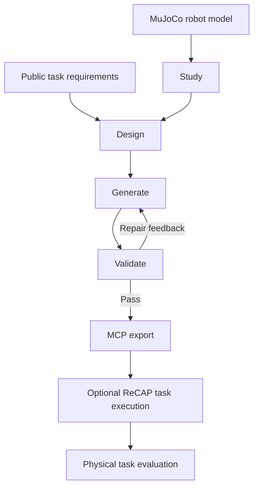

# Auto Adapter and AutoAdapter-Bench

**Auto Adapter** generates robot capabilities from a MuJoCo model and public task
requirements, checks them in physics simulation, and exports a driver through
MCP. An optional ReCAP controller uses that export to execute a task.

**AutoAdapter-Bench** provides robot/task definitions, physical outcome evaluation and
optional baseline implementations. Its existing benchmark executor uses the
earlier direct-driver TaskPlanner; the current Auto Adapter demo uses ReCAP
through MCP. These execution paths have separate result semantics.



This is an experiment-grade source release. Robot inventory, generated-driver
validation and downstream task success describe different things. The repository
does not claim that every listed robot or task has a successful generated driver,
or that the current thesis experiments are fully reproducible from this tree.

## Install

Use Python 3.10 or later and an environment that can run MuJoCo. The focused
release checks use Python 3.13 on macOS; other platform combinations are not
established by those checks. Video-producing runs also need a working OpenGL
context and FFmpeg (provided by `imageio-ffmpeg`).

```sh
git clone https://github.com/Yifannnnnnnnw/robot-capability-adapter.git
cd robot-capability-adapter
python -m venv .venv
source .venv/bin/activate
python -m pip install -e ".[test]"
python scripts/run/run_stage1.py --help
```

The repository includes the shared robot meshes and scenes, so the source tree
is approximately 390 MiB. Trained baseline checkpoints and run videos are not
bundled. One historical reference driver is included as an explicit
[compatibility example](examples/legacy_so101/README.md). The retained Go2
low-level controller data is a runtime input and includes its own source and
licence information.

Follow the [first-run guide](docs/FIRST_RUN.md) to check local MuJoCo without a
model call, generate a Piper driver, and understand each result file.

## Run Auto Adapter

The default provider is **AWS Bedrock**. Configure the normal AWS credential
chain and use a model/inference-profile ID enabled in your region. Credentials
are not stored in this repository. Simulation and generated-code execution run
locally; AgentCore is not required.

```sh
export AUTO_ADAPTER_MODEL='your-enabled-bedrock-model-id'
python scripts/run/run_stage1.py \
  --robots piper --provider bedrock --region us-east-1 \
  --model "$AUTO_ADAPTER_MODEL" --output-root runs/piper-first
```

This runs through Export. Add `--enable-demo` for the configured ReCAP task, or
use `--stop-after validate` to stop before Export. Use a fresh output directory
for an independent run. These commands make real model calls and incur your
provider's normal charges; `--help` makes none.

The existing DeepSeek transport is also available with `--provider deepseek`,
`DEEPSEEK_API_KEY` and an explicit model ID supported by its Anthropic-compatible
API. The release contains no company gateway or private transport defaults.

The launcher selects the existing skeleton-assisted or from-scratch route from
the robot catalog. Start with the Piper example; see [robot inputs](docs/ROBOTS.md)
for the distinction between catalog IDs and automatic Design inputs.

Useful entry points:

- [First run and result files](docs/FIRST_RUN.md)
- [Generation and task execution](auto_adapter/RECAP_TASKS.md)
- [Fixed demo scenes and physical task scoring](docs/DEMO_CONFIGURATION.md)
- [Public task libraries](auto_adapter/task_libraries/README.md)
- [AutoAdapter-Bench commands and compatibility limits](autoadapter_bench/README.md)

## AutoAdapter-Bench

AutoAdapter-Bench evaluates an explicitly supplied, compatible driver workspace using
its existing task suites. Generated workspaces are user inputs; the source
release does not silently substitute a reference driver.

```sh
python -m autoadapter_bench.eval --help
python -m autoadapter_bench.eval_baseline --help
```

The [Bench guide](autoadapter_bench/README.md) describes the legacy driver
interface, physical verdicts and optional RL/DP/OpenVLA dependencies. Current
dynamic ReCAP exports are not automatically interchangeable with that interface.
The [historical SO-101 reach example](examples/legacy_so101/README.md) provides
one explicit starting workspace for this older interface. Historical scores
and baseline weights are excluded from the current source tree. A new run
produces its own reports, traces and videos.

## Source layout

| Path | Purpose |
| --- | --- |
| `auto_adapter/` | Generation, physical validation, MCP export and ReCAP |
| `autoadapter_bench/` | Robot/task catalog, existing evaluation and optional baselines |
| `assets/` | Shared MuJoCo models, meshes and task scenes |
| `scripts/run/run_stage1.py` | Public generation launcher |
| `examples/` | Explicitly scoped source examples with origin and usage notes |
| `auto_adapter/tests/`, `autoadapter_bench/tests/` | Focused checks beside their components |
| `docs/` | Robot support, scoring, asset provenance and migration notes |

The robot catalog remains shared at `autoadapter_bench/spec/robot_zoo.yaml`.
Keep both packages and the assets together. Wheels include that catalog,
task-library data, models and the launcher as well as Python code. The historical
compatibility example is available in the Git checkout and source distribution.

## Scope and provenance

The original local research workspace retains the thesis, chapter experiments,
hardware demonstrations and existing run data. They are outside this public
software tree; see [migration notes](docs/MIGRATION.md). Existing Git history is
preserved, so older research files remain in earlier revisions.

This maintained implementation derives from the original Auto-Adapter project.
[UPSTREAM.md](UPSTREAM.md) records the baseline and changes; [NOTICE](NOTICE)
retains attribution. Code is under [Apache-2.0](LICENSE), with separate licences
for [robot assets](assets/THIRD_PARTY_LICENSES.md), the vendored ReCAP controller
and retained controller data. Cite this repository and the exact revision used;
[CITATION.cff](CITATION.cff) provides software citation metadata.
