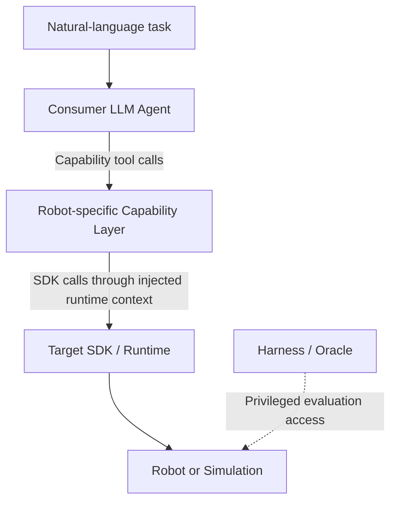
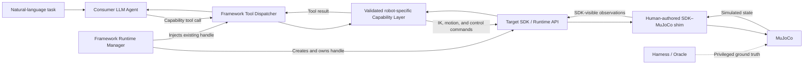

# Robot Capability Framework

## Accepted Project Record

| Field | Value |
|---|---|
| Project name | **Robot Capability Framework** |
| Current phase | G0 — research charter |
| Implementation status | Not authorized; coding is the final step |
| Document status | Sole authoritative project record; contains only decisions explicitly confirmed by the user |
| Authoritative location | `/Users/wangyifan/Projects/auto_adapter2.0/ROBOT_CAPABILITY_PRIMITIVES_RESEARCH_MAP.md` |
| Last cleaned | 2026-08-04 |

prior work github：https://github.com/981526092/auto-adapter
## 0. Document rule

Only material that has been discussed with and explicitly accepted by the user may be added to this file.

This file in `auto_adapter2.0` is the project's only authoritative record. The former copy in `/Users/wangyifan/Projects/auto_adapter/` is a frozen migration snapshot: it is not authoritative and must not receive new project decisions.

- Assistant proposals, candidate designs, baselines, metrics, schemas, and literature-derived recommendations stay in the conversation until accepted.
- `Proposed`, `candidate`, `working draft`, or `not yet accepted` material must not be stored here.
- When the user accepts a proposal, record the accepted wording and the date.
- When a decision is later superseded or removed, retain only a concise status record where historical context is necessary.

This file is independent of the old project structure. The rebuilt project will use a new repository; assets from the old repository may be consulted as references, but no old experimental result or system design is automatically inherited.

---

## 1. Accepted project identity and scope

### 1.1 Problem statement

> High-level embodied systems need a robot-specific capability layer that turns task-level intent into executable behavior. Today, this layer is repeatedly hand-built for individual robots and experiments, resulting in duplicated engineering and capability interfaces that are difficult to reuse or improve. This project investigates how a Robot Capability Framework can construct and maintain such a layer from structured robot and runtime information , task descriptions, and accumulated execution experience.

### 1.2 Central scientific claim

> Robot-specific capability-layer construction is amenable to evidence-driven automation: given structured robot morphology, SDK/runtime information, and representative task descriptions, a framework can determine an appropriate capability design and generate executable robot-specific implementations. The resulting layer can be independently evaluated through its downstream utility for high-level embodied consumers and the amount of robot-specific engineering required. Furthermore, failure-derived execution experience can iteratively improve the correctness and robustness of generated robot-specific implementations.

### 1.3 Name and contribution type

- Official project name: **Robot Capability Framework**.
- Primary contribution type: a **system/framework**.
- Primary publication unit: a complete master's thesis; a top-tier conference paper may be derived later.
- Deadline: 2026-08-25, planned against 20 productive days.
- Research rigor must not be traded away to meet the deadline; scope may be reduced instead.
- Model/API experiment budget is not currently a limiting constraint.

The name does not commit the project to a compiler architecture. The framework may contain generation, validation, persistent libraries, and evolution/lifecycle responsibilities.

### 1.4 Application and embodiment scope

- Primary application domain: **tabletop manipulation**.
- Morphology families in scope:
  - fixed-base serial manipulators;
  - multi-arm systems;
  - mobile manipulators.
- Other morphology families are optional backups.
- Simulation is the main experimental line.
- A SO-ARM101 real-robot sim-to-real check may be added as a small extension after the simulation work is complete.
- Runtime-to-physics fidelity is not an active research question.

### 1.5 Confirmed resources

```text
Physical robot:  SO-ARM101
Sensor:          Intel RealSense D405
Edge compute:    NVIDIA Jetson Orin Nano
Remote compute:  DGX GPU system
Simulation:      MuJoCo and related assets
```

Institutional approval is not currently a planning constraint. University/laboratory requirements will be documented, and detailed engineering safety must be addressed before formal real-robot trials.

### 1.6 Target audience

- Primary audience: researchers in embodied AI, robot learning, and agentic robotics who build robot action/capability interfaces for LLM-, VLM-, policy-, or program-based high-level consumers.
- Secondary audience: researchers in robot software systems, autonomous-agent tooling, and controlled agent self-improvement.
- The project is positioned as a robot/embodied-systems contribution about constructing the intermediate capability layer, rather than as a new foundation model, a new low-level controller, or a general software API generator.

---

## 2. Accepted definition

### 2.1 Robot capability

> A robot capability is a reusable, optionally parameterized unit of behavior that a robot system can realize to achieve, maintain, or observe a class of physical or informational outcomes, and that a higher-level consumer can identify, select, invoke, or compose.

The higher-level consumer is not restricted to an LLM Agent. It may be an Agent, VLM/VLA, learned policy, planner, program, or another high-level component.

The generated-artifact topology and Agent-facing representation are defined in Sections 4.3 and 4.4.

---

## 3. Accepted research questions

### RQ1 — Evidence-Grounded Capability-Layer Synthesis

The previously accepted sentence included cross-robot capability references as a required input. That assumption has now been removed from the initial system, so the exact RQ1 sentence is reopened for later wording approval. The RQ1 title and the three question branches below remain accepted.

RQ1 has three accepted question branches:

1. **RQ1.1 — Synthesis diagnosis (`what to generate`):** study how effectively the framework selects the reusable capabilities that should be generated and expresses their names and intended outcomes. This concerns capability selection and semantic decomposition.
2. **RQ1.2 — Executable realization (`can it be implemented correctly`):** given a Stage 1 Capability Schema, study how effectively the framework designs the executable interfaces and implements them correctly through the target robot's SDK/runtime. This concerns interface design and robot-specific implementation.
3. **RQ1.3 — Generator-backbone and scaffolding effects:** how do the generator LLM/backbone and the presence or form of scaffolding affect generation?

Only these question-level distinctions are accepted. No 2x2 matrix, factorial design, scaffold taxonomy, baseline, metric, model list, budget rule, or experimental protocol has been accepted for RQ1.

If the complete three-RQ portfolio cannot be completed rigorously, the three RQ1 branches may later become the thesis's three top-level RQs. This is an accepted but inactive fallback.

### RQ2 — Agent-Facing Capability Granularity

> When robot-side functionality is held fixed, how does capability granularity affect a high-level Agent's ability to select, parameterize, compose, recover, and reuse capabilities across held-out task families?

The capability definition remains consumer-neutral. The controlled RQ2 experiment uses a fixed Consumer LLM Agent. The G1–G3 granularity conditions and their Agent-facing representation are defined in Sections 4.3 and 4.4. Exact metrics and the remaining statistical protocol have not yet been fixed.

### RQ3 — Experience-Driven Structural Capability Evolution

> How does experience-driven structural evolution of a generated capability layer affect future-task utility, capability reuse, library growth, and regression relative to a frozen layer and non-structural experience reuse?

Accepted conceptual points:

- A shared experience repository exists at the conceptual level.
- The evolution subsystem controls the experience feedback process.
- Experience originates from unsuccessful validation and unsuccessful task execution.
- The lower failure-cause abstraction in the preliminary sketch produces experience.
- The internal evolution architecture, mutation operations, retrieval method, update algorithm, and promotion policy remain unspecified.

No RQ2 or RQ3 baseline, metric, mutation taxonomy, or experimental protocol has yet been accepted.

---

## 4. AutoAdapter — Robot Capability Framework Design Details

AutoAdapter constructs one robot-specific capability layer for a selected robot/runtime and granularity condition. The main generation path, the independent development-validation path, the frozen task-level Demo Evaluation, and the outer Evolution responsibility are distinct parts of the framework.

### 4.1 Framework system model and responsibility boundaries

The Robot Capability Framework is responsible for:

- selecting the assets used in a run;
- orchestrating Generation Stage 1 and Generation Stage 2;
- orchestrating Artifact Validation and Language-conditioned Development Validation;
- orchestrating development repair;
- constructing the Agent-facing capability tool catalog;
- managing the target SDK/runtime lifecycle;
- orchestrating the frozen Demo Evaluation and score sealing;
- recording failure evidence and controlling later Experience/Evolution write-back.

Human authoring of source assets and task content, the underlying robot SDK, the physical robot, and the simulator are outside the generated capability layer. The Consumer LLM Agent, SDK/runtime, MuJoCo simulator, validation task generator, and oracle are external controlled components invoked by the Framework.



The Consumer LLM Agent may invoke only the public capability tools exposed by the active layer. It does not receive the generated Python source, private helper functions, the private runtime handle, or simulator ground truth. The Harness and Oracle may read privileged simulator ground truth for evaluation, but that hidden state is not passed directly to the Consumer Agent or exposed as a capability-tool parameter.

### 4.2 Input assets and run construction

The initial framework uses four input asset collections:

- **Morphology Asset Library**: robot morphology bundles, including relevant MJCF and URDF assets;
- **SDK/Runtime Asset Library**: target SDK packages, API/runtime evidence, and the information required to use the selected SDK/runtime; for example, a SO-ARM101 configuration may use LeRobot as its underlying SDK/runtime;
- **Task Description/Evidence Asset Library**: the task reference collection used by the project;
- **Experience Asset Library**: reusable Experience selected for a later generation round. Its detailed record and Evolution design are not specified in this subsection.

An optional fifth **Golden Capability Library** may later contain curated written capability examples. It is not part of the initial system.

Task Library
├── 3/4 Generation-visible partition → Generation input
│                                  └→ 选 3 个 seen Demo tasks
└── 1/4 Held-out partition ─────────→ 选 3 个 held-out Demo tasks

After the robot and SDK/runtime for a run are selected, the Framework selects the corresponding entries from the four libraries as generation input. Stage 1 and Stage 2 may read all selected generation input, including the complete selected SDK/runtime evidence. Private validation material and the held-out task partition are not generation input.

A sensor-equipped configuration is treated as a distinct configured robot individual. For example, SO-ARM101 and SO-ARM101 + D405 are different run targets, and their selected morphology and SDK/runtime assets describe the complete configured individual.

The libraries are logical asset collections; no database service, release subsystem, mandatory storage format, retrieval algorithm, or snapshot implementation is required by the current G0 design.

### 4.3 Generation
generation阶段使用什么来生成:
Generation ReAct agent （auto adapter）， 其他baselines
Generation stage candinate LLM agent and related paramters:

| Configuration | parameter
|---|---|
|Baselines
|Candidate model     |Sonnet 4.6, Opus 4.8,Haiku 4.5, Nova Pro, DeepSeek V3.2, DeepSeek V3.2,Qwen3|
| AutoAdapter Agent Name | Generation ReAct |
| Role | Generation两个stage：决定合成什么，执行合成 |
| Available Tools |  |
| File Access | input四个文件  |
| Internet Access | no  |
| Actions Requiring Approval | no |
| Maximum Turns | 30 |


#### 4.3.1 Generation Stage 1 — Capability selection

Generation Stage 1 determines which public capabilities should be generated for the selected robot/runtime and granularity condition.

Stage 1 reads the selected generation input assets and produces one **Stage 1 Capability JSON** for the complete capbilities list. In this project, this term denotes the concrete generated capability list for a run. It contains:

- the granularity condition;
- a unique name for each selected public capability;
- a natural-language description of each capability's intended physical or informational outcome.

Stage 1 decides `what capabilities to generate`. It does not define executable function parameters, parameter types, return formats, observation interfaces, implementation dependencies, SDK calls, control logic, or Python code. It does not generate or choose the private validation tasks, oracle, or pass thresholds.

#### 4.3.2 Granularity conditions

The three granularity conditions hold the target robot-side functionality fixed while changing the Agent-facing behavioral units and the amount of composition left to the Consumer Agent.

| Level | Name | Approximate public capabilities | Capability unit | Hidden execution process | Consumer burden | Tabletop examples |
|---|---|---:|---|---|---|---|
| **G1** | Control / Motion Primitive | 5–10 | A single control target or short-horizon motion | Communication and local control details | High: the Consumer plans action sequences and tracks task progress | `set_joint_target()`, `move_ee_delta()`, `set_gripper_width()` |
| **G2** | Closed-loop Semantic Capability | 3–6 | A closed-loop behavior with a clear physical or informational outcome | Perception-control loop, termination logic, and local failure handling | Medium: the Consumer selects, parameterizes, and composes capabilities | `move_to_pose()`, `grasp_object()`, `place_at_pose()`, `detect_object()` |
| **G3** | Reusable Compound Capability | 2–3 | A stable reusable subtask composed of multiple lower-level operations | Multi-step execution, local planning, and local recovery | Lower: the Consumer mainly performs task-level composition | `pick_from_surface(object)`, `place_in_container(object, container)`, `open_drawer(drawer)` |

Each G condition produces an independent capability layer. Only the tool catalog for the active G condition is exposed in a run.


#### 4.3.3 Generation Stage 2 — Interface design and robot-specific implementation

Generation Stage 2 reads:

- the Stage 1 Capability JSON;
- the same selected generation input assets available to Stage 1;
- the implementation-facing Experience input selected for the current round.

Stage 2 may use the simulation environment for kinematic, collision, and other physical checks, and may use necessary Python tools while generating the implementation.

Stage 2 preserves the public capability names and intended outcomes defined by Stage 1. For every declared capability, it is responsible for:

- function parameters, types, and default values;
- result and error contracts;
- observation and runtime-state usage;
- dependencies between public functions and private helper functions;
- target SDK/runtime interaction;
- inverse kinematics, motion generation, control, collision handling, timeout handling, and local recovery as required;
- the final robot-specific Python implementation.

Stage 2 produces one Python module containing all public capability functions for the selected robot/runtime and G condition. Stage 2 output is a generated candidate; it is not yet an LLM-callable or validated layer.

#### 4.3.4 Generated-artifact topology

For each target robot/runtime and granularity condition, the generated capability-layer artifact consists of:

1. one Stage 1 Capability Schema containing the public capability names and descriptions;
2. one Stage 2 Python module containing the corresponding robot-specific implementations.

Individual capabilities are public functions inside the Python module; they are not independent Capability Packages. This layer-level topology supersedes the previously accepted Option A per-capability Package topology.

4.3.5 Tasks and threshold in validation
stage 1 output a JSON file  - what should sysnthesis in this run
--> task generator line: receive JSON file, read task samples, pick 3 + 3 tasks for demo. --> set goal and tolerance range (目标值和可以在validation和demo阶段呗判定通过的阈值)


### 4.4 Capability-layer construction and Agent-facing tools

#### 4.4.1 Public capabilities, private helpers, and dependencies

Every capability declared by Stage 1 must correspond to exactly one public function in the Stage 2 Python module. Stage 2 may generate private helper functions for kinematics, trajectory generation, collision handling, control, and other implementation needs. Private helpers are not capabilities and are not exposed to the Consumer Agent.

A public capability may call another public capability or a private helper within the same Python module. Each G-specific module is self-contained and does not import public capabilities from another G condition.

Capability names must be unique within a Stage 1 Capability Schema. A layer must not contain two public capabilities with materially equivalent intended outcomes. Shared internal implementation does not by itself make two capabilities semantically equivalent.

#### 4.4.2 Tool representation

Each public robot capability is exposed to the Consumer LLM Agent as one **LLM-callable tool**. The complete active Capability Layer is exposed as a **tool catalog** containing all public capability tools for the selected robot/runtime and G condition.

The project does not use `skill` as a formal generated-artifact or Agent-interface term. `Skill` may appear only when describing external systems or related literature that uses that terminology.

The generated Python module is not given to the Consumer Agent. The Framework constructs the Agent-facing representation as follows:

- tool name and description come from the Stage 1 Capability Schema;
- parameter types, required fields, defaults, and result contract come from the Stage 2 public-function interface;
- a Framework-owned dispatcher binds each tool call to its corresponding Python function;
- the private runtime handle is injected by the Framework and is omitted from the LLM-visible parameter schema.

All public capabilities in the active layer are visible for every task. The Framework does not dynamically select a task-specific subset. Provider-specific adapters may change only the API serialization format; they may not change tool names, descriptions, parameters, or behavioral semantics.

#### 4.4.3 Layer states

The capability layer passes through three distinct states:

1. **Generated candidate**: Stage 1 Schema plus Stage 2 Python implementation;
2. **Artifact-valid LLM-callable candidate**: the candidate has passed Artifact Validation and has been deterministically converted into capability tools;
3. **Validated Capability Layer**: the Agent-facing candidate has also passed Language-conditioned Development Validation.

### 4.5 Target SDK/runtime and simulation binding

The Framework manages the target runtime lifecycle and owns the active SDK/runtime handle. Generated capability functions use an existing runtime context injected by the Framework; they do not create, reconnect, replace, or close the runtime connection.

The runtime context is private Framework state and is not included in the Consumer Agent's tool parameter schema. Conceptually, an Agent may call `move_to_pose(target_pose)`, while the Framework internally invokes the implementation with the injected runtime context.

Generated capabilities are responsible for robot-specific capability logic, including inverse kinematics, motion generation, control, and execution monitoring as required. They issue commands and read permitted robot state exclusively through the target SDK/runtime interface.

For simulation, a fixed human-authored SDK–MuJoCo shim translates SDK commands into MuJoCo control inputs and translates MuJoCo state into SDK-visible observations. The shim is controlled experimental infrastructure, not a generated capability artifact, and remains fixed across generation and granularity conditions.



Generated capabilities and the Consumer Agent may not bypass the SDK/runtime interface to access MuJoCo state directly. The Harness and Oracle may access privileged MuJoCo ground truth for evaluation, but that state is not exposed through capability tools unless it is also part of the permitted SDK observation interface.

The manually authored shim is reported as fixed simulation infrastructure and is outside the scope of automatically generated capability code.

### 4.6 Validation

There are two top-level validation categories:

1. **Artifact Validation**;
2. **Language-conditioned Development Validation**.

Only failures from these two validation categories may return to Stage 2 for modification of the current candidate. The later Demo is task-level evaluation, not a third validation category and not part of the development-repair loop.

#### 4.6.1 Independent validation authority

Validation tasks, oracle predicates, and pass thresholds are produced and fixed independently of Generation Stage 1 and Stage 2. Human researchers author the validation standards. A private validation task generator may read the public Stage 1 capability names and descriptions together with the independent validation reference material in order to instantiate capability-level validation cases.

Generation Stage 1 and Stage 2 do not create, select, lower, or modify the validation tasks, oracle, or acceptance thresholds. Independence does not require permanent secrecy during development: detailed validation results and threshold gaps may be returned to Stage 2 as validation-guided repair feedback.

#### 4.6.2 Artifact Validation and deterministic tool construction

Stage 2 first produces a candidate Python module. Artifact Validation checks the generated artifact before it becomes callable by the Consumer Agent. It has two ordered parts.

The base artifact checks include:

- Python syntax, structure, import, and required-file checks;
- capability naming and consistency with the Stage 1 Schema;
- exactly one public callable for every Stage 1 capability;
- absence of undeclared public capability functions;
- function-signature, type, parameter, and result-schema checks;
- confirmation that the runtime handle is private and not part of the Agent-facing parameters.

Generation Stage 2 does not freely generate provider-specific LLM wrappers. After the base artifact checks pass, the Framework deterministically constructs the tool catalog and dispatcher. It then checks that every tool definition, parameter schema, result contract, dispatcher binding, and public function remain consistent. Passing both parts produces an Artifact-valid LLM-callable candidate. Failures in the implementation or callable interface return to Stage 2 repair.

#### 4.6.3 Language-conditioned Development Validation


Validated LLM-callable Capability Layer
├── Agent-facing tool contracts
│   └── name / description / parameter schema
└── Stage 2 Python implementation
    ├── capability functions
    ├── IK / motion / control
    └── framework-bound runtime handle

   Consumer LLM Agent
        ↓ tool call
Validated LLM-callable Capability Layer
        ↓ SDK calls
Target SDK / Runtime

Language-conditioned Development Validation checks whether each public capability can be invoked through its LLM-facing tool interface and can satisfy its declared physical or informational outcome.

A validation case identifies the capability under test and provides a natural-language instruction, target parameters, an initial environment state, a capability-specific success predicate, and a pass threshold. The target capability may be named explicitly because this stage tests capability conformance rather than open-ended task planning.

For example, a `move_to_pose` case may instruct the Consumer Agent to use that capability to reach a specified target pose. A position-related oracle may accept a final end-effector position within `0.005 m` of the target, together with any applicable orientation, collision, joint-limit, and timeout requirements. The `0.005 m` tolerance is an example for a positional capability, not a universal threshold for grasping, placement, sensing, or other capability types.

Detailed feedback may be returned to Stage 2, including execution errors, physical outcomes, oracle measurements, and the gap between the observed result and the required threshold. Stage 2 may revise the Python implementation, but it may not modify the validation case, oracle, or threshold.

After every implementation change, the candidate repeats Artifact Validation, deterministic tool construction, and the required Language-conditioned Development Validation. Passing this development-validation process establishes capability-level conformance after permitted repair; it is not treated as untouched held-out evidence.

The complete candidate layer becomes a **Validated Capability Layer** only after both Artifact Validation and the human-authored aggregate rule for Language-conditioned Development Validation pass.

### 4.7 Frozen Mixed Demo Evaluation

The frozen Demo evaluates the complete Consumer LLM Agent and a Capability Layer that has already passed both Artifact Validation and Language-conditioned Development Validation. A Demo task specifies the desired outcome but does not prescribe a capability name, tool-call sequence, or solution procedure. For example, the Agent may receive `Grasp the red cube` and must independently select, parameterize, and compose the available capability tools.

The Task Library is partitioned as follows:

```text
Complete Task Library
├── approximately 3/4 Generation-visible tasks
└── approximately 1/4 held-out tasks
```

The final held-out partition is not used by the repairable development-validation loop. The frozen Demo batch contains:

```text
Demo Evaluation Batch
├── 3 generation-visible / seen tasks
└── 3 held-out / unseen tasks
```

Seen and unseen are defined relative to capability generation. The Consumer Agent necessarily receives the current task instruction at execution time.

The six Demo tasks are selected before results are observed. The three seen tasks and the three held-out tasks are each chosen to be substantially different in task family, intended outcome, required capability composition, interaction type, spatial or collision requirements, execution horizon, or observation needs. The two groups should remain broadly comparable in difficulty and execution conditions. Seen tasks use fresh execution instances rather than replaying complete reference trajectories.

G1, G2, G3, and all compared Consumer models use the same six Demo tasks. Before the batch begins, the following are frozen:

- the capability layer and tool catalog;
- the Consumer Agent configuration;
- the six tasks and their seen/held-out labels;
- the oracle predicates and thresholds;
- the execution order or its random seed.

Consumer Agent context/history and the environment state are reset between tasks. A Demo failure, whether on a seen or held-out task, is not returned to Stage 2 repair. The evaluated capability layer remains fixed, the failed task is not rerun with a modified implementation, and the resulting Demo score is final for that layer. Seen-task, held-out-task, and overall results are retained separately.

After all batch scores are sealed, eligible failure evidence may enter the later Evolution process. Such evidence may affect only a future generated layer; it does not modify the frozen layer retrospectively or cause the same Demo batch to be rescored. Once a held-out batch has contributed to persistent write-back, it is consumed and cannot be reused as held-out evidence for the updated system; the next untouched batch is required.

### 4.8 Candidate Consumers and Configuration

A **Consumer** is a downstream decision-making system that receives a task or goal and uses the public interface of the active Capability Layer. A Consumer is not required to be an LLM Agent.

#### 4.8.1 Candidate Consumers

| Candidate Consumer | Consumer type | Task input | Capability access | Control architecture | Status |
|---|---|---|---|---|---|
| ReAct Agent | LLM-based Agent | Natural-language task and permitted observations | Complete active LLM-callable capability tool catalog | ReAct observation–action loop | Current candidate |

The selected Consumer configuration is fixed before formal evaluation. The current candidate is evaluated through a small SO-ARM101 development pilot that does not use the final held-out task partition.

#### 4.8.2 Candidate Models for LLM-based Consumers

| Candidate model | Vendor |
|---|---|
| Sonnet 4.6 | Anthropic |
| Opus 4.8 | Anthropic |
| Haiku 4.5 | Anthropic |
| Nova Pro | Amazon |
| DeepSeek V3.2 | DeepSeek |
| Ministral 8B | Mistral |
| Qwen3 32B | Alibaba |

#### 4.8.3 Consumer Runtime Parameters

| Parameter | Selected value |
|---|---|
| Provider/access route | To be fixed after the development pilot |
| Maximum Agent steps | To be fixed after the development pilot |
| Temperature | To be fixed after the development pilot |
| Seed | To be fixed after the development pilot |

#### 4.8.4 System Prompt

The Consumer Agent system prompt is maintained as a separate file rather than embedded in this parameter table. The formal experiment record references the selected prompt artifact and the frozen runtime configuration.

### 4.9 Evolution

- The **inner responsibility** is capability generation.
- The **outer responsibility** is capability evolution/lifecycle.
- These are conceptual responsibilities only; their concrete modules, algorithms, interfaces, scheduling, and artifact boundaries have not been fixed.
- Experience selected by evolution returns through the framework's experience input in later generation/evolution rounds.

---

## 5. G0 status

### Accepted

- problem statement and central scientific claim;
- target audience and embodied-systems positioning;
- project name and system/framework contribution type;
- thesis unit, deadline, and no-shortcut principle;
- core capability definition;
- three primary RQs and the inactive RQ1-only fallback;
- physical and compute resources;
- morphology families and tabletop manipulation scope;
- simulation-first plan and optional SO-ARM101 extension;
- conceptual generation/evolution responsibilities;
- shared experience repository and failure-derived experience;
- two validation categories;
- freeze-score-ingest rule for held-out batches;
- four initial input asset libraries and the optional, initially disabled Golden Capability Library;
- two-stage generation: Stage 1 capability selection followed by Stage 2 interface design and robot-specific implementation;
- one Stage 1 Capability Schema and one Stage 2 Python module per target robot/runtime and granularity condition;
- G1, G2, and G3 Agent-facing granularity conditions;
- one public capability per LLM-callable tool and one tool catalog per active capability layer;
- Framework-managed runtime handles and a fixed human-authored SDK–MuJoCo shim for simulation;
- independent capability-level development validation followed by a frozen task-level Demo Evaluation;
- a mixed Demo batch containing three generation-visible tasks and three held-out tasks.
- a consumer-neutral downstream role with ReAct Agent as the only current Candidate Consumer.

### Not yet accepted; discuss in conversation first

- target venue;
- detailed falsification statement;
- exact input-asset serialization, storage, and retrieval mechanisms;
- final Stage 2 parameter/result conventions and tool-catalog ordering;
- final capability-specific validation cases, aggregate pass rule, and repeated-trial protocol;
- final Consumer model selection and runtime-parameter values;
- internal evolution design and boundaries;
- every remaining RQ baseline, ablation, metric, scaffold, and statistical protocol;
- detailed engineering-safety protocol.

### Deferred G0 item

The detailed `RQ -> required evidence -> available resources -> feasibility` matrix is temporarily deferred. It remains unresolved and cannot be counted as completed when determining whether G0 has passed.

---

## 6. Accepted decision log

| Date | Accepted decision |
|---|---|
| 2026-08-02 | Keep the rebuild record independent of the old project structure and write code only after the research and system plan are accepted. |
| 2026-08-03 | Use **Robot Capability Framework** as the project name and do not commit to a compiler or contract-grounded architecture. |
| 2026-08-03 | Treat Agent, VLM/VLA, learned policy, planner, program, and other high-level components as possible capability consumers. |
| 2026-08-03 | Use a full master's thesis as the primary unit, with a possible top-tier paper later; deadline 2026-08-25 without reducing research rigor. |
| 2026-08-03 | Position the contribution as a system/framework. |
| 2026-08-03 | Accept the revised robot capability definition in Section 2.1. |
| 2026-08-03 | Confirm SO-ARM101, RealSense D405, Jetson Orin Nano, remote DGX, and MuJoCo as available resources. |
| 2026-08-03 | Use fixed-base serial manipulators, multi-arm systems, and mobile manipulators as morphology families, with tabletop manipulation as the primary domain. |
| 2026-08-03 | Remove runtime-to-physics fidelity from the active RQs and use simulation as the main line with an optional later SO-ARM101 extension. |
| 2026-08-03 | Accept RQ1 synthesis, RQ2 granularity, and RQ3 structural evolution. |
| 2026-08-03 | Accept RQ1.1 synthesis diagnosis, RQ1.2 executable realization, and RQ1.3 generator-backbone/scaffolding effects at the question level only. |
| 2026-08-03 | Accept a shared experience repository controlled by evolution and fed by failed validation and sealed unsuccessful task executions. |
| 2026-08-03 | Accept ordered freeze-score-ingest held-out batches. |
| 2026-08-03 | Keep the evolution box internally unspecified while interpreting failure-cause abstraction as experience creation. |
| 2026-08-03 | Use only Artifact validation and Language-conditioned layer validation as top-level validation categories. |
| 2026-08-03 | Accept the RQ1.1–RQ1.3 top-level fallback if the full portfolio later proves infeasible. |
| 2026-08-03 | Defer Behavior Tree and TAMP. |
| 2026-08-04 | Store only explicitly user-approved content in this file; all unapproved designs remain in the conversation. |
| 2026-08-04 | Accept the final problem statement and central scientific claim in Sections 1.1 and 1.2. |
| 2026-08-04 | Accept the target audience and embodied-systems positioning in Section 1.6. |
| 2026-08-04 | Confirm that Capability design and Robot-specific implementation describe the meanings of RQ1.1 and RQ1.2; retain the original RQ titles Synthesis diagnosis and Executable realization. |
| 2026-08-04 | Use Morphology, SDK/Runtime, Task Description/Evidence, and Experience as the four initial input asset libraries; keep a Golden Capability Library as an optional future fifth input rather than an initial requirement. |
| 2026-08-04 | Initially choose Option A: one complete Capability Package for each robot-specific capability and target robot/runtime. This decision was superseded later on 2026-08-04 by the layer-level artifact topology below. |
| 2026-08-04 | Replace the per-capability Package topology with one Stage 1 Capability Schema and one Stage 2 Python implementation module for each target robot/runtime and granularity condition. Individual capabilities are public functions in that module. |
| 2026-08-04 | Define Generation Stage 1 as capability selection expressed through names and intended-outcome descriptions; assign executable parameter/interface design and robot-specific implementation to Generation Stage 2. |
| 2026-08-04 | Expose each public robot capability to the Consumer LLM Agent as one LLM-callable tool and expose the active Capability Layer as a tool catalog; do not use `skill` as a formal project artifact term. |
| 2026-08-04 | Use G1, G2, and G3 as independent Agent-facing granularity conditions with approximate public-capability counts of 5–10, 2–6, and 2–3 respectively. |
| 2026-08-04 | Make the Framework own and inject the SDK/runtime handle; generated capabilities perform robot-specific IK, motion, and control through the SDK, while a fixed human-authored SDK–MuJoCo shim connects the SDK to simulation. |
| 2026-08-04 | Have Stage 2 generate the candidate Python module, perform Artifact Validation, deterministically construct LLM-callable tools in the Framework, and then perform capability-level Language-conditioned Development Validation with validation-guided Stage 2 repair. |
| 2026-08-04 | Separate capability-level development validation from task-level Demo Evaluation; use a frozen mixed Demo batch containing three generation-visible tasks and three held-out tasks selected from an approximately 3/4–1/4 task-library partition. |
| 2026-08-04 | Allow only Artifact Validation and Language-conditioned Development Validation failures to return to Stage 2 repair. Demo failures do not modify or trigger resubmission of the frozen evaluated layer; after score sealing they may affect only a future layer through the separate Evolution process. |
| 2026-08-04 | Move the sole authoritative project record to `auto_adapter2.0`; retain the former `auto_adapter` copy only as a frozen, non-authoritative migration snapshot. |
| 2026-08-04 | Generalize the downstream role from an LLM Agent to a Consumer that may use other decision architectures; record ReAct Agent as the only current Candidate Consumer. |
