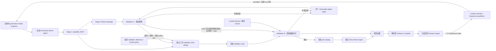
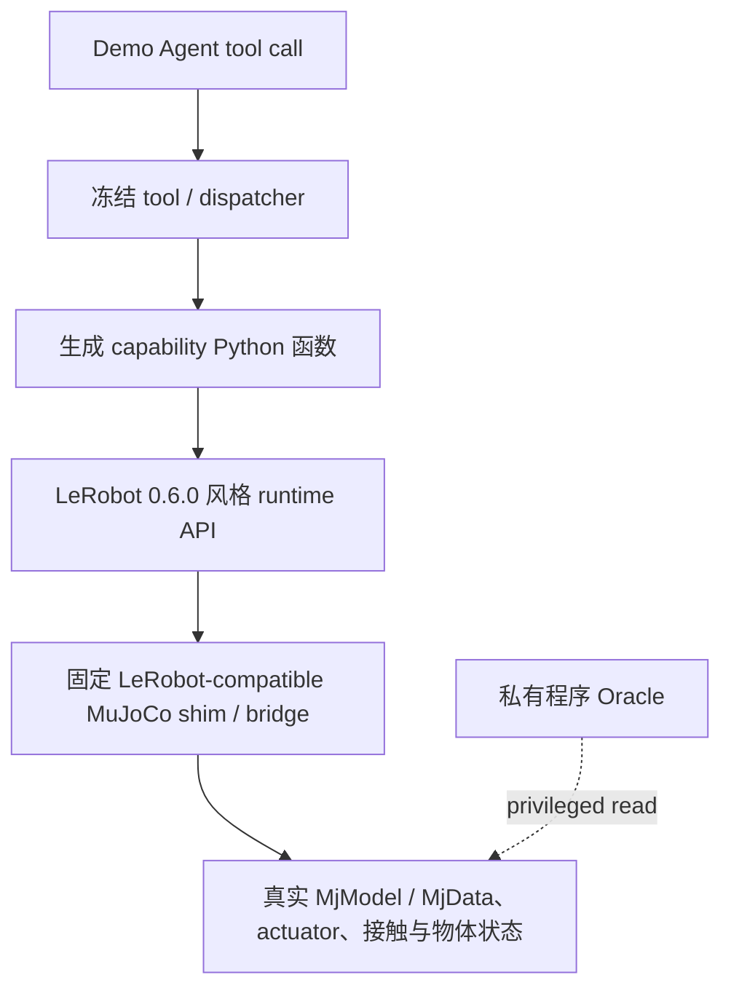

# 机器人能力框架

> **文档状态：SO-ARM101 Demo 后中文整合审阅稿**
>
> 本稿依据 2026-08-04 至 2026-08-05 的 SO-ARM101 最小 Demo 设计、
> 实现、真实模型运行、失败分析和收尾审计整理。它供用户逐段审阅；在用户
> 审阅通过并回归英文文档之前，不能把本稿中新增加的“工作设计”自动解释为
> 最终接受的论文协议。

## 项目记录

| 字段 | 内容 |
|---|---|
| 项目名称 | **Robot Capability Framework（机器人能力框架）** |
| 框架工作名 | **AutoAdapter** |
| 当前阶段 | G0 研究章程已形成；SO-ARM101 P0 全流程 Demo（含只读 Evolution）已收尾；下一步用新 Generation/Validation 实验检验 Experience 建议 |
| 实现状态 | 四库、Generation、Validation、tool packaging、Demo、只读全局 Evolution、trusted evaluator 与非空 Experience 闭环均已实现 |
| 中文文档状态 | Demo 后整合审阅稿 |
| 英文文档状态 | 审阅前的最后同步权威版本；本轮暂不修改 |
|  |
| Demo 结果 | [RESULTS.md](demo/soarm101_minimal/RESULTS.md) |
| 非 Evolution 基线 | Git commit `ab89c93`；tag `soarm101-non-evolution-complete-v0.1` |
| Evolution 结果 | `aws-evolution-readonly-final-20260805a`：`accepted` negative Experience；不代表 capability 已改善 |
| Evolution 基线 | tag `soarm101-evolution-complete-v0.1` |
| 本次整理日期 | 2026-08-05 |

前作参考仓库：[981526092/auto-adapter](https://github.com/981526092/auto-adapter)。
新项目私有仓库：
[Yifannnnnnnnw/robot-capability-adapter](https://github.com/Yifannnnnnnnw/robot-capability-adapter)。

---

## 0. 文档治理与证据语言

### 0.1 本轮审阅稿的例外

此前规则要求项目地图只记录用户已经明确接受的决定。本轮用户明确要求先在
中文文件中整合 Demo 发现、用户批注和修改草稿，再进行审阅，最后回归英文
文档。因此，本稿允许同时出现以下四种内容，但必须明确区分：

| 标签 | 含义 |
|---|---|
| **已接受设计** | 用户此前已经接受、仍然有效的研究或系统决定 |
| **P0 实验事实** | 能由当前源码、测试、封存报告或真实 run 证据直接支持的事实 |
| **工作设计** | 根据 P0 发现形成、等待本轮审阅确认的设计 |
| **开放问题** | Demo 未回答，或必须在正式 RQ 实验前重新设计、校准和冻结的内容 |

审阅通过后，应将接受的修改同步到英文文档；未接受内容应删除、改写为开放
问题，或保留在单独的设计讨论中。

### 0.2 证据陈述纪律

本项目必须区分以下结论：

1. **系统流程执行完成**：状态机、监督、预算、失败记录和报告按契约运行。
2. **候选 capability 通过 Validation**：生成代码满足冻结的能力级标准。
3. **Demo task 成功**：Consumer 使用冻结 tool 完成某一具体任务。
4. **正式科研主张成立**：经受控基线、重复试验、统计分析和真正未接触测试支持。

前一项不自动推出后一项。尤其是：

- 一个真实 run 可以以可信的 Validation 失败结束，同时仍然是有效的系统实验；
- offline fixture 只能证明确定性编排，不能充当物理执行证据；
- `pilot-held-out` 只能表示 P0 的开发性分区，不能冒充论文级 generalization；
- 仿真成功不能证明真机性能；
- LLM 输出、程序返回的 `success` 字段和任务 Oracle 的最终判定不是同一件事。

### 0.3 权威边界

- 旧 `auto_adapter` 目录和前作仓库只提供可追溯参考，不自动继承其设计或实验结论。
- SO-ARM101 Demo 是新框架的 P0 试点证据，不是正式 RQ1–RQ3 实验。
- 私有任务、Oracle、测试源码和秘密配置不得因文档整理而公开。
- 历史 run 是不可变证据；后续修复不能追溯性改变其结果。

---

## 1. 项目定位与范围

### 1.1 问题陈述

> 高层具身系统需要一个机器人特定的能力层，将任务级意图转化为可执行行为。
> 这一层通常针对不同机器人和实验被反复手工构建，造成工程重复，也使能力
> 接口难以复用、比较和持续改进。本项目研究如何根据结构化的机器人形态、
> SDK/运行时、任务描述和累积执行经验，自动构建并维护机器人能力层。

### 1.2 核心科学假设

> 给定结构化的机器人形态、SDK/运行时信息和具有代表性的任务描述，框架能够
> 选择适当的能力设计，并生成面向目标机器人的可执行实现。生成的能力层可以
> 通过独立验证、对下游 Consumer 的效用以及所需机器人特定工程量进行评估。
> 来自失败验证和任务执行的可信经验，可能改善未来生成与验证过程。

最后一句仍是需要由 RQ3 检验的科学假设，不是 SO-ARM101 P0 Demo 已经证明的
结论。P0 只证明了收集、隔离和传递这类证据所需的系统边界可以实现。

### 1.3 名称与贡献类型

- 正式项目名称：**Robot Capability Framework**。
- 框架工作名：**AutoAdapter**。
- 主要贡献类型：机器人/具身智能的**系统与框架**。
- 主要发表单元：完整硕士论文，之后可进一步形成顶级会议论文。
- 截止日期：2026-08-25；必要时缩小正式实验范围，不牺牲证据真实性。
- API 经费不是当前主要限制，但调用上限仍是可复现性、可比性和因果分析所需的实验约束。
- 项目名称不预设必须采用编译器架构。

### 1.4 应用、形态和实验范围

- 主要应用：桌面操作。
- 形态范围：固定基座串联机械臂、多臂系统、移动操作机器人。
- P0 机器人：SO-ARM101 标准夹爪配置。
- P0 传感范围：本体状态和任务提供的结构化场景事实；不使用 D405 图像感知。
- 主要实验路线：MuJoCo 仿真。
- 可选扩展：完成仿真研究后进行小规模 SO-ARM101 真机 sim-to-real 检查。
- 运行时到真实物理系统的保真度不是当前研究问题。

带传感器的配置视为不同的机器人配置个体。例如，SO-ARM101 与
SO-ARM101 + D405 是两个不同的生成目标，必须选择不同的形态与运行时资产。

### 1.5 已确认资源

```text
实体机器人：      SO-ARM101
传感器：          Intel RealSense D405
边缘计算：        NVIDIA Jetson Orin Nano
远程计算：        DGX GPU 系统
仿真：            MuJoCo
目标 SDK：        LeRobot
```

机构审批目前不是 P0 规划限制；正式真机实验前仍必须完成实验室要求和详细工程
安全协议。

### 1.6 目标受众

- 具身 AI、机器人学习和智能体机器人研究人员；
- 为 LLM、VLM/VLA、策略、规划器或程序构建机器人能力接口的研究人员；
- 机器人软件系统、Agent tool 和受控自我改进研究人员。

本项目不是新的基础模型、低层控制器或通用软件 API 生成器。

---

## 2. 核心定义

### 2.1 机器人能力

> 机器人能力是一个可复用、可选参数化的行为单元，机器人系统通过它实现、
> 维持或观察某一类物理或信息结果，高层 Consumer 可以识别、选择、调用或
> 组合该行为单元。

Consumer 不限于 LLM Agent，也可以是 VLM/VLA、学习策略、规划器、程序或
其他高层组件。

### 2.2 机器人能力层

机器人特定能力层包含：

1. 对外可见的公共能力契约；
2. 面向目标机器人/运行时的可执行实现；
3. 必要但不对 Consumer 暴露的私有辅助函数；
4. 由框架确定性生成的 tool schema 和 dispatcher binding。

`skill` 不作为本项目生成物的正式术语；只有在引用使用该术语的外部工作时
才使用。

### 2.3 候选、验证与冻结状态

本稿统一使用以下状态：

1. **生成候选项**：Stage 1 JSON + Stage 2 Python package；
2. **静态合规候选项**：通过 Validation A，公共 API 已冻结；
3. **能力级验证候选项**：整个冻结 Validation B suite 聚合通过；
4. **冻结 tool catalog**：整层 A+B 通过后，框架统一包装其全部公共函数，供 Demo Consumer 使用；
5. **Demo 结果**：冻结能力层在任务级评估中的表现，不改变该能力层。

---

## 3. 研究问题

### 3.1 RQ1 — 基于证据的能力层合成

英文基线中曾经更完整的 RQ1 总句已重新开放；当前只把 RQ1 标题和以下三个
分支视为稳定研究骨架。正式实验前仍需独立定义“适当的能力设计”参考和拒绝
生成的条件，不能用生成器自己的选择证明其选择正确。

RQ1 包含三个分支：

1. **RQ1.1 — 合成诊断（生成什么）**：框架能否选择应生成的可复用能力，并以名称和预期结果表达？
2. **RQ1.2 — 可执行实现（能否正确实现）**：给定 Stage 1 能力设计，框架能否设计接口并通过目标 SDK/运行时生成正确实现？
3. **RQ1.3 — 骨干模型和脚手架影响**：模型、Agent scaffold 和工具边界如何影响能力选择、实现质量、成本和修复行为？

候选完整系统基线包括让 Codex 或 Claude Code 接受相同的输入和最终目标，自主
完成能力层构建。该基线及具体模型列表尚未冻结，属于**开放问题**；正式协议
必须固定输入可见性、工具权限、预算和评分方式，不能只比较最终代码。

如果时间和证据不足以严谨完成三个 RQ 的完整组合，可以启用此前接受的备选：
将 RQ1.1–RQ1.3 提升为论文顶层研究问题。本备选尚未启用。

### 3.2 RQ2 — 面向 Agent 的能力粒度

> 在保持机器人侧目标功能固定时，能力粒度如何影响高层 Agent 在未见任务类别
> 中选择、参数化、组合、恢复和复用能力的表现？

工作粒度定义：

| 层级 | 名称 | 典型公共能力数量 | 能力单元 | Consumer 负担 |
|---|---|---:|---|---|
| G1 | 控制/运动原语 | 5–10 | 单个控制目标或短时域运动 | 高 |
| G2 | 闭环语义能力 | 3–6 | 明确物理结果的闭环行为 | 中 |
| G3 | 可复用复合能力 | 2–3 | 多步、可恢复的稳定子任务 | 较低 |

正式 RQ2 必须让 G1、G2、G3 分别使用独立 catalog，并尽量保持机器人侧目标
功能等价。P0 同时生成三个模块并使用 combined catalog，只是打通 plumbing，
不能作为粒度优劣证据。P0 实际生成的能力数量也不满足上述正式条件范围。

### 3.3 RQ3 — 经验驱动的能力结构演化

> 与冻结能力层和非结构化经验复用相比，基于可信执行证据的能力结构演化如何
> 影响未来任务效用、能力复用、程序库增长和回归？

已接受的概念边界：

- 存在共享 Experience Library；
- 经验可以来自失败验证、失败任务以及被证据支持的成功修复；
- 当前 run 不能消费自己产生的经验；
- 被吸收的 pilot/held-out 证据不再是未经接触的测试证据；
- 演化不能修改历史 run 或为旧批次重新评分。

Evolution Agent、变异操作、检索、晋升策略和正式基线仍需后续实验确定。

### 3.4 P0 Demo 与 RQ 的关系

SO-ARM101 Demo 的目标是发现系统设计中实际会失败的地方，并形成能够支撑正式
研究的实验基础设施。它没有控制模型、粒度、任务和重复次数，因此不直接回答
RQ1、RQ2 或 RQ3。

---

## 4. Demo 后的框架设计

### 4.1 三条职责线

项目由三条相互连接但权威不同的线组成：

1. **能力合成主线（AutoAdapter）**：根据四类输入生成机器人能力设计和实现；
2. **独立验证设计与执行线（自动验证线）**：在独立参考与 Oracle 约束下实例化验证 case，并由可信程序执行与判分；
3. **只读经验演化线**：旁观完整历史证据，提出一条供未来 Generation 使用的改进建议，经独立 evaluator 后写入 Experience；当前 Demo 不自动改框架。

“自动验证”不意味着 LLM 可以自由决定成功标准。人类/参考库负责冻结能力类型、
测量空间、阈值政策和 Oracle 权威；suite generator 只能在该边界内实例化 case。



### 4.2 信任与可见性边界

| 参与者 | 可以读取 | 不可以读取 |
|---|---|---|
| Generation Agent | 四库的 generation view、Stage 1、当前 package、结构化 repair 反馈、公共 simulation probe | pilot-held-out、私有 Oracle、验证源码、MuJoCo privileged state、历史答案 |
| Validation-suite generator | Stage 1 公共能力、冻结签名、验证参考、允许的测量和 schema | 生成实现源码、Demo task、修改 Oracle 的权限 |
| Trusted Validation harness | 冻结 package、case、runtime、私有 Oracle 和 MuJoCo 状态 | 改写生成代码或放宽阈值 |
| Demo Agent | 当前任务、允许的场景事实、冻结 tool、tool result | Generation trace、Python 源码、私有 Oracle、其他任务 |
| Evolution Agent（已实现） | 隐私安全的全局证据投影，以及 SHA 冻结的公开源码、prompt/schema/config/library 摘要 | 原始秘密、测试、私有 run 文件、可直接泄漏答案的私有 payload、任何写入或 shell 权限 |

### 4.3 四个输入库

| Library | 内容 | P0 SO-ARM101 实例 |
|---|---|---|
| Morphology | 机器人模型、mesh、运动学、附件、兼容场景和物体资产 | SO-ARM101 MJCF、18 个 mesh、tabletop scene、cube/cylinder/tray/bowl/marker |
| SDK/Runtime | 固定版本的 API、运行时契约、探针和最小示例 | LeRobot 0.6.0 |
| Tasks | 任务模板、taxonomy、来源、相似度和分区 | 12 个本地编写任务，9 visible + 3 pilot-held-out |
| Experience | 可被未来 Generation 选择的版本化经验 | P0 初始输入为 0；首个可信 negative claim 保留 1.0.0/1.1.0 两个 ledger 版本，Generation 只选最新 1.1.0 |

可选的 Golden Capability Library 仍是未来方案，不属于 P0 的第五个输入。

这些库不需要数据库或发布服务，但每个 run 必须：

1. 选择明确版本；
2. 验证 manifest 和 payload hash；
3. 生成 allowlist-only 的 Generation snapshot；
4. 冻结私有执行 bundle；
5. 在每次消费边界重新验证。

### 4.4 Task Library、相似度和分区

P0 task library 从 LIBERO/LIBERO-PRO、RLBench、CALVIN、ManiSkill 和
RoboCasa 借用高层任务组织思想，但不复制其资产、坐标、Oracle、演示或代码。
完整来源与适配边界见
[TASK_LIBRARY_RESEARCH.md](demo/soarm101_minimal/TASK_LIBRARY_RESEARCH.md)。

```text
12 个任务模板
├── 9 个 generation-visible
│   └── 固定选择 3 个 visible Demo task
└── 3 个 pilot-held-out
    └── P0 Demo 使用全部 3 个
```

分区单位是 similarity group，而不是单条自然语言或 rollout seed。同一语义模板、
paraphrase 和未来实例必须留在同一分区。P0 的 9/3 只用于系统试点；这些任务已
在开发与历史 run 中反复使用，因此不能再作为正式论文的 untouched held-out。

`private/task_library/soarm101_tabletop/v1/task_oracles.yaml` 不是从 LIBERO 等
benchmark 复制的资产，也不是每轮由 LLM 临时生成。它由研究者为本地 task
template 预先编写，定义确定性成功条件、容差政策和所需 privileged measurement，
并随 private execution bundle 冻结。trusted harness 根据 MuJoCo 私有状态解释
这些规则；Generation 和 Demo Agent 都不能读取或修改它们。P0 tolerance 是本地
起始设计，正式 benchmark 前仍需重复物理校准。

### 4.5 Scene 资产与 task-local world

Scene 不是第五个输入。它是 Morphology Library 的版本化子项：

```text
Morphology
├── robot model / meshes / kinematics
└── scenes/soarm101_tabletop/v1
    ├── tabletop definition
    └── cube / cylinder / tray / bowl / target marker profiles
```

任务或 case 只提供 `asset_ref + instance_id + pose + goal`。几何、质量、摩擦、
材质和碰撞参数来自冻结 catalog，不能由每个 task 随意重定义。

“冻结 12 个任务场景”只表示冻结 12 份任务/初始状态描述和它们引用的资产，
不是预先构建 12 个 `MjModel/MjData`。真实规则是：

- provider call 1 前的 `private_execution_preflight` 只做静态完整性检查，
  `mujoco_worlds_created = 0`；
- Generation public probe、每个 Validation B case 和每个被选中的 Demo task
  才按需解析资产并创建 fresh world；
- 未执行的任务不创建世界；
- 每个 case/task 都使用独立状态，避免跨任务污染。

P0 不需要 Scene Builder Agent。未知 `asset_ref` 返回 `MISSING_ASSET`，
研究者将所需资产加入 Morphology Library 的新不可变版本，再从输入冻结重新运行。
隔离环境不能取代 catalog：没有统一资产版本时，两个隔离环境仍可能使用不同物理参数。

### 4.6 连续 Generation ReAct Agent

一次 run 只创建一个 Generation Agent。Stage 1、Stage 2 和 repair 保持相同的：

- `agent_id`、`session_id` 和 `episode_id`；
- generation-visible snapshot；
- workspace；
- append-only trace；
- 阶段历史与冻结 artifact 引用。

阶段切换通过工具 allowlist 和 artifact freeze 实现，不创建第二个 Generation Agent。

| 阶段 | P0 调用预算 |
|---|---:|
| Stage 1 | 最多 3 次 |
| Stage 2 初始 package | 最多 30 次 |
| Validation-suite design | 固定 3 次：生成、全量复核、最终复核 |
| Repair | 最多 10 轮；每轮独立最多 6 次，不计入 Stage 2 的 30 次 |
| Demo | 每个 task 独立最多 30 次 |

本地工具、Python 检查、MuJoCo step 和直接函数调用不计为 LLM call。
`max_retries: 0` 使一次逻辑调用对应至多一次 provider HTTP attempt。

P0 真实使用 AWS Model API 上的
`anthropic.claude-sonnet-4-5-20250929-v1:0`。短请求可以使用 API Gateway；
Generation、repair 等重请求使用支持最长 120 秒的 Lambda URL，以避开标准
endpoint 的 30 秒硬限制。客户端不进行隐藏重试。具体模型列表属于每次实验的
冻结配置，研究地图不再维护容易过期的候选版本清单。

P0 的 Generation Agent、validation-suite generator 和 Demo Consumer 使用同一
冻结 provider/model profile，但它们具有各自的角色、session、prompt、预算和
trace。共享 model client 配置不等于共享 Agent 身份或上下文。

#### 4.6.1 Stage 1 — 能力选择

Stage 1 负责“生成什么”。此前接受的最小科学边界是：

- 唯一 capability ID 和函数名；
- 粒度；
- 预期物理或信息结果。

它不应定义完整参数、返回类型、控制代码、SDK 调用、测试 case 或阈值。

P0 的 `stage1.v2` 为了连接验证和物理 scaffold，又加入了 assumptions、
evidence refs、unresolved evidence gaps、`implementation_family`、
`implementation_evidence` 和 `validation_effect`。这是**P0 实现事实，
但尚未整体成为正式科学设计**。其中显式 gap 能抑制无证据生成，但其余字段也
可能提前向 Stage 2 提供实现答案。正式
RQ1 前必须决定：

1. 这些字段是否会提前约束 Stage 2、削弱 RQ1.1 的独立性；
2. 它们应属于 Stage 1 输出，还是由框架从 Stage 1 派生的 validation metadata；
3. 不同基线是否能公平获得相同信息。

Stage 1 公共产物可以进入 Validation-suite generator，用于能力级 case
实例化；它不能生成、选择或替换冻结的 Demo task。

#### 4.6.2 Stage 2 — 接口与机器人特定实现

Stage 2 在同一 Agent 会话中继续，生成一个 robot-specific Python package：

```text
generated_capability_package/
├── __init__.py
├── _kinematics.py
├── g1.py
├── g2.py
├── g3.py
└── package_manifest.json
```

每个 Stage 1 公共能力恰好对应一个公共 Python 函数。Package 可以包含私有
运动学、轨迹、碰撞、控制、超时和恢复 helper，但这些 helper 不会包装成 tool。
每个公共函数以框架注入的 `runtime` 为第一个参数；该参数不向 Consumer 暴露。

P0 把 G1/G2/G3 放在同一个 package 的独立模块中以打通流程。正式 RQ2 运行应
分别冻结和暴露每个 G 条件。

#### 4.6.3 Repair 连续性

repair 仍属于同一个 Generation Agent，但不能把不断增长的完整原始对话重复
发送给 provider。P0 使用新的 provider-context epoch，并注入：

- 当前结构化 failure feedback；
- 当前 package checkpoint；
- 之前 failure signature；
- 修改前后 hash 和 `package_changed/no_package_change`；
- 后续 static/direct 状态；
- 隐私安全的 process audit。

`repair_ledger.v2` 保留轮次、tool/action 顺序、target/result hash、成功写入、
协议拒绝和 unfinished read；它不保存 chain-of-thought、原始模型文本、源码
内容、秘密或私有 Oracle。

P0 多轮 repair 实验提示了两点：

1. 不携带前序结构化修复历史时，Agent 容易在错误之间摆动；
2. 无界携带历史又会导致上下文膨胀。最新 run 在第 10 轮准备第 6 次请求时，
   由本地 guard 检测到 `288426 > 262144` bytes 而终止。

因此，“同一 Agent”指身份、artifact 和审计连续，不等于每次 provider 请求都
重发完整原始历史。后续应研究更好的因果摘要、去重和 unresolved issue 投影。

### 4.7 SDK/Runtime 与 LeRobot–MuJoCo bridge

P0 固定 LeRobot 0.6.0（release commit `30da8e6`）。框架先执行 hardware-free API probe，确认 import、
配置字段、六个 observation/action key、单位和非阻塞语义，但不打开串口或真机。

控制路径是：



公共 runtime 表面包括：

```text
connect / get_observation / send_action / disconnect
```

bridge 匹配 LeRobot SO-101 的六个 key、degree/radian 转换、gripper 0–100
映射、clipping 和 non-blocking `send_action`。它是 API-compatible shim，
不是 Feetech serial byte-level emulation。

生成代码和 Consumer 只能通过 SDK/runtime 接口控制与观察；不得直接访问
MuJoCo。只有 trusted harness 和 Oracle 可以读取 privileged state 判分。

### 4.8 Validation

P0 用两级 Validation 取代了旧的“语言条件能力验证”设计：

1. **Validation A — Artifact/Static Validation**；
2. **Validation B — Direct Module Verification**。

Validation B 的 suite 设计可以使用 LLM，但最终 `passed/failed` 只由程序
执行和 Oracle 决定，不由 LLM 判断。

#### 4.8.1 Validation A

Validation A 使用 AST、schema、import 和依赖规则检查：

- package 与必需文件；
- Python 语法、编译和 import；
- Stage 1 与公共函数一一对应；
- 无额外公共能力；
- module、签名、类型和结果契约；
- `runtime` 为私有注入参数；
- 不连接/关闭 runtime；
- 不导入 MuJoCo、bridge、Oracle、私有任务、raw serial 或禁用依赖；
- package manifest 与源码一致。

首次完整通过后冻结 public API。repair 可以修改实现和私有 helper，但不能静默
更改 Validation-suite 所依赖的公共接口。

P0 也曾发现 Validation A 把一次 post-close release command 错当成 G3 最早的
tool-centred boundary。该规则已经修复并加入回归测试。这说明 validator、Oracle、
schema 和 prompt 本身也可能出错；它们必须像生成代码一样被版本化、冻结和审计。

#### 4.8.2 Validation-suite 生成

私有 suite generator 接受 Stage 1 公共能力、冻结签名、schema、validation
reference 和允许的测量名，不接受生成实现源码或 Demo task。

三次 LLM call 的目的固定为：

1. 生成；
2. 全套检查并重写；
3. 最终复核并重写。

随后由确定性代码检查 JSON/schema、函数覆盖、case 数、唯一性、调用参数、
测量、阈值和可执行测试入口。输出到达 `max_tokens=8192` 并被截断，表示
响应不完整，不能当作合法 suite。早期曾出现“8 个 capability 生成 14 个 case”
的现象，说明 suite contract 对 case 数和覆盖映射不够严格；由这种错误产生的
失败不能全部归咎于生成 capability。

P0 当前采用“每个冻结公共 capability 恰好一个 case、总数精确相等”的严格
plumbing 规则。它不是已经接受的正式论文聚合规则；正式实验可以在独立论证后
使用多 case 或重复试验，但必须预先冻结。

本轮形成的要求是：LLM 负责受约束的 case 实例化，程序负责 fail-closed 的
结构与语义检查。

#### 4.8.3 Validation B 直接执行

suite 冻结后，trusted harness 直接导入函数：

```python
result = generated_function(runtime, **case.call_arguments)
measurements = oracle.measure(case.target_measurements)
```

每个 case 使用 fresh MuJoCo world。通过要求包括：

- import 和调用成功；
- 返回契约正确；
- 在 host harness deadline 内完成；
- 所有目标和 tolerance 由 private Oracle 满足；
- 没有 forbidden collision、joint limit、instability 或 runtime condition。

`cases[].timeout_s` 是 host monotonic hard deadline；公共 capability timeout
使用 MuJoCo simulation time。两种时钟不得直接比较或混用。

Validation B 不是自然语言 tool-use 测试，也没有 Consumer Agent。只有 A 和 B
都通过，package 才能进入 tool packaging。

生成函数返回的 `success/complete` 只能作为被测输出，不能替代 Oracle。最新
run 中部分 G3 调用没有 simulator exception 或 timeout，也曾报告完成，但实际
物体后置条件仍未满足；这是“代码自报成功不等于物理世界成功”的直接证据。

#### 4.8.4 Repair gate

失败反馈可以包含 capability/case ID、sanitized arguments、异常或 timeout、
观察/目标/tolerance gap、forbidden-condition 和有限 traceback signature，
但不包含 Oracle/test 源码。

- package 真正改变后：重跑 Validation A，再重跑冻结的 Validation B；
- `no_package_change`：记录该轮消耗和原因，不能假装产生了改进；
- 最多 10 轮；
- Validation case、Oracle 和阈值在当前 run 中保持冻结。

### 4.9 Tool packaging

只有整个 package 和冻结 Validation B suite 聚合通过后，才统一包装全部公共函数；
P0 不做“部分 case 通过、部分函数提前发布”的 partial promotion。Packager：

1. 读取 Stage 1 名称和描述；
2. 读取冻结签名与结果契约；
3. 从 Agent-visible schema 移除注入的 `runtime`；
4. 生成 JSON tool schema；
5. 建立 dispatcher binding；
6. 检查参数与结果 round-trip；
7. 输出 G1、G2、G3 和 combined catalog。

P0 combined catalog 只证明系统连接，不是 RQ2 结果。

### 4.10 冻结 Demo

Demo 使用另一个独立的 ReAct Agent，而不是 Generation Agent。两者具有不同的：

- role/agent ID；
- session/episode；
- prompt 和 conversation history；
- tool allowlist；
- call counter；
- trace；
- artifact 目录。

每个 Demo task 还会重新创建该 task 的 Agent episode、runtime 和 MuJoCo world。

```text
冻结 Demo batch
├── 3 个 generation-visible task
└── 3 个 pilot-held-out task
```

Demo Agent 只接收当前 task、允许的结构化场景事实、冻结 tool catalog 和 tool
result。它自主选择、参数化和组合 tool。任务最终成功与否由代码 Oracle 根据
真实 MuJoCo 状态判断，不由 Demo Agent 自评。

Demo 失败不返回当前 Generation/repair。Validation 没通过而未进入 Demo 是
正常 gate 行为，不是 Demo runner 缺失。一个完成六项执行的 run 可以包含
Oracle miss；系统结构完整与 6/6 performance 是两种不同结论。

ReAct LLM Agent 是 P0 的 Consumer 配置，不是 Consumer 定义本身。正式实验的
Consumer 模型、prompt、temperature、seed 和最大步数必须另行冻结。行为树和
TAMP 继续延后，不属于 P0。

### 4.11 运行证据、视频与可复现性

证据必须按 run 实际到达的阶段闭合。通过输入冻结、即将发出首个 provider call
的 run 必须先写 `run_inputs.json`；更早的 `INPUT_INVALID` 或操作中断可能在该
文件产生前结束，只能保留当时已有的 manifest/terminal 证据并显式说明缺失，
不能伪造占位产物。其余产物同样只在对应阶段到达时绑定：

- `run_inputs.json`：配置、prompt、schema、library、private evaluator 和源码文件 hash；
- 一个 detached `source_tree` digest；
- library snapshot 和 private execution bundle hash；
- Stage 1、package、public API freeze 和 tool catalog；
- model/provider logical call、HTTP attempt、token、错误和预算；cost 与 remaining
  quota 只在 provider 实际返回时记录，否则显式为 `null`；
- static/direct suite、feedback、repair result 和 repair ledger；
- Demo trace 和程序 Oracle 报告；
- `video_index.json`；
- `sealed_report.json` 或 `terminal_report.json`。

`run_inputs.json` 不复制整套 Python harness。源码由 Git 保存，run 记录实际
使用文件的 byte hash 和 source-tree digest，从而发现“检查之后、使用之前文件
被替换”的问题。正式复现必须同时拥有仓库版本和 run fingerprint；hash 本身
不能恢复已经丢失的源码。

失败报告采用 two-cut manifest：

1. 先封闭预算和 provider accounting；
2. 复制 terminal manifest snapshot 并构建报告；
3. 最后只向 live manifest 追加 terminal report hash/event。

这避免报告引用自身产生 hash cycle，也避免终局 snapshot 丢失最后预算。

#### 4.11.1 视频语义

- Validation A 不录视频；
- AWS Validation B 为每个实际执行 case/round 录制真实 MuJoCo MP4；
- 进入并实际执行完整六任务 Demo 的 AWS run，才为六个 task 各录一个 MP4，
  包括 Oracle 未通过的任务；未进入 Demo 的 run 记录 0 个 Demo 视频；
- 每个 MP4 有 metadata sidecar，并进行全帧解码；
- `video_index.json` 绑定文件 hash、case/task、package、suite 和 scene；
- sealed/terminal report 再单向嵌入并绑定 `video_index.json` 的内容与 hash；
- `partial` 表示 run 未封存完整集合，不表示其中每个已绑定视频损坏；
- preflight 不创建任务 world，因此不应产生或冒充任务视频；
- offline fixture 的视频索引必须为空并写明 `offline_reason`；其 Demo/sealed report
  将 runtime 标记为 `not_physical_evidence`。

#### 4.11.2 隐私与记录边界

证据采用分层保存，而不是把“私有”和“不记录”混为一谈：

- API key、authorization header 和 hidden chain-of-thought 不记录；
- 完整 held-out catalog、原始私有 task record、私有 Oracle、评分初始状态和阈值
  只保存在受控的 run-local `private_execution_bundle`，供 trusted harness 使用；
  Generation 和未授权 Evolution 投影永远不获得 held-out 内容；
- Demo Agent 每个 episode 只获得当前已选任务的 instruction 和允许公开的场景
  view，包括执行 pilot-held-out task 时所需的信息；它看不到原始私有 record、
  分区全集、其他任务、Oracle 或 threshold；
- 模型 response、生成源码和 tool payload 可以保存在 run-local 审计 trace，
  但跨阶段 feedback 和 Evolution/Experience 投影必须经过 allowlist、长度限制和
  redaction；
- 可反推出测试答案的完整私有轨迹、未经约束的大段 traceback 或源码回显不得
  跨越其授权边界。

### 4.12 失败分类

| 类型 | 示例 | 能否解释为 capability 性能 |
|---|---|---|
| Input failure | manifest/hash 不一致、缺少 asset、SDK probe 不一致 | 否 |
| Generation failure | 输出无效、预算耗尽、上下文 guard 拒绝 | 通常否；需看是否已有能力执行证据 |
| Validation-suite failure | JSON 截断、case contract 无效、覆盖不完整 | 否，不能归咎于 capability |
| Capability validation miss | 函数执行完成但 Oracle 不满足 | 是 |
| Infrastructure failure | renderer、provider、report construction、runtime 故障 | 否 |
| Operator interruption | `KeyboardInterrupt` | 否；只表示运行被人工/进程中断 |
| Demo task miss | 冻结 tool 被执行但 task Oracle 不满足 | 是任务级结果，不返回当前 repair |

异常必须保留最初原因。视频索引或终局报告的后处理失败不能覆盖原始 provider、
runtime 或 capability 失败原因。

### 4.13 Evolution 与 Experience（已实现）

最终采用 **Evidence-grounded Audit–Synthesize–Judge–Publish**，而不是让
Evolution 自动修改框架：

```text
冻结的终局 run
  → 确定性 Evidence Compiler
  → 独立、只读的全局 Audit Agent
  → 一个排序后的主要 finding + 一个可证伪 Experience claim
  → 确定性 trusted evaluator
  → accepted：追加一条版本化 Experience
     rejected / inconclusive：不写 Experience
  → 后续新 run 加载脱敏 approved view
```

`evolution.py` 是唯一的确定性证据、隐私、判定和发布边界；Agent runtime 只负责
独立身份、session、上下文、预算、trace 和只读工具。Agent 可以读取脱敏的全局
证据投影及 SHA 冻结、逐行脱敏的公开仓库片段；每个片段会标明与 source run
记录的 hash 是 matched、changed 还是 absent，不能把当前源码静默冒充为历史证据。
Agent 没有 write、patch、shell、threshold、private-file 或历史 run 修改工具。它在
同一 session 中最多使用 20 calls 做全局审计，再使用余下最多 10 calls 完成结构化
综合，总上限仍是 30；第一个有效 submit 随即冻结。

Evidence Compiler 以 1 MiB 默认、2 MiB hard limit 完整读取最新真实 source run
的 598,979-byte `terminal_report.json`，重新验证原始 SHA、schema、manifest
binding、既有 terminal/video semantic audit 和跨 artifact 语义；不截断、不修改
历史报告，也不信任旧的 run-local candidate bundle。投影得到 5 个脱敏
`confirmed_failure` candidate，同时排除 API key、
held-out task 原文、私有 Oracle、隐藏 measurement、raw model message、traceback
和绝对路径。

真实 run `aws-evolution-readonly-final-20260805a` 使用
`anthropic.claude-sonnet-4-5-20250929-v1:0`，完成 22/30 个真实模型 calls。Agent
依次排序出：所有 G3 的重复 Oracle mismatch、repair 第 10 轮 context limit、5 个
`no_package_change` repair、Stage 2 预算耗尽，以及 G1/G2 的稳定通过。它选择第一项，
形成一条 negative Experience。Agent 将 tool-point/site-frame 变换或物体交互逻辑
作为待验证机制，并保留 timeout、gripper/contact、calibration 和 kinematics
transcription 等替代解释；这只是 Agent 假设，不是 evaluator 已证明的根因。

独立 trusted evaluator 重新编译证据，并检查 source integrity、framework
snapshot、audit schema/semantics、evidence binding、claim strength、privacy 和
Experience schema 八个 gate。全部通过后发布：

```text
experience_id: evolution.b9ee1c81d3c1c516c075000e
version: 1.0.0
status: approved
conclusion_kind: negative
```

收尾代码审计发现：重复 G3 失败这一负面事实有证据，但 1.0.0 中具体机制和 prompt
建议写得过强；Stage 2 prompt 已要求相应 site-quaternion composition，生成的
kinematics 代码也包含该组合。项目没有改写 source run 或删除 1.0.0。收紧后的
trusted compiler 对同一个 accepted claim 追加 1.1.0：保留重复失败事实，将
`repair_succeeded` 设为 `null`，明确 exact mechanism/remedy 均未证明。Generation
的 latest-version selector 只暴露 1.1.0。

该 1.1.0 校正另由 `EVOLUTION_CORRECTION_RECEIPT.json` 固化：它绑定未修改的历史
Evolution report/audit、完整 source terminal report、重新执行的八个 trusted gate、
1.1.0 record、ledger/manifest 以及唯一 Generation view 的 SHA；校正使用 0 次新增
模型调用。旧 AWS report 保持原始字节，不用追溯改写来适配后来的加固 schema。

这里 `approved` 只表示证据和隐私条件允许发布，不代表结论是正面，更不代表
capability 已改善。两个版本都明确声明 `framework_change_applied=false`、
`capability_improvement_proven=false`、`new_generation_validation_required=true`。
Evolution 的建议只是供未来 run 检验的数据；如果以后需要自动改源码/prompt/
schema，应另建有独立授权和因果协议的 Meta-Evolution，而不是扩张当前 Agent 权限。

Experience 只有一个 raw authority：`libraries/experience/v1/records.jsonl`。下一轮
Generation 只获得逐字段 allowlist 投影后的 `selected_records.json`；origin、证据
引用、measurement、易混淆的 repair outcome 和私有内容不会进入 Generation
snapshot。唯一 projector 会再次验证 record schema、latest approved 状态、内容级
隐私与 exact file allowlist；缺失 required hash、非 canonical semver 或把
`records.jsonl` visibility 改成 generation 都会 fail closed。publisher 只能通过
evaluator-bound record hash 调用，并拒绝 authority 路径中的 symlink。source run
ID 还会被显式排除，因此一个 run 不会消费由自己结果产生的经验。

`accepted`、`rejected` 和 `inconclusive` 描述 Experience claim 是否可信，而不是
框架补丁或 capability 改善。开发过程中的 rejected/inconclusive run 也被保留为
有效科研记录，没有通过重评分旧实验、放宽阈值或修改历史证据制造成功。

### 4.14 科研最小化原则

P0 需要保留的科研能力包括：

- 输入/私有边界；
- 独立程序监督；
- 固定预算与真实 provider accounting；
- 失败分类；
- artifact hash 与 Git 可复现性；
- task/world 隔离；
- 防止 benchmark leakage；
- 证据等级和不夸大结论；
- 能回归的自动测试。

不需要数据库、服务化 registry、复杂审批流、Scene Builder Agent、每个 run
复制完整 harness，或企业级发布系统。只有当新的机器人或正式实验确实需要时，
再增加复杂度。

---

## 5. SO-ARM101 P0 Demo 实验复盘

### 5.1 实验构成

P0 固定：

- SO-ARM101 + 标准 gripper；
- LeRobot 0.6.0 API contract；
- MuJoCo 3.11.0；
- 12 个本地任务模板，9 visible + 3 pilot-held-out；
- 3 visible + 3 pilot-held-out Demo batch；
- 一个连续 Generation ReAct Agent；
- 一个独立 Demo ReAct Agent；
- Validation A + 三次 suite design + Validation B direct execution；
- Stage 1 ≤3 calls、Stage 2 ≤30 calls、repair ≤10×6、Demo ≤30/task；
- 实际任务视频、程序 Oracle、预算、hash 和终局报告。

本地环境使用 Demo 自己的 `.venv`，不使用 host Python。非 Evolution 收尾基线
`ab89c93` 的完整测试收集为 522 项，最近一次执行退出码 0，只有 1 个环境相关
skip；后续 Evolution 工作树增加的测试不应追溯改写这一基线数字。当前含
Evolution 的完整工作树收集 555 项测试，最近一次完整执行同样退出码 0、1 skip。

### 5.2 关键 run

| Run | 目的与执行 | 结果 | 正确解释 |
|---|---|---|---|
| `offline-postfix-closure-20260805a` | 确定性执行完整状态机和 3+3 Demo | `SEALED`；报告 schema/semantic 0 issue；无视频 | 证明编排与契约，不是模型或物理性能 |
| `aws-research-minimal-20260805b` | 真实模型、真实 MuJoCo、完整 Validation 与六任务 Demo | direct 5/5；Demo 5/6；5 Validation + 6 Demo 视频；最后 report construction failure | 证明历史源码可到达独立 Demo；不是 sealed success |
| `aws-research-minimal-20260805c` | 真实 repair 路径 | direct 4/5；repair 期间 provider timeout | provider/运行终止，不能把未完成轮次当 capability 结论 |
| `aws-research-minimal-20260805d` | 完整 10 轮 repair | 最终 4/5；35 个 Validation 视频；未进入 Demo | 证明 repair exhaustion 和失败证据路径 |
| `aws-postfix-evolution-source-20260805a` | 新基线首次 pre-provider gate | SDK dossier payload hash 过期，`INPUT_INVALID`；0 model call、0 视频 | 输入 gate 正确阻止不一致实验 |
| `aws-postfix-evolution-source-20260805b` | 修正 hash 后的最新真实 Evolution source run（source `a494207`） | Stage 1 3/3、Stage 2 30/30、suite 3/3；进入 repair 1–10，前 9 轮完整，第 10 轮 5/6 calls 后由 context guard 终止；95 次 provider 成功；五次 direct 均 2/5；25 个视频 | 最新源码得到可信失败证据，但 capability 未通过且未进入 Demo；不能称为 10 轮 clean exhaustion |
| `aws-evolution-readonly-final-20260805a` | 独立全局只读审计上述 source run | 22/30 真实 calls；5 个 ranked findings；8 个 trusted gate 全通过；发布 1 条 negative Experience | `accepted` 仅表示该经验主张可安全发布；未修改框架，也未证明 capability 改善 |

最新 run 的 terminal report schema 与 cross-artifact semantic audit 均为 0 issue。
80 个冻结文件、31 个源码记录和 source-tree digest 无 mismatch。25 个 Validation
视频全部可解码，共 1145 帧、57.25 秒。

主要证据入口：

- [完整结果汇总](demo/soarm101_minimal/RESULTS.md)；
- 本地最新真实 run：
  `demo/soarm101_minimal/runs/aws-postfix-evolution-source-20260805b/`；
- 本地最终 Evolution run：
  `demo/soarm101_minimal/runs/aws-evolution-readonly-final-20260805a/`；
- 本地当前源码离线 run：
  `demo/soarm101_minimal/runs/offline-postfix-closure-20260805a/`。

`runs/` 是本地实验产物目录，不随源码仓库提交；可公开复现所需的结论与 hash
写入版本化的 `RESULTS.md`。当前原始大体积/私有证据只在本地保存；正式实验前
必须建立受控备份、archive manifest 和 retention policy，否则 Git 中的摘要与
hash 无法恢复视频和私有报告原文。

### 5.3 最新 Stage 1 示例及表现

最新 Stage 1 选择：

| G | 公共能力 | 最新 direct 结果 |
|---|---|---|
| G1 | `move_joints` | 通过 |
| G2 | `reach_position` | 通过 |
| G3 | `pick_place_object` | 未通过 |
| G3 | `lift_object` | 未通过 |
| G3 | `place_objects_sequence` | 未通过 |

这说明系统能够把失败定位到复合操作层，但不能据此断言 G1/G2 普遍优于 G3：
每层功能、数量和难度并未在 P0 中受控。

### 5.4 从问题与设计风险到修订

| 早期问题或设计风险 | P0 观察或设计推理 | 当前修订 |
|---|---|---|
| 把 Stage 1 和 Stage 2 当成两个 Agent | 若重新实例化，就不再是同一 Agent 的连续生成轨迹；P0 未做两种方案的受控性能对比 | 同一 Generation Agent、同一 session，阶段化工具权限 |
| repair 被算进 Stage 2 的 30 calls | 混合预算无法分别报告初始生成与反馈修复成本 | repair 独立最多 10 轮，每轮 6 calls |
| 后续 repair 看不到前序过程 | 早期 repair 日志和重复/no-change 行为提示存在遗忘与摆动风险，尚无受控消融 | repair ledger + privacy-safe process audit |
| 把完整历史不断重发 | 上下文最终超过 262,144 bytes | bounded epoch；下一阶段继续研究压缩与因果投影 |
| 长 JSON/Python 依赖单次模型输出 | 可能达到 8192-token 上限并留下不完整文件 | 截断输出不执行；大文件采用带 expected hash 的分段/原子写入，完成由 `finish_package` gate 判定 |
| Validation B 用自然语言/LLM 判断 | 会把 tool selection 与能力实现验证混在一起，且引入主观裁决 | LLM 只设计 suite；程序直接调用函数，Oracle 判分 |
| suite schema 只检查 JSON 形状 | 出现输出截断、case 过多、契约不严 | 加入长度、覆盖、唯一性、case-count 和语义 gate |
| 默认假设 validator 正确 | Validation A 曾对 G3 release boundary 产生假阳性 | validator/schema/prompt 纳入冻结源码输入并建立回归测试 |
| 相信函数自报 `success` | G3 可在自报完成时仍未达到物理后置条件 | 以 private Oracle、世界状态和视频为最终权威 |
| 只记录 `success=false` | 无法定位 G3 在 grasp/lower/release 哪一阶段失败 | 增加 `phase_reached`、`completed_moves`、`failed_move_index`、`timeout_scope` |
| 混用 host time 和 simulation time | timeout 标准可能自相矛盾 | 分离 host monotonic deadline 与 MuJoCo simulation timeout |
| 把 scene 当第五库或引入 Scene Builder | P0 task scan 只需要一个薄 catalog，没有证据表明需要独立 Agent 生命周期 | scene/objects 作为 Morphology 子库；缺失资产新版本重跑 |
| “冻结 12 个场景”等同预建 12 个环境 | 输入冻结只需描述/hash；预建世界会增加无关状态和资源成本 | 只冻结描述/hash；执行 case/task 时 JIT 创建 fresh world |
| 单独 renderer preflight 视频 | 视频里没有任务物体，容易被误当证据 | 只在正式 Validation B/Demo 录制任务世界 |
| offline fixture 生成假视频 | 会混淆编排与物理证据 | offline video index 必须为空 |
| 失败 run 丢失视频/预算 | 无法审计真实过程 | terminal report 保留 partial video index 和最终 accounting |
| 每个 run 复制完整 harness | 系统过重且仍需版本管理 | `run_inputs.json` 文件 hash + source-tree digest + Git commit/tag |
| 要求 Validation/Demo 必须成功才算流程跑通 | 把性能失败误当系统失败，妨碍科研复盘 | 系统完整性、capability pass、task score 分层报告 |
| Evolution Evidence Compiler 被当成 Agent | 名称混淆导致错误声称已进化 | 明确 compiler、global Agent、trusted evaluator、publisher 四个职责 |

最新 repair 的因果记录进一步表明：第 1、2、7、8、9 轮是
`no_package_change`，第 3–6 轮才发生 `package_changed`；只有后者触发了新的
static/direct 执行。消耗一次 repair budget 不等于产生候选变化，更不等于改善。

### 5.5 P0 已经证明的内容

- 四库格式、visible/private snapshot 和 hash 边界可运行；
- Stage 1 → Stage 2 → repair 可以由同一 Generation Agent 连续执行；
- LeRobot-style SDK 可通过固定 shim 控制真实 MuJoCo `MjModel/MjData`；
- Validation 由独立于 Generation Agent 的 trusted harness 执行：A 静态检查候选
  源码，B 直接调用候选函数并由 Oracle 判分；
- 私有程序 Oracle 可以真实判定 pass/fail；
- package 通过后可以确定性包装为 tool；
- Demo Agent 可以与 Generation 完全隔离并运行 3+3 task；
- task-local scene、视频、预算、terminal failure 和源码 provenance 可以形成闭环；
- 失败 run 也能产生可用于 Evolution 的可信证据；
- 独立只读 Evolution Agent 可以审计大体积终局证据、由 trusted evaluator 判定，
  并在不修改框架或历史证据的情况下发布一条非空、脱敏、版本化 Experience；
- 一个后续新 run 能够加载该 Experience 的非空 Generation view。

### 5.6 P0 没有证明的内容

- 当前 post-fix 源码尚无一个真实模型 run 封存完整
  Generation → Validation → 六任务 Demo；
- 最新生成 capability 未通过全部五个 direct case；
- P0 没有建立独立 gold/reference 来证明 Stage 1 选择的是“适当能力”；
- P0 没有比较不同 generator backbone 或 scaffold；
- combined catalog 不能回答 G1/G2/G3 粒度效应；
- pilot-held-out 已被开发使用，不是正式 generalization；
- Task Oracle 和 tolerance 仍是本地 P0 设计，不是外部 benchmark 标准；
- all-12 静态 preflight 只证明任务描述、资产引用和数值完整性，不证明 12 个任务
  都经过重复物理可行性与阈值校准；
- 没有 D405 感知或真机实验；
- 没有统计重复、置信区间、显著性或工程量正式指标；
- 没有区分一次性框架建设成本与新增一个机器人所需的边际工程成本，因此尚未
  证明框架减少了机器人特定工程工作；
- Evolution 提出的 G3 tool-point/site-frame 根因仍是假设，推荐的 Generation
  guidance 尚未在新的 Generation/Validation run 中检验；
- “经验能够改善未来能力层”的 RQ3 主张仍未验证。

---

## 6. Demo 后的项目状态

### 6.1 已稳定的研究与系统决定

- Robot Capability Framework 的问题定位、能力定义和 Consumer-agnostic 边界；
- RQ1 合成、RQ2 粒度和 RQ3 演化；
- 桌面操作、仿真优先和 SO-ARM101 P0；
- 四个输入库；
- Scene 作为 Morphology 子库，而不是第五个输入；
- 任务按 similarity group 分区；
- 连续 Generation Agent 的 Stage 1 → Stage 2 → repair；
- Validation A 静态检查和 Validation B 直接函数执行；
- LLM suite design 与程序 Oracle 判分分离；
- A+B 后才进行 tool packaging；
- 独立 Demo Agent、每任务 reset、3+3 pilot batch；
- Demo 失败不返回当前 repair；
- 只读全局 Evolution、独立 trusted evaluator 和单一 Experience publisher；
- Experience 的 publication status、结论正负号和 capability 改善证明相互分离；
- 预算、视频、失败、hash 和 terminal report 的证据边界；
- 科研最小系统原则。

### 6.2 下一阶段必须完成

1. 审阅并冻结本中文稿；
2. 将接受内容同步回英文 Research Map；
3. 用新冻结的 Generation/Validation run 消费这条非空 Experience，检验建议是否
   改善 G3，而不更改当前实验阈值；
4. 根据 P0 发现设计正式 RQ1/RQ2/RQ3 实验，而不是直接复用 P0 分数。

### 6.3 正式实验前的开放问题

- Stage 1 v2 的 implementation/validation metadata 是否保留；
- 正式能力粒度功能等价条件；
- generator 和 Consumer 模型/基线；
- prompt/scaffold 消融；
- validation suite case 数、聚合规则和重复试验；
- Task/Oracle 校准与全新 untouched batches；
- 正式 RQ3 的 Experience 检索、重复试验和比较基线；
- 是否需要 Meta-Evolution，以及它与当前只读 Evolution 的独立授权和因果边界；
- 工程工作量、复用、增长和回归指标；
- 真机安全协议和 sim-to-real 范围；
- `RQ → evidence → resources → feasibility` 矩阵。

---

## 7. Git 与可复现研究记录

源码本身必须保存在版本库中；hash 只能识别内容，不能恢复丢失源码。

P0 当前基线：

```text
private repository: Yifannnnnnnnw/robot-capability-adapter
commit:             ab89c93536259dc41902ae831afe6c5682f0980b
tag:                soarm101-non-evolution-complete-v0.1
```

含只读 Evolution、trusted evaluator、首条 Experience 和 555-test 回归的收尾
基线使用 tag `soarm101-evolution-complete-v0.1`；具体 commit 由该 tag 解析，避免
在文档中维护可漂移的缩写。

每个正式 run 应记录：

- Git commit/tag；
- clean/dirty 状态；
- `run_inputs.json`；
- source-tree digest；
- 依赖 lock；
- model/runtime 配置；
- artifact 和 report hash。

不要求把完整源码树复制到每个 run。若运行时工作树不干净，应记录实际文件 hash，
不能只依赖 commit 名称。

---

## 8. 摘要式决策日志

本节保留与当前研究地图最相关的决定和 supersession 摘要；英文基线保存审阅前
更完整的接受历史。中文审阅通过后应逐项对齐，而不是用本摘要静默覆盖英文历史。

| 日期 | 决定 |
|---|---|
| 2026-08-02 | 重建记录独立于旧项目；旧设计和实验不自动继承。 |
| 2026-08-03 | 使用 Robot Capability Framework 作为项目名称，不预设编译器架构。 |
| 2026-08-03 | 将 Agent、VLM/VLA、策略、规划器和程序都视为可能的 Consumer。 |
| 2026-08-03 | 以完整硕士论文为主要单元，将贡献定位为系统/框架。 |
| 2026-08-03 | 接受机器人能力定义、桌面操作范围、仿真优先和可选 SO-ARM101 真机扩展。 |
| 2026-08-03 | 接受 RQ1 合成、RQ2 粒度和 RQ3 结构演化。 |
| 2026-08-03 | 如果完整 RQ 组合不可行，可将 RQ1.1–RQ1.3 提升为顶层 RQ；该备选尚未启用。 |
| 2026-08-03 | 行为树和 TAMP 延后。 |
| 2026-08-03 | 接受由 Evolution 控制的共享 Experience 概念和冻结—评分—吸收规则。 |
| 2026-08-04 | 使用 Morphology、SDK/Runtime、Tasks、Experience 四个初始输入库；Golden Library 为可选未来项。 |
| 2026-08-04 | 最初选择“每项 capability 一个 package”的 Option A；同日被能力层级生成物拓扑取代。 |
| 2026-08-04 | 将 Stage 1 定义为能力选择，将接口和机器人特定实现分配给 Stage 2。 |
| 2026-08-04 | 每个公共能力包装为 LLM-callable tool；不把 skill 作为正式生成物术语。 |
| 2026-08-04 | 接受 G1、G2、G3 粒度条件。 |
| 2026-08-04 | 框架持有并注入 SDK/runtime，固定 SDK–MuJoCo bridge 属于实验基础设施。 |
| 2026-08-04 | 分离能力级开发验证和冻结任务级 Demo；P0 使用 3 visible + 3 pilot-held-out。 |
| 2026-08-04 | 最初接受 language-conditioned capability validation；P0 实验在 2026-08-05 将其替换为直接函数 Validation B。 |
| 2026-08-04 | Demo 失败不触发当前能力层 repair，只能在封存后影响未来 Evolution。 |
| 2026-08-05 | 用一个连续 Generation ReAct Agent 顺序执行 Stage 1、Stage 2 和独立预算的 repair。 |
| 2026-08-05 | 将 robot-specific 生成物细化为含 G1/G2/G3 和私有 helper 的 Python package，而不是强制单文件。 |
| 2026-08-05 | 用 Validation A 静态检查 + Validation B 直接 Python 函数执行，取代语言条件 tool-use Development Validation。 |
| 2026-08-05 | Validation-suite LLM 只进行三次受约束设计；最终 pass/fail 由 trusted harness 和程序 Oracle 决定。 |
| 2026-08-05 | 只有 A+B 都通过才冻结并包装 tool。 |
| 2026-08-05 | repair 最多 10 轮、每轮最多 6 calls，独立于 Stage 2 的 30 calls，并携带隐私安全的结构化历史。 |
| 2026-08-05 | Demo 使用与 Generation 完全独立的 ReAct Agent，并在每个 task 重置 session、context、runtime 和 world。 |
| 2026-08-05 | Scene 和桌面物体属于 Morphology Library；只在实际 probe/case/task 时创建 task-local world。 |
| 2026-08-05 | preflight 是静态完整性检查，不创建 world，也不产生任务视频。 |
| 2026-08-05 | 使用 `run_inputs.json` 文件 hash、source-tree digest 和 Git ref，而不是向每个 run 复制完整 harness。 |
| 2026-08-05 | 区分系统流程完成、capability Validation pass、Demo task success 和正式科学结论。 |
| 2026-08-05 | `pilot-held-out` 不等于正式 untouched held-out；被开发/Evolution 使用后必须视为已消耗。 |
| 2026-08-05 | Evolution 采用 Evidence Compiler + 独立只读全局 Agent + deterministic trusted evaluator + 单一 Experience publisher；不自动修改框架。 |
| 2026-08-05 | 首次真实 Evolution 以 22/30 calls 完成，发布一条 approved negative Experience；accepted 只表示经验主张通过证据/隐私 gate，不表示 capability 改善。 |
| 2026-08-05 | 收尾审计保留原始 Experience 1.0.0，并追加保守的 1.1.0；Generation 只读取 latest view，具体机制和 remedy 均标为未证明。 |
| 2026-08-05 | 自动修改源码、prompt 或 schema 被移出当前 Demo；若未来需要，应作为权限和因果协议独立的 Meta-Evolution。 |
