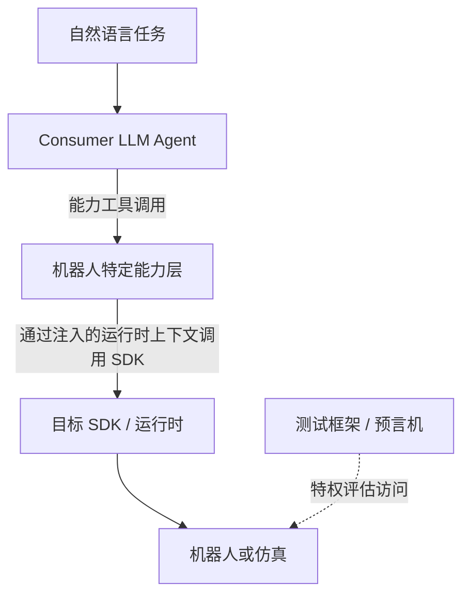

# 机器人能力框架

## 已接受的项目记录

| 字段 | 内容 |
|---|---|
| 项目名称 | **机器人能力框架（Robot Capability Framework）** |
| 当前阶段 | G0 — 研究章程 |
| 实现状态 | 尚未授权；编码是最后一步 |
| 文档状态 | 唯一权威项目记录；仅包含用户明确确认的决定 |
| 权威文件位置 | `/Users/wangyifan/Projects/auto_adapter2.0/ROBOT_CAPABILITY_PRIMITIVES_RESEARCH_MAP.md` |
| 最近整理日期 | 2026-08-04 |

此前工作的 GitHub：https://github.com/981526092/auto-adapter

## 0. 文档规则

只有已经与用户讨论并得到用户明确接受的内容，才可以加入此文件。

`auto_adapter2.0` 中的此文件是项目唯一的权威记录。`/Users/wangyifan/Projects/auto_adapter/` 中的旧副本是冻结的迁移快照：它不具有权威性，也不得接收新的项目决定。

- 助手提出的方案、候选设计、基线、指标、模式（schema）以及基于文献的建议，在被接受之前都只保留在对话中。
- 标记为 `Proposed`、`candidate`、`working draft` 或 `not yet accepted` 的内容不得存入此文件。
- 用户接受某项提议后，记录已接受的表述和日期。
- 当某项决定后来被替代或删除时，仅在历史背景确有必要时保留简洁的状态记录。

此文件独立于旧项目结构。重建后的项目将使用新的代码仓库；旧仓库中的资产可以作为参考，但旧的实验结果或系统设计不会自动继承。

---

## 1. 已接受的项目定位与范围

### 1.1 问题陈述

> 高层具身系统需要一个机器人特定的能力层，将任务级意图转化为可执行行为。如今，这一层通常针对不同机器人和实验被反复手工构建，造成工程工作重复，也使能力接口难以复用或改进。本项目研究机器人能力框架如何基于结构化的机器人与运行时信息、任务描述以及累积的执行经验，构建并维护这一能力层。

### 1.2 核心科学主张

> 机器人特定能力层的构建可以实现证据驱动的自动化：给定结构化的机器人形态、SDK/运行时信息以及具有代表性的任务描述，框架能够确定适当的能力设计，并生成针对该机器人的可执行实现。生成的能力层可以通过其对下游高层具身消费者的效用，以及所需机器人特定工程工作的数量进行独立评估。此外，来自失败执行的经验可以迭代提高生成的机器人特定实现的正确性与鲁棒性。

### 1.3 名称与贡献类型

- 正式项目名称：**Robot Capability Framework（机器人能力框架）**。
- 主要贡献类型：一个**系统/框架**。
- 主要发表单元：完整的硕士论文；之后可以进一步形成顶级会议论文。
- 截止日期：2026-08-25，按 20 个有效工作日规划。
- 不得为了赶截止日期牺牲研究严谨性；必要时应缩小范围。
- 模型/API 实验预算目前不是限制因素。

项目名称并不限定必须采用编译器架构。框架可以包含生成、验证、持久化程序库以及演化/生命周期管理职责。

### 1.4 应用与机器人形态范围

- 主要应用领域：**桌面操作（tabletop manipulation）**。
- 范围内的形态类别：
  - 固定基座串联机械臂；
  - 多臂系统；
  - 移动操作机器人。
- 其他形态类别可作为可选备选方案。
- 仿真是主要实验路线。
- 仿真工作完成后，可以将 SO-ARM101 真机 sim-to-real 检查作为一个小型扩展。
- 运行时到物理系统的保真度不是当前研究问题。

### 1.5 已确认资源

```text
实体机器人：      SO-ARM101
传感器：          Intel RealSense D405
边缘计算：        NVIDIA Jetson Orin Nano
远程计算：        DGX GPU 系统
仿真：            MuJoCo 及相关资产
```

机构审批目前不是规划限制。项目将记录大学/实验室的相关要求，并在正式开展真机试验前解决详细的工程安全问题。

### 1.6 目标受众

- 主要受众：从事具身 AI、机器人学习和智能体机器人研究，并为基于 LLM、VLM、策略或程序的高层消费者构建机器人动作/能力接口的研究人员。
- 次要受众：从事机器人软件系统、自主智能体工具以及受控智能体自我改进的研究人员。
- 本项目被定位为有关中间能力层构建的机器人/具身系统贡献，而非新的基础模型、新的低层控制器或通用软件 API 生成器。

---

## 2. 已接受的定义

### 2.1 机器人能力

> 机器人能力是一个可复用、可选参数化的行为单元，机器人系统可以通过它实现、维持或观察某一类物理或信息结果，并且高层消费者能够识别、选择、调用或组合该行为单元。

高层消费者不限于 LLM Agent。它可以是 Agent、VLM/VLA、学习策略、规划器、程序或其他高层组件。

生成物的拓扑结构和面向 Agent 的表示在第 4.3 节和第 4.4 节中定义。

---

## 3. 已接受的研究问题

### RQ1 — 基于证据的能力层合成

RQ1 包含三个已接受的问题分支：

1. **RQ1.1 — 合成诊断（`生成什么`）：**研究框架能否有效选择应生成的可复用能力，并用能力名称和预期结果表达这些能力。关注能力选择与语义分解。
2. **RQ1.2 — 可执行实现（`能否被正确实现`）：**给定第一阶段能力模式（Stage 1 Capability JSON file/document “修改”），研究框架能否有效设计可执行接口，并通过目标机器人的 SDK/运行时正确实现这些接口。关注接口设计与机器人特定实现。
3. **RQ1.3 — 生成器骨干模型与脚手架的影响：**生成器 LLM/骨干模型以及脚手架是否存在、采用何种形式，会对生成产生何种影响？

目前只接受上述问题层面的划分。尚未接受 RQ1 的任何 2×2 矩阵、因子实验设计、脚手架分类、基线、指标、模型列表、预算规则或实验协议。

如果无法严谨完成包含三个 RQ 的完整研究组合，可以在之后将 RQ1 的三个分支改为论文的三个顶层 RQ。这是一个已接受但尚未启用的备选方案。

### RQ2 — 面向 Agent 的能力粒度

> 在保持机器人侧功能固定时，能力粒度会如何影响高层 Agent 在未见任务类别中选择、参数化、组合、恢复和复用能力的表现？

能力定义仍然与消费者类型无关。受控的 RQ2 实验使用固定的 Consumer LLM Agent。G1–G3 粒度条件及其面向 Agent 的表示在第 4.3 和 4.4 节定义。精确指标和其余统计协议尚未确定。

### RQ3 — 经验驱动的能力结构演化

> 与冻结能力层和非结构化经验复用相比，由经验驱动的生成能力层结构演化，会如何影响未来任务效用、能力复用、程序库增长和回归？

已接受的概念要点：

- 概念层面存在一个共享经验库。
- 演化子系统控制经验反馈过程。
- 经验来自未通过的验证和未成功的任务执行。
- 初步草图中较低层的失败原因抽象会产生经验。
- 内部演化架构、变异操作、检索方法、更新算法和晋升策略均未确定。

尚未接受任何 RQ2 或 RQ3 的基线、指标、变异分类或实验协议。

---

## 4. AutoAdapter — 机器人能力框架设计细节

AutoAdapter 针对选定的机器人/运行时及粒度条件，构建一个机器人特定能力层。主要生成路径、独立的开发验证路径、冻结的任务级 Demo 评估，以及外层的演化职责，是框架中彼此不同的组成部分。

”添加“ - ： 项目被分为三条线：
1.主线：autoadapter，接受结构化的机器人形态以及其他信息，合成并验证机器人能力层
2.自动验证线：自动生成验证标准
3.自动进化线：从以往的失败中获取经验，提升主线和自动验证线能力


### 4.1 框架系统模型与职责边界

机器人能力框架负责：

- 选择一次运行所使用的资产；
- 编排生成阶段 1 和生成阶段 2；
- 编排生成物验证和语言条件开发验证； （“自动验证线“ ）
- 编排开发修复；
- 构建面向 Agent 的能力工具目录；
- 管理目标 SDK/运行时生命周期；
- 编排冻结的 Demo 评估并封存分数；
- 记录失败证据，并控制之后向经验/演化模块的回写。（“自动进化线“）

人工编写的源资产和任务内容、底层机器人 SDK、实体机器人和仿真器，都不属于生成的能力层。Consumer LLM Agent、SDK/运行时、MuJoCo 仿真器、验证任务生成器和预言机（oracle）都是框架调用的外部受控组件。



Consumer 只能调用当前能力层暴露的公共能力工具。它无法获得生成的 Python 源码、私有辅助函数、私有运行时句柄或仿真器真实状态。测试框架和预言机可以读取特权仿真器真实状态用于评估，但该隐藏状态不得直接传给 Consumer Agent，也不得作为能力工具参数暴露。

### 4.2 输入资产与运行构建

初始框架使用四类输入资产集合：

- **形态资产库（Morphology Asset Library）**：机器人形态包，包括相关 MJCF 和 URDF 资产；
- **SDK/运行时资产库（SDK/Runtime Asset Library）**：目标 SDK 包、API/运行时证据，以及使用所选 SDK/运行时所需的信息；例如，SO-ARM101 配置可以使用 LeRobot 作为底层 SDK/运行时；
- **任务描述/证据资产库（Task Description/Evidence Asset Library）**：项目使用的任务参考集合；
- **经验资产库（Experience Asset Library）**：为后续生成轮次选择的可复用经验。其详细记录和演化设计不在本小节规定。

可选的第五个**黄金能力库（Golden Capability Library）**可以在之后包含人工整理的能力示例。它不属于初始系统。

```text
任务库
├── 3/4 生成可见分区 → 生成输入
│                       └→ 选择 3 个已见 Demo 任务
└── 1/4 留出分区 ───────→ 选择 3 个未见 Demo 任务
```

确定一次运行所用的机器人和 SDK/运行时后，框架从四个库中选择相应条目作为生成输入。阶段 1 和阶段 2 可以读取全部已选生成输入，包括完整的 SDK/运行时证据。私有验证材料和留出任务分区不是生成输入。

带传感器的配置被视为一个不同的机器人配置个体。例如，SO-ARM101 与 SO-ARM101 + D405 是不同的运行目标，其所选形态和 SDK/运行时资产应描述完整的配置个体。

这些库是逻辑资产集合；当前 G0 设计不要求数据库服务、发布子系统、强制存储格式、检索算法或快照实现。

### 4.3 生成

生成阶段使用什么进行生成：1. Generation ReAct Agent（AutoAdapter）- 使用不同LLM backbone2. 其他基线。
其他基线有：
1. claude code 和 codex 接受相同输入和最终目标描述
2.


生成阶段候选 LLM Agent 及相关参数：

| 配置 | 参数 |
|---|---|
| 基线 | 待定 |
| 候选模型 | Sonnet 4.6、Opus 4.8、Haiku 4.5、Nova Pro、DeepSeek V3.2、DeepSeek V3.2、Qwen3 |
| AutoAdapter Agent 名称 | Generation ReAct |
| 角色 | 生成的两个阶段：决定合成什么，以及执行合成 |
| 可用工具 |  |
| 文件访问 | 输入的四个文件 |
| 互联网访问 | 无 |
| 需要审批的操作 | 无 |
| 最大轮次 | 30 |

#### 4.3.1 生成阶段 1 — 能力选择

生成阶段 1 决定应为所选机器人/运行时和粒度条件生成哪些公共能力。

阶段 1 读取选定的生成输入资产，并为完整能力列表生成一个**阶段 1 能力 JSON（Stage 1 Capability JSON）**。在本项目中，该术语表示一次运行实际生成的能力列表，其中包含：

- 粒度条件；
- 每个已选公共能力的唯一名称；
- 每个能力预期物理或信息结果的自然语言描述。

阶段 1 决定“生成哪些能力”。它不定义可执行函数参数、参数类型、返回格式、观察接口、实现依赖、SDK 调用、控制逻辑或 Python 代码；也不生成或选择私有验证任务、预言机或通过阈值。

”添加“ - 阶段1度产物会进入自动验证线，用于生成validation第二阶段和demo阶段renewed目的和标准

#### 4.3.2 粒度条件

三个粒度条件保持目标机器人侧功能固定，同时改变面向 Agent 的行为单元，以及留给 Consumer Agent 的组合工作量。

| 层级 | 名称 | 公共能力数量（约） | 能力单元 | 隐藏的执行过程 | Consumer 负担 | 桌面操作示例 |
|---|---|---:|---|---|---|---|
| **G1** | 控制/运动原语 | 5–10 | 单个控制目标或短时域运动 | 通信与局部控制细节 | 高：Consumer 规划动作序列并跟踪任务进度 | `set_joint_target()`、`move_ee_delta()`、`set_gripper_width()` |
| **G2** | 闭环语义能力 | 3–6 | 具有明确物理或信息结果的闭环行为 | 感知—控制循环、终止逻辑和局部失败处理 | 中：Consumer 选择、参数化并组合能力 | `move_to_pose()`、`grasp_object()`、`place_at_pose()`、`detect_object()` |
| **G3** | 可复用复合能力 | 2–3 | 由多个低层操作组成的稳定、可复用子任务 | 多步执行、局部规划与局部恢复 | 较低：Consumer 主要进行任务级组合 | `pick_from_surface(object)`、`place_in_container(object, container)`、`open_drawer(drawer)` |

每个 G 条件都会生成独立的能力层。一次运行只暴露当前 G 条件的工具目录。

#### 4.3.3 生成阶段 2 — 接口设计与机器人特定实现

生成阶段 2 读取：

- 阶段 1 能力 JSON；
- 与阶段 1 相同的已选生成输入资产；
- 为当前轮次选择的、面向实现的经验输入。

阶段 2 可以使用仿真环境执行运动学、碰撞和其他物理检查，也可以在生成实现时使用必要的 Python 工具。

阶段 2 保留阶段 1 定义的公共能力名称和预期结果。对于每个声明的能力，它负责：

- 函数参数、类型和默认值；
- 结果和错误契约；
- 观察与运行时状态的使用；
- 公共函数与私有辅助函数之间的依赖；
- 与目标 SDK/运行时交互；
- 按需实现逆运动学、运动生成、控制、碰撞处理、超时处理和局部恢复；
- 最终的机器人特定 Python 实现。

阶段 2 生成一个 Python 模块，其中包含所选机器人/运行时和 G 条件的全部公共能力函数。阶段 2 输出是生成的候选项；此时它还不是可由 LLM 调用或已经验证的能力层。

#### 4.3.4 生成物拓扑

对于每个目标机器人/运行时和粒度条件，生成的能力层由以下内容组成：

1. 一个包含公共能力名称与描述的阶段 1 能力模式；
2. 一个包含相应机器人特定实现的阶段 2 Python 模块。

各项能力是 Python 模块中的公共函数，而不是独立的能力包。该层级拓扑取代此前接受的方案 A（每项能力一个 Package）拓扑。

”例子： - soarm101 demo完整之后会有示例“


### 4.4 能力层构建与面向 Agent 的工具

#### 4.4.1 公共能力、私有辅助函数与依赖

阶段 1 声明的每项能力，都必须恰好对应阶段 2 Python 模块中的一个公共函数。阶段 2 可以为运动学、轨迹生成、碰撞处理、控制及其他实现需求生成私有辅助函数。私有辅助函数不是能力，也不会向 Consumer Agent 暴露。

公共能力可以调用同一 Python 模块中的其他公共能力或私有辅助函数。每个 G 对应的模块都是自包含的，不会从其他 G 条件导入公共能力。

一个阶段 1 能力模式中的能力名称必须唯一。一个能力层不能包含两个预期结果实质等价的公共能力。共享内部实现本身并不意味着两个能力在语义上等价。

#### 4.4.2 工具表示

每项公共机器人能力都作为一个**LLM 可调用工具**暴露给 Consumer LLM Agent。完整的当前能力层作为一个**工具目录**暴露，其中包含所选机器人/运行时和 G 条件的全部公共能力工具。

项目不使用 `skill` 作为正式的生成物或 Agent 接口术语。只有在描述使用该术语的外部系统或相关文献时，才可以出现 `Skill`。

生成的 Python 模块不会交给 Consumer Agent。框架按以下方式构建面向 Agent 的表示：

- 工具名称和描述来自阶段 1 能力模式；
- 参数类型、必填字段、默认值和结果契约来自阶段 2 的公共函数接口；
- 框架自有的分发器将每次工具调用绑定到对应的 Python 函数；
- 私有运行时句柄由框架注入，并从 LLM 可见参数模式中省略。

当前能力层的所有公共能力对每项任务均可见。框架不会动态选择特定于任务的工具子集。各提供商适配器只能改变 API 序列化格式，不得改变工具名称、描述、参数或行为语义。

#### 4.4.3 能力层状态

能力层依次经历三种不同状态：

1. **生成候选项**：阶段 1 模式加阶段 2 Python 实现；
2. **通过生成物验证、可由 LLM 调用的候选项**：候选项已通过生成物验证，并被确定性地转换为能力工具；
3. **已验证能力层**：面向 Agent 的候选项还通过了语言条件开发验证。

### 4.5 目标 SDK/运行时与仿真绑定

框架管理目标运行时生命周期，并持有当前 SDK/运行时句柄。生成的能力函数使用框架注入的现有运行时上下文；它们不会创建、重连、替换或关闭运行时连接。

运行时上下文是框架的私有状态，不包含在 Consumer Agent 的工具参数模式中。概念上，Agent 可以调用 `move_to_pose(target_pose)`，而框架在内部使用注入的运行时上下文调用该实现。

生成的能力负责机器人特定能力逻辑，包括按需实现逆运动学、运动生成、控制和执行监控。它们只能通过目标 SDK/运行时接口发送命令和读取允许访问的机器人状态。

在仿真中，一个固定的人工编写 SDK–MuJoCo 适配层将 SDK 命令转换为 MuJoCo 控制输入，并将 MuJoCo 状态转换为 SDK 可见观察。该适配层是受控实验基础设施，不属于生成能力产物，并在所有生成条件和粒度条件中保持固定。

生成的能力和 Consumer Agent 不得绕过 SDK/运行时接口直接访问 MuJoCo 状态。测试框架和预言机可以访问 MuJoCo 特权真实状态进行评估，但除非该状态也属于获准的 SDK 观察接口，否则不能通过能力工具暴露。

人工编写的适配层将被报告为固定仿真基础设施，不属于自动生成的能力代码。

“添加”：
Consumer LLM Agent
        ↓ tool call
warpped Validated LLM-callable Capability Layer
        ↓ SDK calls
Target SDK / Runtime

### 4.6 验证

顶层验证分为两类：

1. **生成物验证（Artifact Validation）**；
2. **语言条件开发验证（Language-conditioned Development Validation）**。- “修改，目前我们改为了直接调用python函数”

只有这两类验证产生的失败可以返回阶段 2，用于修改当前候选项。之后的 Demo 是任务级评估，不是第三类验证，也不属于开发修复循环。

“添加”两者都通过之后，使用包装工具，把python module转为tools

#### 4.6.1 独立验证权威

验证任务、预言机谓词和通过阈值独立于生成阶段 1 和阶段 2 被制定并冻结。验证标准由人类研究者编写。私有验证任务生成器可以读取公共的阶段 1 能力名称和描述，以及独立的验证参考材料，从而实例化能力级验证用例。

生成阶段 1 和阶段 2 不会创建、选择、降低或修改验证任务、预言机或接受阈值。独立性并不要求开发期间永久保密：详细验证结果和阈值差距可以作为验证引导的修复反馈返回阶段 2。

#### 4.6.2 生成物验证与确定性工具构建

“一下一段都要修改了，我们现在已经使用代码，直接调用python module来做这个而不是自然语言”
阶段 2 首先生成候选 Python 模块。生成物验证在其可被 Consumer Agent 调用之前检查该生成物，按顺序包含两个部分。

基础生成物检查包括：

- Python 语法、结构、导入及必需文件检查；
- 能力命名及其与阶段 1 模式的一致性；
- 每个阶段 1 能力恰好对应一个公共可调用对象；
- 不存在未声明的公共能力函数；
- 函数签名、类型、参数和结果模式检查；
- 确认运行时句柄为私有状态，并且不属于面向 Agent 的参数。

生成阶段 2 不会自由生成特定于提供商的 LLM 包装器。基础生成物检查通过后，框架确定性地构建工具目录和分发器，然后检查每个工具定义、参数模式、结果契约、分发器绑定及公共函数是否保持一致。两个部分均通过后，产生通过生成物验证、可由 LLM 调用的候选项。实现或可调用接口中的失败将返回阶段 2 修复。

“添加的新功能”：
“记录”已经有：每轮都有 feedback_NN.json、repair_result_NN.json、static/direct report，以及同一 Generation Agent 的完整 append-only generation_trace.jsonl。所以 repair 过程没有丢，能事后用于 evolution。
“让下一轮看到并利用”目前不完整：为了控制上下文，每轮 repair 会建立新的 context epoch；它保留同一 agent_id/session_id/episode_id 和前史哈希，但发给模型的内容主要是当前反馈与包 checkpoint，没有把前几轮的 unresolved failure/采取过的修复/验证结果以结构化摘要重新注入。这就是它在两个错误之间摆动的原因。

#### 4.6.3 语言条件开发验证

```text
已验证、可由 LLM 调用的能力层
├── 面向 Agent 的工具契约
│   └── 名称 / 描述 / 参数模式
└── 阶段 2 Python 实现
    ├── 能力函数
    ├── IK / 运动 / 控制
    └── 框架绑定的运行时句柄

Consumer LLM Agent
        ↓ 工具调用
已验证、可由 LLM 调用的能力层
        ↓ SDK 调用
目标 SDK / 运行时
```

语言条件开发验证检查每项公共能力能否通过其面向 LLM 的工具接口被调用，并满足其声明的物理或信息结果。

一个验证用例会标识被测能力，并提供自然语言指令、目标参数、初始环境状态、能力特定成功谓词和通过阈值。由于该阶段测试能力一致性，而非开放式任务规划，因此可以明确指定目标能力名称。

例如，`move_to_pose` 用例可以要求 Consumer Agent 使用该能力到达指定目标位姿。与位置有关的预言机可以接受末端执行器最终位置与目标相距不超过 `0.005 m`，同时满足适用的姿态、碰撞、关节限制和超时要求。`0.005 m` 容差只是位置能力的示例，并非抓取、放置、感知或其他能力类型的通用阈值。

详细反馈可以返回阶段 2，包括执行错误、物理结果、预言机测量结果，以及观察结果与所需阈值之间的差距。阶段 2 可以修改 Python 实现，但不得修改验证用例、预言机或阈值。

每次实现变更后，候选项必须重新执行生成物验证、确定性工具构建和所需的语言条件开发验证。通过此开发验证流程，只能证明允许修复后的能力级一致性；它不被视为未经接触的留出证据。

只有同时通过生成物验证，以及人工制定的语言条件开发验证聚合规则后，完整候选能力层才会成为**已验证能力层**。

### 4.7 冻结的混合 Demo 评估

冻结 Demo 对完整的 Consumer LLM Agent 和已经通过生成物验证与语言条件开发验证的能力层进行评估。Demo 任务描述期望结果，但不规定能力名称、工具调用序列或解决流程。例如，Agent 可以收到 `抓取红色方块`，并必须自主选择、参数化和组合可用的能力工具。

任务库按以下方式划分：

```text
完整任务库
├── 约 3/4 生成可见任务
└── 约 1/4 留出任务
```

最终留出分区不用于可修复的开发验证循环。冻结 Demo 批次包含：

```text
Demo 评估批次
├── 3 个生成可见 / 已见任务
└── 3 个留出 / 未见任务
```

已见与未见是相对于能力生成而言的。Consumer Agent 在执行时必然会接收当前任务指令。

六项 Demo 任务在观察结果之前选定。三个已见任务和三个留出任务应分别在任务类别、预期结果、所需能力组合、交互类型、空间或碰撞要求、执行时域或观察需求方面存在显著差异。两组任务在难度和执行条件方面应大致可比。已见任务使用新的执行实例，而不是重放完整参考轨迹。

G1、G2、G3 以及所有被比较的 Consumer 模型使用相同的六项 Demo 任务。批次开始前冻结以下内容：

- 能力层和工具目录；
- Consumer Agent 配置；
- 六项任务及其已见/留出标签；
- 预言机谓词和阈值；
- 执行顺序或其随机种子。

每项任务之间都会重置 Consumer Agent 的上下文/历史和环境状态。无论已见还是留出任务，Demo 失败都不会返回阶段 2 修复。被评估的能力层保持固定，失败任务不会使用修改后的实现重新运行，该能力层的 Demo 分数即为最终分数。已见任务、留出任务和总体结果分别保留。

所有批次分数封存后，符合条件的失败证据可以进入之后的演化过程。此类证据只能影响未来生成的能力层；不能追溯修改冻结层，也不能对同一 Demo 批次重新评分。一旦某个留出批次参与持久化回写，它就已被消耗，不能作为更新系统的留出证据再次使用；必须使用下一个未经接触的批次。

### 4.8 候选消费者及配置

**消费者（Consumer）**是接收任务或目标，并使用当前能力层公共接口的下游决策系统。消费者不要求必须是 LLM Agent。

#### 4.8.1 候选消费者

| 候选消费者 | 消费者类型 | 任务输入 | 能力访问 | 控制架构 | 状态 |
|---|---|---|---|---|---|
| ReAct Agent | 基于 LLM 的 Agent | 自然语言任务和获准的观察 | 完整的当前 LLM 可调用能力工具目录 | ReAct 观察—动作循环 | 当前候选项 |

选定的 Consumer 配置将在正式评估前冻结。当前候选项通过一个小型 SO-ARM101 开发试点进行评估，该试点不使用最终留出任务分区。

#### 4.8.2 基于 LLM 的候选 Consumer 模型

| 候选模型 | 提供商 |
|---|---|
| Sonnet 4.6 | Anthropic |
| Opus 4.8 | Anthropic |
| Haiku 4.5 | Anthropic |
| Nova Pro | Amazon |
| DeepSeek V3.2 | DeepSeek |
| Ministral 8B | Mistral |
| Qwen3 32B | Alibaba |

#### 4.8.3 Consumer 运行时参数

| 参数 | 选定值 |
|---|---|
| 提供商/访问路径|“之前generation阶段一样的API”  |
|
| Agent 最大步数 | 在开发试点后确定 |
| Temperature | 在开发试点后确定 |
| Seed | 在开发试点后确定 |

#### 4.8.4 系统提示词

Consumer Agent 的系统提示词保存在单独文件中，而不是嵌入此参数表。正式实验记录引用所选提示词产物和冻结的运行时配置。

### 4.9 演化

- **内层职责**是能力生成。
- **外层职责**是能力演化/生命周期管理。
- 这些只是概念职责；其具体模块、算法、接口、调度和生成物边界尚未确定。
- 演化选择的经验将在之后的生成/演化轮次中，通过框架的经验输入返回。

### 4.10 recording 以及 artifact，生成过程中要记录什么
“添加”
可以去参考auto adapter文章，里面记录了消费，时间，还有最终demo阶段的视屏recording

### 4.11 Scene 资产（科研最小设计）

Scene 不是第五类输入，也不需要独立 Scene Builder。机器人本体与 table、
cube、tray、bowl 等物品都属于 Morphology Library。task/case 只提供
`asset_ref + id + pose + goal`；几何、质量、摩擦和碰撞参数由同一个 catalog
解析。只有实际执行 Generation probe、Validation B case 或 Demo task 时才
创建 fresh MuJoCo world。未知引用返回 `MISSING_ASSET`，在后续版本手工补入
Morphology Library 后重新运行；当前 run 不修改资产库。

### 4.12 shim and bridge
“添加”
Generation 生成的 capability 函数
        ↓ 调用 LeRobot 0.6.0 风格接口
connect / get_observation / send_action / disconnect
        ↓
LeRobot-compatible shim / bridge
        ↓
MuJoCo 的 MjModel / MjData、关节 actuator、接触与物体状态

---


## 5. G0 状态

### 已接受

- 问题陈述与核心科学主张；
- 目标受众与具身系统定位；
- 项目名称与系统/框架贡献类型；
- 论文单元、截止日期和不走捷径原则；
- 核心能力定义；
- 三个主要 RQ 及未启用的仅 RQ1 备选方案；
- 实体与计算资源；
- 机器人形态类别和桌面操作范围；
- 仿真优先计划和可选 SO-ARM101 扩展；
- 概念上的生成/演化职责；
- 共享经验库和由失败产生的经验；
- 两类验证；
- 留出批次的冻结—评分—吸收规则；
- 四个初始输入资产库和可选、初始禁用的黄金能力库；
- 两阶段生成：阶段 1 能力选择，随后阶段 2 接口设计和机器人特定实现；
- 每个目标机器人/运行时和粒度条件对应一个阶段 1 能力模式和一个阶段 2 Python 模块；
- G1、G2、G3 面向 Agent 的粒度条件；
- 每项公共能力对应一个 LLM 可调用工具，每个当前能力层对应一个工具目录；
- 框架管理运行时句柄，并在仿真中使用固定的人工编写 SDK–MuJoCo 适配层；
- 独立的能力级开发验证，随后进行冻结的任务级 Demo 评估；
- 混合 Demo 批次包含三个生成可见任务和三个留出任务；
- 与消费者类型无关的下游角色，ReAct Agent 是目前唯一的候选 Consumer。

### 尚未接受；须先在对话中讨论

- 目标投稿场所；
- 详细的可证伪性陈述；
- 输入资产最终的序列化、存储与检索机制；
- 阶段 2 最终参数/结果约定与工具目录顺序；
- 最终的能力特定验证用例、聚合通过规则和重复试验协议；
- 最终 Consumer 模型选择和运行时参数值；
- 内部演化设计与边界；
- 其余所有 RQ 基线、消融、指标、脚手架和统计协议；
- 详细工程安全协议。

### 延后的 G0 项目

详细的 `RQ → 所需证据 → 可用资源 → 可行性` 矩阵暂时延后。它仍未解决，在判断 G0 是否通过时不能计为已完成。


---
## 6 git
“添加 - 源码保存部分”
对于这个科研 Demo，删除没有问题，而且已经通过离线主流程、schema 和 report-audit 回归。唯一需要明确的是：哈希不能恢复已经丢失的源码，所以项目源码本身仍要随实验一起保存；正式论文发布时再在 run_inputs.json 增加 Git commit/tag 即可。生产审计系统可能值得保留整份源码快照，但我们当前不需要。

## 7. 已接受的决策日志

| 日期 | 已接受的决定 |
|---|---|
| 2026-08-02 | 保持重建记录独立于旧项目结构，只有在研究和系统计划获得接受后才编写代码。 |
| 2026-08-03 | 使用 **Robot Capability Framework** 作为项目名称，不预先限定编译器或契约驱动架构。 |
| 2026-08-03 | 将 Agent、VLM/VLA、学习策略、规划器、程序和其他高层组件都视为可能的能力消费者。 |
| 2026-08-03 | 以完整硕士论文为主要单元，之后可能形成顶级论文；截止日期为 2026-08-25，但不降低研究严谨性。 |
| 2026-08-03 | 将贡献定位为系统/框架。 |
| 2026-08-03 | 接受第 2.1 节修订后的机器人能力定义。 |
| 2026-08-03 | 确认 SO-ARM101、RealSense D405、Jetson Orin Nano、远程 DGX 和 MuJoCo 为可用资源。 |
| 2026-08-03 | 将固定基座串联机械臂、多臂系统和移动操作机器人作为形态类别，以桌面操作为主要领域。 |
| 2026-08-03 | 从当前 RQ 中移除运行时到物理系统的保真度，以仿真为主线，并将后续 SO-ARM101 扩展设为可选项。 |
| 2026-08-03 | 接受 RQ1 合成、RQ2 粒度和 RQ3 结构演化。 |
| 2026-08-03 | 仅在问题层面接受 RQ1.1 合成诊断、RQ1.2 可执行实现和 RQ1.3 生成器骨干/脚手架影响。 |
| 2026-08-03 | 接受由演化控制的共享经验库，其输入来自失败验证和分数封存后的失败任务执行。 |
| 2026-08-03 | 接受有序的冻结—评分—吸收留出批次。 |
| 2026-08-03 | 演化模块内部保持未指定，同时将失败原因抽象解释为经验创建。 |
| 2026-08-03 | 只使用生成物验证和语言条件能力层验证作为顶层验证类别。 |
| 2026-08-03 | 如果之后证明完整 RQ 组合不可行，则接受将 RQ1.1–RQ1.3 改为顶层 RQ 的备选方案。 |
| 2026-08-03 | 延后行为树和 TAMP。 |
| 2026-08-04 | 此文件只保存用户明确批准的内容；所有未经批准的设计留在对话中。 |
| 2026-08-04 | 接受第 1.1 和 1.2 节的最终问题陈述与核心科学主张。 |
| 2026-08-04 | 接受第 1.6 节的目标受众与具身系统定位。 |
| 2026-08-04 | 确认 Capability design 和 Robot-specific implementation 分别描述 RQ1.1 与 RQ1.2 的含义；保留原 RQ 标题 Synthesis diagnosis 和 Executable realization。 |
| 2026-08-04 | 使用形态、SDK/运行时、任务描述/证据和经验作为四个初始输入资产库；把黄金能力库作为可选的未来第五项输入，而非初始要求。 |
| 2026-08-04 | 最初选择方案 A：每项机器人特定能力和目标机器人/运行时对应一个完整能力包。该决定随后在 2026-08-04 被下述能力层级生成物拓扑取代。 |
| 2026-08-04 | 用每个目标机器人/运行时和粒度条件对应的一个阶段 1 能力模式及一个阶段 2 Python 实现模块，取代每项能力一个 Package 的拓扑。各项能力是该模块中的公共函数。 |
| 2026-08-04 | 将生成阶段 1 定义为通过名称和预期结果描述进行能力选择；将可执行参数/接口设计和机器人特定实现分配给生成阶段 2。 |
| 2026-08-04 | 将每项公共机器人能力作为一个 LLM 可调用工具暴露给 Consumer LLM Agent，并将当前能力层作为工具目录暴露；不使用 `skill` 作为正式项目生成物术语。 |
| 2026-08-04 | 将 G1、G2、G3 用作独立的面向 Agent 粒度条件，其公共能力数量约为 5–10、2–6 和 2–3。 |
| 2026-08-04 | 由框架持有并注入 SDK/运行时句柄；生成能力通过 SDK 执行机器人特定 IK、运动和控制，固定的人工 SDK–MuJoCo 适配层将 SDK 连接到仿真。 |
| 2026-08-04 | 由阶段 2 生成候选 Python 模块，执行生成物验证，在框架中确定性构建 LLM 可调用工具，然后进行能力级语言条件开发验证，并使用验证反馈指导阶段 2 修复。 |
| 2026-08-04 | 将能力级开发验证与任务级 Demo 评估分开；使用冻结的混合 Demo 批次，其中包含从约 3/4–1/4 任务库分区中选择的三个生成可见任务和三个留出任务。 |
| 2026-08-04 | 只有生成物验证和语言条件开发验证的失败才能返回阶段 2 修复。Demo 失败不会修改或触发冻结评估层的重新提交；分数封存后，它们只能通过独立的演化过程影响未来能力层。 |
| 2026-08-04 | 将唯一权威项目记录移至 `auto_adapter2.0`；旧 `auto_adapter` 副本仅保留为冻结、非权威的迁移快照。 |
| 2026-08-04 | 将下游角色从 LLM Agent 泛化为可使用其他决策架构的 Consumer；将 ReAct Agent 记录为目前唯一的候选 Consumer。 |
