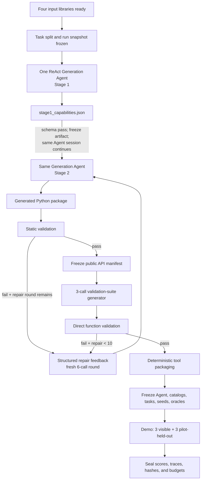

# SO-ARM101 Minimal Capability-Generation Demo Plan

> **Status:** User-requested working DemoPlan, updated 2026-08-05 to match the
> current implementation. The latest protocol/source fixes have local test
> evidence; this document does **not** claim that a new post-fix AWS end-to-end
> replay has passed.
>
> **Authority boundary:** This file plans a standalone SO-ARM101 demo. It does not modify or replace the accepted project record in `ROBOT_CAPABILITY_PRIMITIVES_RESEARCH_MAP.md`. Where this demo intentionally uses a different mechanism—especially direct-function Development Validation—the difference is stated explicitly.

## 1. Purpose

Build one small but real end-to-end demo that resolves the concrete details of:

```text
four input libraries
    -> one continuous ReAct Generation Agent
        -> Stage 1: capability selection and JSON artifact
        -> Stage 2: Python package implementation
    -> static validation
    -> direct-function physical validation and repair
    -> deterministic tool packaging
    -> 3 visible + 3 pilot-held-out Demo tasks
    -> sealed run report
```

The demo is a reusable sample for the later multi-robot project. It is not intended to establish the final RQ1/RQ2/RQ3 evidence, compare models, or report a formal held-out result.

### 1.1 Demo success

The demo succeeds as a systems prototype when it proves that:

1. the four libraries have versioned, extensible formats;
2. generation-visible and private assets are physically separated;
3. Stage 1 can propose G1, G2, and G3 capabilities in a validated JSON artifact;
4. Stage 2 can generate an importable Python package within its LLM budget;
5. static and direct-function validation execute against a LeRobot-compatible MuJoCo runtime;
6. structured failures return to Stage 2 for no more than ten repair rounds;
7. only validated functions become LLM-callable tools;
8. the Demo Agent executes three visible and three pilot-held-out tasks under a frozen configuration;
9. all inputs, model calls, artifacts, failures, repairs, task traces, scores, and termination reasons are reproducible.

High Demo success rate is desirable, but it is not the criterion for deciding whether the plumbing itself works.

The current implementation also contains a deterministic post-run Evidence
Compiler. The proposed global-audit ReAct Evolution Agent and validated
Experience publication close the later Evolution loop, but are still awaiting
final design approval and implementation. They must not be reported as already
implemented or used as current completion evidence.

## 2. Fixed scope and working interpretations

### 2.1 Fixed scope

| Item | Demo choice |
|---|---|
| Robot | SO-ARM101 with its standard gripper |
| Robot alias | Canonical ID `soarm101`; accepted source aliases include `so101` |
| Runtime contract | LeRobot SO-101 follower public interface |
| Simulator | MuJoCo |
| Sensor scope | Proprioception only in P0; no D405/image perception |
| Tasks | SO-ARM101 tabletop manipulation tasks adapted from public benchmark ideas |
| Experience | Library schema and loader exist; the library contains zero records |
| Generation | One continuous ReAct Generation Agent, producing one Stage 1 artifact and then one Stage 2 Python package |
| Validation | Static checks followed by direct Python function calls |
| Demo | One mixed capability catalog, three visible tasks, three pilot-held-out tasks |
| Real robot | Out of scope for this demo |

Because P0 has no camera or object-perception service, every task supplied to the Agent must include the structured scene facts needed to act, such as object and target coordinates. MuJoCo ground truth used for scoring remains private. Adding the D405 later creates a different configured robot individual and a new task route.

### 2.2 Interpretation of G1–G3 output

Stage 1 produces one `stage1_capabilities.json` containing three independently grouped proposals:

- G1: control/motion primitives;
- G2: closed-loop semantic capabilities;
- G3: reusable compound capabilities.

Stage 2 produces one importable Python package with three self-contained modules:

```text
generated_capability_package/
├── __init__.py
├── g1.py
├── g2.py
├── g3.py
└── capability_manifest.json
```

Functions in one granularity module must not import public functions from another granularity module. The tool packager emits G1-only, G2-only, G3-only, and combined catalogs. P0 runs the combined catalog once to test the whole pipeline. The later formal granularity experiment will expose one catalog at a time and is not part of this demo.

### 2.3 LLM and repair budgets

An **LLM call** is one request sent to the configured model API. Local tool execution, Python subprocesses, schema validation, and MuJoCo steps do not count as LLM calls.

| Stage | Budget |
|---|---:|
| Stage 1 | default maximum 3 calls: generate, schema correction, final schema correction |
| Stage 2 initial implementation | maximum 30 calls; this counter closes when the initial package is returned |
| Validation-suite generator | maximum 3 calls total: generate, review-and-rewrite, final review-and-rewrite |
| Repair | maximum 10 rounds; every round receives a fresh maximum 6-call counter and does **not** consume the initial Stage 2 30 calls |
| Demo Consumer | maximum 30 calls per task, with context reset between tasks |

If the initial Stage 2 counter, one repair-round counter, or the ten-round limit is exhausted before that unit completes, validation terminates as failed. Stage 1, initial Stage 2, and each repair round are separate accounting windows in one continuous Generation Agent session/history. Every API request is written to its own window counter and audit log.

## 3. End-to-end state machine



### 3.1 State transitions

```text
INIT
  -> INPUT_LIBRARIES_READY
  -> TASK_SPLIT_FROZEN
  -> GENERATION_AGENT_READY
  -> STAGE1_RUNNING
  -> STAGE1_FROZEN
  -> STAGE2_RUNNING
  -> STATIC_VALIDATION
  -> VALIDATION_SUITE_GENERATION
  -> DIRECT_FUNCTION_VALIDATION
  -> TOOL_PACKAGING
  -> DEMO_FROZEN
  -> DEMO_RUNNING
  -> SEALED
```

Terminal failure states are:

- `INPUT_INVALID`;
- `GENERATION_FAILED`;
- `VALIDATION_SUITE_GENERATION_FAILED`;
- `VALIDATION_FAILED`;
- `TOOL_PACKAGING_FAILED`;
- `INFRASTRUCTURE_FAILED`.

Infrastructure errors must not be silently counted as capability failures.

`STAGE1_RUNNING` and `STAGE2_RUNNING` are two phases of the same Generation Agent instance. The orchestrator changes the phase and available tools after the Stage 1 artifact is frozen; it does not construct a new Agent or start a new generation conversation.

## 4. Common library conventions

All four libraries use the same outer convention:

```text
<library_type>/<entry_id>/<version>/
├── manifest.yaml
├── sources.yaml
└── type-specific payloads
```

Every `manifest.yaml` contains at least:

```yaml
schema_version: robot_capability.library_manifest.v1
library_type: morphology | sdk_runtime | tasks | experience
entry_id: string
version: string
status: draft | ready | deprecated
generation_visibility: visible | private | mixed
payloads: []
content_hashes: {}
compatibility: {}
provenance: {}
```

Every library implements the small loader interface:

```python
class Library:
    def verify(self) -> "VerificationReport": ...
    def get(self, entry_id: str, version: str) -> "LibraryEntry": ...
    def generation_view(self, entry_id: str, version: str) -> "Snapshot": ...
```

`generation_view()` is an allowlist-based materialization into the run snapshot. The Generation Agent never receives a root filesystem browser and never relies on prompts alone to avoid private files.

## 5. Morphology Asset Library

### 5.1 Format

```text
libraries/morphology/soarm101/v1/
├── manifest.yaml
├── sources.yaml
├── model/
│   ├── so101.xml
│   └── meshes/
├── kinematics.yaml
└── compile_probe.json

libraries/morphology/scenes/soarm101_tabletop/v1/
├── manifest.yaml
├── scene.yaml
└── assets/
    └── primitive_catalog.yaml
```

The scene registry is a child of the Morphology Library, not a fifth input
library. `scene.yaml` defines the compatible tabletop workspace and composition
contract. The primitive catalog owns the reusable table, cube, cylinder, tray,
bowl, and target-marker geometry/physics. Task records select these assets by
immutable `asset_ref` and supply a concrete task instance; they do not redefine
physical assets inline.

`kinematics.yaml` records machine-readable morphology facts without prescribing capabilities:

```yaml
robot_id: soarm101
morphology_family: fixed_base_serial_manipulator
joints:
  - name: shoulder_pan
    type: revolute
    limits: {}
  - name: shoulder_lift
    type: revolute
    limits: {}
  - name: elbow_flex
    type: revolute
    limits: {}
  - name: wrist_flex
    type: revolute
    limits: {}
  - name: wrist_roll
    type: revolute
    limits: {}
gripper:
  present: true
end_effector:
  frame_or_site: string
base:
  fixed: true
```

The exact names, limits, actuator mapping, frames, and mesh hashes are extracted from the selected MJCF and verified by compiling it with the pinned MuJoCo version.

### 5.2 Source

The initial asset comes from the predecessor repository's RobotStudio SO-101 MJCF bundle:

- `assets/mjcf/robotstudio_so101/so101.xml`;
- the referenced mesh directory;
- the asset README, LICENSE, and change log.

The generation-visible morphology bundle contains both the robot entry and the
public SOARM101 tabletop scene/catalog entry. Public scene facts and a synthetic
non-task smoke instance may be used by Generation. Private task realizations,
oracle thresholds, weld/grasp helpers, validation code, and historical drivers
remain outside that view.

Freezing the twelve task/initial-state specifications resolves and hashes their
asset references but constructs no MuJoCo model or data (`worlds_created = 0`).
The bridge composes a fresh robot-plus-scene world just in time for an actual
public Generation probe, Validation B case, or selected Demo task. It does not
prebuild twelve worlds merely because twelve task records exist.

The demo copies the approved asset subset with provenance and license information. It must not import files from the predecessor repository at runtime.

## 6. SDK/Runtime Asset Library

### 6.1 Version pin

The demo pins **LeRobot v0.6.0**, release commit `30da8e6`, rather than following `main`.

Reasons:

- the official project has continued to change import paths and configuration fields after v0.6.0;
- a generated package must target one reproducible SDK surface;
- the SDK library must distinguish documented facts, probed facts, and compatibility assumptions.

Planned environment pin:

```text
Python 3.12
lerobot[core_scripts,feetech]==0.6.0
MuJoCo version pinned separately by the demo lock file
```

Official sources:

- [LeRobot v0.6.0 release](https://github.com/huggingface/lerobot/releases/tag/v0.6.0)
- [v0.6.0 installation guide](https://huggingface.co/docs/lerobot/v0.6.0/installation)
- [SO-101 guide](https://huggingface.co/docs/lerobot/v0.6.0/so101)
- [SO follower configuration source](https://github.com/huggingface/lerobot/blob/v0.6.0/src/lerobot/robots/so_follower/config_so_follower.py)
- [SO follower runtime source](https://github.com/huggingface/lerobot/blob/v0.6.0/src/lerobot/robots/so_follower/so_follower.py)
- [LeRobot Robot base protocol](https://github.com/huggingface/lerobot/blob/v0.6.0/src/lerobot/robots/robot.py)

### 6.2 Format

```text
libraries/sdk_runtime/lerobot_soarm101/0.6.0/
├── manifest.yaml
├── sources.yaml
├── api_surface.yaml
├── runtime_contract.yaml
├── examples/
│   └── minimal_follower.py
└── api_probe.json
```

The generation-visible `api_surface.yaml` contains SDK facts, not a desired capability list.

### 6.3 SO-101 public SDK surface

Canonical import:

```python
from lerobot.robots.so_follower import SO101Follower, SO101FollowerConfig
```

In v0.6.0 these names alias the generic `SOFollower` and `SOFollowerRobotConfig`, so validators must not depend on the concrete runtime class name.

Relevant configuration:

- `port`;
- inherited `id` and calibration location;
- `disable_torque_on_disconnect`;
- `max_relative_target`;
- `cameras`;
- `use_degrees`.

Relevant user-facing surface:

- properties: `observation_features`, `action_features`, `is_connected`, `is_calibrated`;
- setup/lifecycle: `setup_motors()`, `connect(calibrate=True)`, `calibrate()`, `configure()`, `disconnect()`;
- runtime: `get_observation()`, `send_action(action)`.

Without cameras, action and observation use six scalar fields:

```text
shoulder_pan.pos
shoulder_lift.pos
elbow_flex.pos
wrist_flex.pos
wrist_roll.pos
gripper.pos
```

With `use_degrees=True`, the first five values use degrees and the gripper uses normalized `[0, 100]`. `send_action()` writes joint position targets and returns the action actually sent, potentially clipped by `max_relative_target`. It does not perform IK, trajectory generation, collision checking, waiting for arrival, or timeout handling; it also does not return a post-motion observation.

`api_probe.json` verifies these imports, signatures, properties, feature keys, units, return shapes, and non-blocking semantics against the pinned installation before generation begins.

### 6.4 Generation leakage rule

The SDK library must not expose predecessor artifacts such as:

- `joint_arm_v1` required method names;
- desired driver/capability lists;
- `primitive_tasks.yaml`;
- reference adapters;
- validation source code, reports, or historical generated code.

Those artifacts would answer Stage 1's research question in advance.

## 7. Task Description/Evidence Asset Library

### 7.1 Public benchmark research

The task library adapts task semantics and record-design ideas; it does not copy another benchmark's simulator, robot model, or controller.

| Source | What the demo borrows |
|---|---|
| [LIBERO](https://github.com/Lifelong-Robot-Learning/LIBERO) | Spatial, object, goal, and long-horizon task axes; separation of scene, initial state, goal predicate, and language |
| [LIBERO procedural task generation](https://lifelong-robot-learning.github.io/LIBERO/html/procedural_generation/task_generation.html) | Structured task templates rather than text-only tasks |
| [LIBERO-PRO](https://github.com/Zxy-MLlab/LIBERO-PRO) | Object, position, semantic, task, and environment generalization axes |
| [RLBench tasks](https://github.com/stepjam/RLBench/tree/master/rlbench/tasks) | Task variations, multiple language descriptions, and composable success conditions |
| [CALVIN](https://github.com/mees/calvin) | Ordered composition of atomic language-conditioned subtasks |
| [ManiSkill tabletop gripper tasks](https://maniskill.readthedocs.io/en/latest/tasks/table_top_gripper/index.html) | Physics-grounded reach, pick, lift, push, place, stack, and insertion task cards; direct SO-series inspiration |
| [RoboCasa benchmark](https://robocasa.ai/docs/build/html/benchmarking/benchmarking_overview.html) | Atomic-seen, composite-seen, and composite-unseen distinctions |

### 7.2 Task record format

Task templates are JSON Lines records validated against one JSON Schema. A record contains:

```yaml
task_id: string
version: string
robot_scope: [soarm101]
scene_id: string

language:
  canonical: string
  paraphrases: []

taxonomy:
  family: reach | push | grasp_hold | lift | pick_place | stack | composite
  level: atomic | composite
  skill_sequence: []
  goal_predicates: []
  object_affordances: []
  spatial_relations: []
  horizon_class: short | medium | long
  precision_class: low | medium | high

initial_state:
  template_id: string
  public_scene_facts: {}
  seed_policy: {}

goal:
  public_description: string
  private_predicate_ref: string

generalization_axes:
  object: string
  position: string
  semantic: string
  task: string
  environment: string

split:
  visibility: generation_visible | demo_heldout
  template_id: string
  similarity_group: string

provenance:
  inspired_by: []
  source_urls: []
  license_notes: []
```

Private initial-state realizations, exact oracle predicates, thresholds, and held-out language stay outside the generation-visible record.

### 7.3 Library layout

```text
libraries/tasks/soarm101_tabletop/v1/
├── manifest.yaml
├── taxonomy.yaml
├── sources.yaml
├── visible_tasks.jsonl
└── splits/
    └── split_manifest.json

private/task_library/soarm101_tabletop/v1/
├── heldout_tasks.jsonl
├── task_oracles.yaml
├── initial_states/
├── similarity_matrix.json
└── demo_batch.json
```

The public split manifest exposes counts, schema version, selection seed, policy version, and hashes, but it does not expose held-out instructions, predicates, object choices, or initial states.

### 7.4 Classification and similarity

Splitting is performed at task-template/similarity-cluster level, never by randomly separating paraphrases or seeds from the same template.

The default structured task distance is:

```text
35% skill-sequence edit distance
25% goal-predicate set distance
15% object-affordance distance
15% spatial/receptacle distance
10% horizon and precision distance
```

Text embeddings are used only for retrieval and detecting paraphrases inside a structural cluster. They do not independently determine the visible/held-out boundary.

Split procedure:

1. filter out tasks infeasible for the SO-ARM101 workspace and gripper;
2. normalize task verbs, predicates, objects, spatial relations, and skill sequences;
3. compute and record all distance components;
4. cluster complete templates together with all seeds and paraphrases;
5. perform a deterministic, stratified 3:1 split by cluster;
6. audit cross-split nearest neighbours for leakage;
7. freeze content hashes before Generation begins.

### 7.5 Initial 12-task pilot catalog

Generation-visible templates:

1. reach a specified colored target pose;
2. push a cube into a target region;
3. grasp a cube and hold it stably;
4. lift a cube by a specified height;
5. place a cube on a planar target and release it;
6. place a cube into a tray and release it;
7. place a cylinder into a tray and release it;
8. stack a red cube on a green cube;
9. place two named objects into one tray in sequence.

Pilot-held-out templates:

1. push a cylinder into a lateral target region;
2. move a cube from a new initial region into a bowl;
3. place red and blue cubes into their matching trays.

The three held-out tasks intentionally provide near, medium, and farther generalization while reusing visible atomic behavior. Final task feasibility and tolerance values are frozen only after SO-ARM101 reachability and repeated-execution probes.

## 8. Experience Asset Library

### 8.1 Format

```text
libraries/experience/v1/
├── manifest.yaml
├── experience.schema.json
└── records.jsonl
```

`records.jsonl` exists but is empty. `manifest.yaml` records `record_count: 0` and the hash of the empty file.

The interface is real even though it returns no records:

```python
class ExperienceLibrary:
    def list(self) -> list["ExperienceRecord"]: ...
    def select(self, ids: list[str]) -> list["ExperienceRecord"]: ...
    def generation_view(self, ids: list[str]) -> list[dict]: ...
```

The current P0 input starts with no Experience records. Its implemented
Evidence Compiler may save a redacted candidate bundle in the run directory,
but does not mutate this library. Under the pending Evolution design, a
global-audit Agent may propose a record and the framework may publish it only
after deterministic privacy/evidence checks and an independent replay pass;
that write path is planned, not yet implemented.

## 9. Model API and ReAct Generation Agent

### 9.1 AWS Model API configuration

The first concrete model backend is the user-provided AWS Model API. No API key is committed. The demo provides `.env.example` with an empty secret field and a model config:

```yaml
provider: aws_model_api
model: anthropic.claude-sonnet-4-5-20250929-v1:0
api_key_env: AWS_MODEL_API_KEY
route: long
short_endpoint: https://i5xpracyci.execute-api.eu-west-2.amazonaws.com/model-api/invoke
long_base_url: https://q7s6v6seerne7eyh5ttsovjjcu0hxbou.lambda-url.eu-west-2.on.aws
long_path: /v1/chat/completions
temperature: 0.2
max_tokens: 8192
short_timeout_s: 30
long_timeout_s: 120
max_retries: 0
```

Requests use `POST`, JSON, `X-Api-Key`, and `Content-Type: application/json`. The client sends `model`, `messages`, `max_tokens`, and `temperature`, then normalizes the response's `content` block array into text while separately recording `usage.cost` and `metadata.remaining_quota.remaining_budget` when present.

The short API Gateway endpoint remains available for small calls. Generation, repair, and other potentially long requests default to the 120-second Lambda URL. The full long URL is constructed from `long_base_url + long_path` so the service path can be corrected by configuration without code changes.

The code keeps a small normalized `ModelClient` interface so another backend can later be added without changing the generation, validation-suite, or Demo orchestrators.

`max_retries: 0` is required in P0: one plan-level LLM call is exactly one HTTP
provider attempt. A timeout or provider error consumes that call, so hidden
transport retries cannot exceed the Stage 1, Stage 2, validation-suite, repair,
or Demo budgets.

Every call writes:

- stage and run ID;
- model/provider;
- call index and remaining budget;
- request/response artifact references;
- token usage, latency, finish reason, and error;
- tool calls requested by the model.

Secrets and authorization headers are redacted.

### 9.2 One continuous Generation Agent lifecycle

The demo creates exactly one `GenerationReActAgent` for a run. It has:

- one Agent identity and model configuration;
- one conversation/session and continuous ReAct history;
- one generation-visible input snapshot, supplied when the Agent starts;
- one working directory;
- one trace with phase markers and separate phase counters.

The same Agent executes the lifecycle in order:

```text
receive four-library generation snapshot once
  -> inspect and reason about the inputs
  -> Stage 1: submit stage1_capabilities.json
  -> deterministic schema check
  -> freeze the accepted Stage 1 artifact
  -> continue in the same Agent session
  -> Stage 2: implement the Python package
  -> pause while Validation runs
  -> resume the same Agent session for repair when failure feedback arrives
```

Stage 1 freezing is enforced by the orchestrator and filesystem permissions. Conversation continuity does not allow the Agent to rewrite the frozen Stage 1 artifact during Stage 2 or repair.

The Stage 1, initial Stage 2, and per-repair-round budgets remain separately auditable, but all appear in the same Agent trace. A transition between stages or repair windows is not counted as creating or invoking another Agent.

### 9.3 Phase-gated ReAct tools

During Stage 1, the Generation Agent receives only:

- `list_generation_inputs`;
- `read_generation_input`;
- `submit_stage1_json`.

After Stage 1 freezes, the same Agent retains its history and receives the Stage 2/repair tool set:

- generation-visible file listing and reading;
- current Stage 1 artifact;
- package file read/write/edit;
- Python compile/import checks;
- dependency and public-signature inspection;
- a restricted scratch Python runner;
- the latest structured validation feedback during repair.

At no phase can it read private tasks, validation cases, oracle source, MuJoCo state, predecessor reference adapters, or historical test answers.

## 10. Generation Stage 1

Stage 1 is the first phase of the single continuous Generation Agent. The Agent receives the generation snapshot once at startup and explores it through the Stage 1 read-only tools.

### 10.1 Inputs

- SO-ARM101 morphology generation view;
- pinned and sanitized LeRobot SDK/runtime generation view;
- nine generation-visible task templates;
- empty selected-experience list;
- definitions of G1, G2, and G3;
- Stage 1 output schema.

### 10.2 Output

`stage1_capabilities.json` contains:

```yaml
schema_version: robot_capability.stage1.v1
target:
  robot_id: soarm101
  runtime_id: lerobot_soarm101_0_6_0
layers:
  G1:
    rationale: string
    capabilities:
      - capability_id: string
        function_name: string
        intended_outcome: string
  G2: {}
  G3: {}
assumptions: []
unresolved_evidence_gaps: []
evidence_refs: []
```

Stage 1 does not define parameters, return types, control code, helpers, test cases, or thresholds. After schema validation succeeds, the artifact and its hash are frozen for the run.

## 11. Generation Stage 2

### 11.1 Responsibility

After the Stage 1 schema check succeeds, the same ReAct Generation Agent continues with its existing history and understanding of the inputs. Its tool permissions expand for implementation, and it creates the package described in Section 2.2. No second Generation Agent is created.

Every public capability follows the framework call convention:

```python
def capability(runtime: "RobotRuntime", ...) -> "CapabilityResult":
    ...
```

`runtime` is the first implementation parameter. It is injected by validation or the tool dispatcher and is never exposed to the Demo Agent.

Stage 2 owns:

- public parameters and type annotations;
- result/error contracts;
- FK/IK and motion logic where required;
- joint command sequencing;
- observation polling and arrival checks;
- timeouts and local recovery;
- private helper functions;
- the package manifest.

Every G3 result contract must expose truthful `phase_reached` on success and on
all failures. The ordered `object_move_sequence` capability must additionally
return `completed_moves`, `failed_move_index`, and `timeout_scope`, so direct
validation and repair can localize a failure to holding/lowering,
release/retreat, or a particular sequence element without reading private
oracle code.

It may use only the allowed SDK/runtime interface. It must not create or close the runtime, import MuJoCo or private bridge/oracle code, open raw robot transports, or embed task-specific shortcuts.

## 12. LeRobot–MuJoCo bridge

### 12.1 P0 bridge level

LeRobot's official SO-101 follower constructs a Feetech serial bus and does not provide native MuJoCo transport injection. For the minimum demo, the fixed infrastructure implements an **API-compatible bridge**, not byte-level serial emulation:

```python
class SO101MujocoRobot:
    observation_features: dict
    action_features: dict
    is_connected: bool

    def connect(self, calibrate: bool = False) -> None: ...
    def get_observation(self) -> dict[str, object]: ...
    def send_action(self, action: dict[str, float]) -> dict[str, float]: ...
    def disconnect(self) -> None: ...
```

It matches the pinned LeRobot SO-101 keys, units, clipping behavior, and non-blocking command semantics. Generated code uses only this shared public contract, so a real `SO101Follower` can later be injected without changing capability signatures.

### 12.2 Fixed bridge components

```text
SO101MujocoRobot
├── LeRobot-compatible API surface
├── degree-to-radian conversion for five arm joints
├── gripper 0..100 mapping to the MJCF actuator/joint range
├── safety clipping and action receipts
├── fixed-rate MuJoCo simulation clock
├── reset and initial-state loading
└── trace/evidence hooks
```

`send_action()` sets targets and returns the action actually accepted; it does not claim that the target has been reached. Simulation stepping is owned by fixed runtime infrastructure. Generated capability code must poll observations and enforce its own completion/timeout semantics.

Transport-level Feetech/PTY emulation is explicitly deferred; it is not required to resolve the capability-generation workflow.

## 13. Validation

This demo intentionally changes Development Validation from language-conditioned tool invocation to **direct executable function validation**, following the user's instruction in this plan.

### 13.1 Phase A: static validation

Static checks include:

- package presence and required files;
- Python parsing, compilation, and import;
- dependency allowlist;
- no MuJoCo, bridge, oracle, validation, raw serial, or hidden-task imports;
- one declared public function for every Stage 1 capability;
- no undeclared public capabilities;
- correct module/granularity mapping;
- unique IDs and deterministic names;
- complete type annotations and serializable result contract;
- runtime is the first injected parameter;
- no connection/disconnection lifecycle code in generated functions;
- package manifest and public signatures agree.

Static failures produce structured feedback and consume one repair round when sent back to Stage 2. That round has an independent six-call ceiling; it does not decrement the closed initial Stage 2 counter.

### 13.2 Public API freeze

After the first complete static pass, the public names and signatures are frozen. Repairs may change implementations and private helpers but may not silently change the interface against which validation code was generated.

### 13.3 Phase B validation-suite generation

The private validation-suite generator receives:

- frozen Stage 1 capability IDs, names, and intended outcomes;
- frozen public signatures and result contracts;
- the validation reference library;
- permitted MuJoCo measurement names;
- validation-case and validation-code schemas.

It does not receive the generated implementation source or held-out Demo tasks.

Its maximum three calls have fixed purposes:

1. generate all direct-function validation cases and code;
2. inspect the whole suite for coverage, invalid calls, leakage, and weak predicates, then rewrite;
3. perform final review and rewrite.

After call three, deterministic checks compile the suite and verify all Stage 1 functions are covered. If it remains invalid, the run terminates as `VALIDATION_SUITE_GENERATION_FAILED`.

The frozen suite and case contracts are
`robot_capability.validation_suite.v2` and
`robot_capability.validation_case.v2`. They distinguish two clocks:

- `cases[].timeout_s` is the trusted harness hard deadline measured by the
  host monotonic wall clock, with a 30-second maximum;
- a generated capability's public timeout is measured in MuJoCo simulation
  time.

Nominal cases omit an optional public timeout argument and exercise the
published default. The suite must not compare the two clocks numerically or
invent a cross-clock `+1` margin; the host deadline only bounds the harness.

Each case instantiates the user's template:

```text
应用 <Stage 1 function_name>
传入 <arguments derived from the public signature>
达到 <measurable target>
误差在 <tolerance> 以内
```

The frozen case record includes:

```yaml
case_id: string
capability_id: string
module: g1 | g2 | g3
function_name: string
initial_state: {}
call_arguments: {}
target_measurements: {}
tolerances: {}
forbidden_conditions: []
timeout_s: number
test_entrypoint: string
reference_provenance: []
```

### 13.4 Phase B execution

The validation harness directly imports and calls generated functions:

```python
result = generated_function(runtime, **case.call_arguments)
measurements = oracle.measure(case.target_measurements)
```

There is no Consumer Agent, tool catalog, or natural-language tool selection in validation.

A case passes only when:

- import and invocation succeed;
- execution completes before timeout;
- result contract is valid;
- the private oracle satisfies every target/tolerance;
- forbidden collision, joint-limit, instability, or runtime conditions are absent.

The initial aggregate rule is strict: every generated public capability must pass every assigned case. This rule is appropriate for plumbing and may be revisited for the formal experiment.

### 13.5 Repair

On failure, Stage 2 receives only a normalized report containing:

- capability and case ID;
- sanitized call arguments;
- exception or timeout information;
- observed and target measurements;
- tolerance gaps;
- forbidden-condition evidence;
- relevant traceback lines;
- regression failures.

It does not receive private oracle/test source. After every repair, the complete static suite and frozen direct-function validation suite run again from clean world states. Validation stops after success, ten repair rounds, failure to complete any repair within its independent six-call ceiling, or failure to complete the initial package within its separate 30-call Stage 2 ceiling.

Repair continuity is persisted as `robot_capability.repair_ledger.v2`. Each
round carries forward bounded failure/fix/regression evidence plus a
privacy-safe `repair_process_audit`: ordered tool kinds and targets, hashes and
outcomes, rejected protocol/final counts, successful writes, and whether the
round ended on an unfinished read. It deliberately excludes raw model text,
tool/source contents, secrets, hidden reasoning, private tests, and oracles.
Thus a later repair can see what earlier repairs actually tried without being
given chain-of-thought or leaking evaluator state.

## 14. Tool packaging

Tool packaging occurs only after all generated functions pass both validation phases.

The deterministic packager:

1. loads the frozen Stage 1 names and descriptions;
2. reads the frozen Python signatures and result contracts;
3. removes the injected `runtime` parameter;
4. generates JSON tool schemas;
5. creates dispatcher bindings;
6. verifies round-trip argument and result serialization;
7. emits G1-only, G2-only, G3-only, and combined catalogs.

The P0 Demo uses the combined catalog. This checks the complete package but must not be reported as evidence about granularity effects.

## 15. Demo evaluation

### 15.1 Independent Demo ReAct Agent

The Demo is controlled by a separate `DemoReActAgent`. It reuses the generic ReAct engine and AWS Model API client architecture, but it is not the Generation Agent.

The two Agents must have different:

- role/agent ID;
- session and episode IDs;
- system prompts;
- conversation histories;
- tool allowlists;
- model-call counters and budgets;
- trace files and artifact directories.

The Demo Agent receives only the current task, permitted scene facts, validated tool catalog, and tool results. It cannot read the Stage 1/2 prompts, generation history, Python implementation source, validation feedback, private oracle state, held-out files for other tasks, or Generation Agent trace.

Each Demo task starts a fresh Demo Agent episode with empty task history and a new per-task 30-call counter. Reusing the generic ReAct engine does not imply shared Agent state.

### 15.2 Batch

Before results are observed, freeze:

- three tasks selected from the nine generation-visible templates;
- all three pilot-held-out templates;
- concrete initial-state seeds;
- the combined tool catalog and package hash;
- Consumer model, prompt, temperature, and per-task 30-call budget;
- task order or randomization seed;
- private oracles and thresholds.

### 15.3 Execution

For each of the six tasks:

1. reset MuJoCo and the runtime;
2. reset Consumer context and call counter;
3. give the Consumer only the task instruction, permitted structured scene facts, and validated tool catalog;
4. execute ReAct tool calls through the dispatcher;
5. stop on success, task timeout, Agent termination, or 30 model calls;
6. record tool calls, results, simulation trace, oracle measurements, and termination reason.

Demo failures do not return to Stage 2 and do not modify validation. Seen, held-out, and overall results are stored separately.

The term `pilot-held-out` is mandatory in P0 reports so these tasks are not confused with future formal held-out evidence.

### 15.4 Post-run Evolution status

The existing `src/soarm_demo/evolution.py` is a deterministic **Evidence
Compiler and privacy gate**. It reads bounded run artifacts and writes only the
run-local redacted `evolution/candidate_bundle.json`; it is not a ReAct Agent,
does not edit the system, and does not publish Experience records.

The proposed next component is one separate, global-observer ReAct Evolution
Agent. Subject to final design approval, it will audit the whole run, select one
primary causal problem, produce one scoped candidate patch, and submit that
patch to deterministic evaluation and an independent replay. A passing,
privacy-safe result may then be written as a versioned Experience record for a
future run. This paragraph specifies intended closure of the demo; it must not
be cited as evidence that the Agent, replay, or write-back is already
implemented or has passed.

## 16. Target demo folder

```text
demo/soarm101_minimal/
├── README.md
├── DEMO_PLAN.md
├── pyproject.toml
├── lockfiles/
├── configs/
│   ├── run.yaml
│   ├── models.yaml
│   └── .env.example
├── libraries/
│   ├── morphology/soarm101/v1/
│   ├── morphology/scenes/soarm101_tabletop/v1/
│   ├── sdk_runtime/lerobot_soarm101/0.6.0/
│   ├── tasks/soarm101_tabletop/v1/
│   └── experience/v1/
├── private/
│   ├── task_library/soarm101_tabletop/v1/
│   ├── validation_reference/
│   └── oracle/
├── schemas/
│   ├── library_manifest.schema.json
│   ├── morphology.schema.json
│   ├── sdk_runtime.schema.json
│   ├── task.schema.json
│   ├── experience.schema.json
│   ├── stage1.schema.json
│   ├── capability_manifest.schema.json
│   ├── validation_case.schema.json
│   ├── failure_feedback.schema.json
│   ├── tool_catalog.schema.json
│   └── demo_report.schema.json
├── prompts/
│   ├── stage1.md
│   ├── stage2.md
│   ├── repair.md
│   ├── validation_generate.md
│   ├── validation_review.md
│   ├── validation_final_review.md
│   └── demo_react.md
├── src/soarm_demo/
│   ├── libraries.py
│   ├── run_manifest.py
│   ├── model_client.py
│   ├── react_agent.py
│   ├── generation.py
│   ├── static_validation.py
│   ├── validation_suite.py
│   ├── direct_validation.py
│   ├── evolution.py
│   ├── tool_packager.py
│   ├── demo_runner.py
│   ├── oracle.py
│   └── bridge/
│       └── lerobot_mujoco.py
├── tests/
├── run_pipeline.py
└── runs/
    └── <run_id>/
        ├── run_manifest.json
        ├── input_snapshot/
        ├── stage1/
        ├── generated_package/
        ├── validation/
        ├── tools/
        ├── demo/
        └── sealed_report.json
```

This is a demo package, not the future full repository hierarchy. Another robot should be addable by providing new morphology and SDK/runtime entries, task compatibility data, and a runtime bridge without rewriting the stage protocols.

## 17. Work packages

### WP1 — Schemas and folder skeleton

- create the demo directory;
- create all library and artifact schemas;
- implement manifest/hash verification;
- enforce visible/private loader boundaries;
- add schema fixtures and tests.

### WP2 — Morphology and SDK/runtime inputs

- copy and license the minimal SO-ARM101 MJCF bundle;
- extract and verify kinematic metadata;
- pin LeRobot v0.6.0 and the MuJoCo version;
- write sanitized API/runtime facts;
- implement and run the SDK API probe.
- maintain the SOARM101 tabletop scene and primitive assets as a versioned
  Morphology child entry selected by task `asset_ref`.

### WP3 — Task library

- produce a short benchmark research/provenance note;
- author the 12 SO-ARM101-adapted task templates;
- write taxonomy and private oracle/initial-state records;
- calculate structured distances and clusters;
- freeze the 9/3 split and 3+3 Demo batch;
- before provider request 1, freeze all twelve authored initial states and
  prove the task/state bijection, required scene facts, asset IDs, and
  catalog-owned geometry using redacted count/hash evidence;
- keep that twelve-record gate static in every mode: freezing task descriptions
  must not create `MjModel`/`MjData`; create a fresh world only for an actual
  Generation probe, Validation B case, or one of the selected 3+3 Demo tasks,
  and never materialize the six tasks unused by the run;
- audit feasibility and cross-split leakage.

### WP4 — Experience Library input

- implement the schema, manifest, empty JSONL file, and loader;
- verify the initial P0 selection returns an empty list;
- keep current-run candidate evidence separate from generation-visible records;
- after the Evolution design is approved and implemented, allow only a
  deterministically evaluated, replay-supported, privacy-safe record to be
  appended as a new version for a future run.

### WP5 — LeRobot-compatible MuJoCo bridge

- implement the six-key SO-101 runtime surface;
- map units, actuators, gripper, clipping, and readback;
- implement fixed-rate stepping, reset, timeout, and traces;
- test non-blocking `send_action` and observation semantics;
- add deterministic oracle access unavailable to Generation and Consumer.

### WP6 — API client and ReAct Generation Agent

- implement model configuration and secret loading;
- implement request/response normalization and audit logs;
- instantiate one continuous Generation Agent per run;
- preserve one Agent session, ReAct history, workspace, and trace across Stage 1, Stage 2, and repair;
- implement phase-specific tool allowlists on that same Agent;
- enforce all call budgets;
- implement Stage 1 structured submission;
- freeze Stage 1 without ending the Agent session;
- implement Stage 2 package editing and repair.

### WP7 — Validation

- implement static checks and feedback schema;
- implement the three-call validation-suite generator;
- freeze and compile generated cases;
- implement direct function execution and private oracles;
- implement full regression reruns and ten-round repair limit.
- enforce suite/case v2 host-wall versus MuJoCo-simulation timeout semantics;
- persist repair ledger v2 with the bounded process audit.

### WP8 — Tool packaging and Demo

- generate deterministic tool catalogs and dispatcher;
- implement the ReAct Consumer;
- freeze and execute the six-task batch;
- enforce 30 model calls per task;
- seal results and prevent repair feedback.

### WP9 — End-to-end verification

- run schema/unit/integration tests;
- run a no-LLM fixture pipeline for deterministic orchestration checks;
- run one real model-backed SO-ARM101 pipeline;
- inspect all generated artifacts and traces;
- write the reproducibility README and final demo summary.

## 18. Deliverables

1. `demo/soarm101_minimal/` with the structure in Section 16.
2. Four validated, versioned library formats and one populated SO-ARM101 entry in the first three libraries.
3. An empty but operational Experience Library.
4. A benchmark research/provenance note and a classified 12-task SO-ARM101 catalog.
5. A frozen 9-visible/3-pilot-held-out split, similarity report, and leakage audit.
6. A pinned LeRobot v0.6.0 SDK dossier and passing API probe.
7. A tested LeRobot-compatible SO-ARM101 MuJoCo bridge.
8. One configurable, audited ReAct Generation Agent whose session remains continuous through Stage 1, Stage 2, and repair.
9. A Stage 1 G1–G3 JSON artifact followed, in the same Agent trajectory, by Stage 2 three-module Python package generation.
10. Static validation, three-call validation-suite generation, direct-function execution, and bounded repair.
11. Deterministic G1, G2, G3, and combined tool catalogs.
12. One frozen six-task Demo execution with traces and private oracle scores.
13. A sealed run report containing input hashes, all model-call budgets and usage, repair history, package/tool hashes, task results, and terminal status.
14. Tests and a single-command reproduction path.
15. A deterministic, run-local Evolution evidence bundle; the global ReAct
    Evolution Agent, independent replay, and Experience publication become
    deliverables only after their pending design is approved.

## 19. Acceptance checklist

- [ ] No private task, oracle, validation source, or predecessor answer artifact is readable by Generation.
- [ ] The SO-ARM101 MJCF compiles under the pinned MuJoCo version.
- [ ] The selected tabletop scene and primitive assets resolve from the
  versioned Morphology scene child entry; task records do not redefine their
  physics inline.
- [ ] The LeRobot v0.6.0 API probe matches the stored SDK facts.
- [ ] The empty Experience Library validates and returns `[]`.
- [ ] The task split is cluster-based, deterministic, hashed, and 3:1.
- [ ] All 9 visible + 3 pilot-held-out authored task records pass the
  framework-only static pre-provider integrity gate; its run evidence contains
  counts/hashes but no task IDs, language, poses, oracle thresholds, or source
  paths, and records that it created zero MuJoCo worlds.
- [ ] Fresh MuJoCo model/data pairs are constructed only for actual Generation
  probes, Validation B cases, and the selected 3 visible + 3 pilot-held-out
  Demo tasks; unselected task records are never materialized.
- [ ] Exactly one Generation Agent is instantiated for the run.
- [ ] The same Generation Agent session, history, workspace, and trace continue from Stage 1 into Stage 2 and later repair.
- [ ] Stage 1 freezes without allowing the continuing Agent to modify it during Stage 2.
- [ ] The Demo uses a separate ReAct Agent instance with a distinct identity, session/history, tools, counter, and trace.
- [ ] No Generation Agent state or private validation state is visible to the Demo Agent.
- [ ] Stage 1 output validates and contains G1, G2, and G3.
- [ ] Stage 2 output imports as one package with three independent modules.
- [ ] Initial Stage 2 never exceeds 30 model calls; repair calls are not charged to it.
- [ ] Each of at most ten repair rounds has a fresh counter and never exceeds six model calls.
- [ ] Static and dynamic validation together never exceed ten repair rounds.
- [ ] Validation-suite generation never exceeds three model calls.
- [ ] Every model profile has `max_retries: 0`, so every budgeted call maps to
  exactly one provider attempt.
- [ ] The frozen validation suite/cases use v2 contracts and keep host-monotonic
  harness deadlines separate from public MuJoCo-simulation-time timeouts.
- [ ] Dynamic validation invokes Python functions directly and never uses an Agent/tool catalog.
- [ ] Frozen validation cases and thresholds do not change during repair.
- [ ] Only validated functions appear in tool catalogs.
- [ ] Demo runs exactly three visible and three pilot-held-out tasks.
- [ ] Every Demo task resets environment, runtime, Consumer context, and its 30-call counter.
- [ ] Demo failures do not enter current-run repair.
- [ ] Every G3 result exposes `phase_reached`; ordered sequence results also
  expose `completed_moves`, `failed_move_index`, and `timeout_scope`.
- [ ] Repair evidence validates as ledger v2 and carries only the bounded,
  privacy-safe process audit into the next repair round.
- [ ] The sealed report contains enough hashes, configuration, traces, and counters to reproduce or diagnose the run.

## 20. Explicitly deferred

- formal G1/G2/G3 comparison using isolated catalogs;
- multiple Generator or Consumer models;
- final RQ metrics and statistical protocol;
- D405/image perception;
- real SO-ARM101 execution;
- transport-level Feetech serial fidelity;
- the not-yet-approved global-audit ReAct Evolution Agent and its Experience
  publication policy (the deterministic run-local Evidence Compiler already
  exists);
- final held-out task library and formal experiment batches;
- a general multi-robot repository, database, or service architecture.
