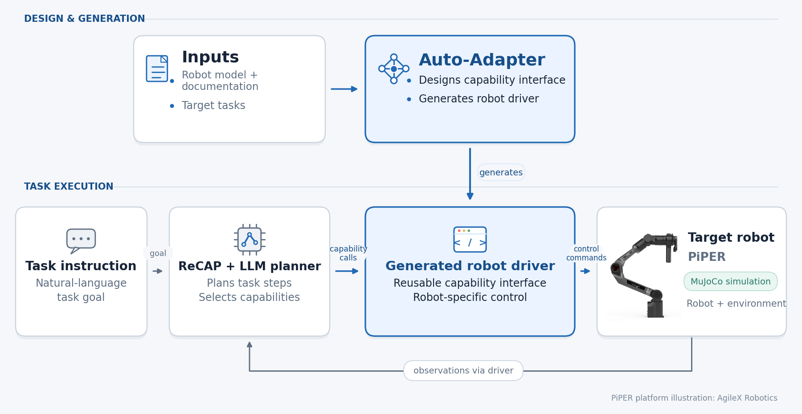

# Auto Adapter generation stages and ReCAP tasks

Both `SelfAssemble` and `FromScratchOrchestrator` now use:

```text
Study → Design (generate or load) → Generate ↔ Validate → Export → optional Demo
```

The standard and from-scratch generation implementations remain separate.
The selected task-grounded design is passed to
generation, validation, export and task execution. A final validation failure
blocks export. Export writes `mcp_server.py`; standard drivers retain
`driver.py:build()`, and scratch drivers retain
`driver_from_scratch.py:Robot.build_from_mjcf(mjcf_path)`.

Both config classes accept `enable_demo=False` and `demo_config_path=None`.
Set `enable_demo=True` for automatic local task execution after export. An
inclusive `stop_after` still stops the pipeline, including before a configured
demo. Disabled or deliberately skipped stages do not fail the run. A demo
failure does not change generation/validation results or trigger repair.

## Task execution through MCP

[](../docs/images/auto_adapter_control_chain.png)

*Capability calls and observations pass through the exported MCP server. Piper
is shown as an example robot. Click the diagram to view it at full resolution.*

## One task entry point

`auto_adapter.agent.task_execution.run_task` receives an existing MCP export and driver,
its current capability design, validation cases and report, and an explicit
task, scene, initial state and public parameters. It never studies, generates,
repairs or selects another driver. It starts the copied `mcp_server.py` with
the official SDK's stdio client. ReCAP discovers the available request schemas
through `list_tools()` and executes through `call_tool()`. The server's
`ExportRuntime` builds the generated driver once: standard exports use
`driver.build()`; scratch exports use `Robot.build_from_mjcf()`. The client
reads `robot://state` before planning and after calls.

Each task creates a fresh output directory and a new MuJoCo world. Within one
task all calls share the same driver/model/data. Input copies and the scene
link live in the task directory; the generation workspace's `mjcf.xml` is
unchanged. Use a new `output_dir` for each invocation.

The unified `agent/recap.py` contains the controller adapter, model and capability
bridges, and task CLI. `task_execution.py` owns the SDK client and shared MuJoCo
recorder/JSON helpers. `export_runtime.py` uses those helpers inside the server
to record the controlled world. This path does not import `task_planner.py`.

After installing the package from the repository root, the task CLI uses the same runner:

```sh
python -m auto_adapter.agent.recap \
  --workspace /absolute/generated/piper --robot-id piper \
  --provider bedrock --model us.anthropic.claude-sonnet-4-6 --region us-east-1
```

Add `--from-scratch` for `driver_from_scratch.py`. The wrapper loads the saved
design and cases under `design/`; missing inputs fail without a catalog fallback.
It uses the sibling `mcp_server.py`, or an explicitly supplied export path.
Automatic demos call `run_configured_demo`, which dispatches an isolated task
process and returns its report to the orchestrator.

For a manually chosen independent task, write a JSON object containing the
`run_task` keyword inputs and pass `--input-json /absolute/task-inputs.json`:

| Input | Value |
| --- | --- |
| `driver_path`, `from_scratch`, `robot_id` | Existing driver and construction route |
| `export_server_path` | Existing MCP server; defaults to the sibling `mcp_server.py` |
| `capability_design` | Current public design object |
| `validation_suite`, `validation_report` | Corresponding case and result objects |
| `task_description`, `parameters` | Natural-language task and public goal parameters |
| `scene_path`, `initial_state` | Explicit scene and AutoAdapter reset-state object |
| `required_capabilities` | Optional explicit exported-tool requirements for standalone callers; fixed DEMO configurations do not set these |
| `model`, `provider`, `region`, `max_tokens` | Public model transport: `bedrock` (default) or `deepseek`; use a model ID accepted by the selected provider |
| `output_dir` | New task directory |

No task library or formal experiment runner is introduced here.

Fixed tasks, public parameters and initial states are in `demo_tasks.yaml`.
The 22 configuration IDs cover 17 robot families plus existing model/scene
variants. See [configuration and scene locations](../docs/DEMO_CONFIGURATION.md).

## Controller and outputs

`agent/recap.py` adapts the **official ReCAP controller** vendored at
`agent/vendor/recap/chatbot.py`, revision
`2fb112ffad685c7c6f7de86d5487ecca6f566fcc` of
[ReCAP-Stanford/ReCAP](https://github.com/ReCAP-Stanford/ReCAP).
The complete source, MIT license, source URL and small integration patch are
kept together in that directory. The previous custom `submit_plan` loop is removed.

The model returns the official JSON format with a brief `think` summary and an
ordered list of string `subtasks`. Abstract strings become task-tree nodes.
Primitive strings encode a capability name and native request as JSON. The
upstream generator expands the first subtask, yields executable actions, returns
to parent nodes and builds prompts containing the parent's previous summary and
remaining tasks. AutoAdapter validates and executes each yielded native request, then
sends back the actual operation status and public observations.

The official downward singleton rule is retained: one subtask denotes a
primitive action; an abstract decomposition needs at least two subtasks. After
a leaf returns, the parent revises its remaining plan. An empty abstract-node
plan returns to its parent. Root termination ends the controller only; AutoAdapter
rejects a diagnostic with no executed action or a final failed action.

All nodes share 16 model calls, 12 capability calls and a maximum depth of 6
(root depth is zero; primitive nodes count). Budget exhaustion and errors are
explicit results. Model history uses the upstream message-window policy, with
a default threshold of 32 messages. AutoAdapter replaces the cooking few-shot setup and
wording with robot task/schema instructions, and avoids claiming an attempted
action succeeded before its status is inspected. These adaptations do not
replace the official tree traversal or parent-context construction.

The task bridge reuses AutoAdapter's model client; it does not call `ReactLoop.run()`.
Generation and export retain their existing ReAct loops. Ordinary method errors
return as observations for replanning; world corruption stops task execution.

The task directory contains `task_report.json`, `trace.jsonl`,
`model_turns.jsonl`, copied inputs, `recap/tree.json`, `recap/history.json`, and
`video.mp4` when recording is available. The official timestamped tree/history
files are retained too. Tree JSON uses upstream's nested `task_name`, `children`,
`info_list` and `obs_list` structure, including primitive nodes. The report names
the official controller and its source revision. `execution_ok` records completion
of the execution and recording chain. With a `success_spec`, the independent
physical evaluator sets `physical_task_success`, and `ok` also requires that result
to be true. Without a success predicate, `physical_task_success` remains `null`.

## Fixed demos and scope

`demo_tasks.yaml` supplies the fixed task, scene, initial state and physical
success predicate. Scene paths resolve from the repository root. The selected
generated driver still needs a matching, validated capability design; a fixed
task configuration does not establish that the driver can complete it.

See [DEMO configuration](../docs/DEMO_CONFIGURATION.md) for the current scene
mapping and [robot inputs](../docs/ROBOTS.md) for generation routes and public
task-library bindings. Local diagnostic runs and their videos are generated
outputs; they are not distributed with the source release.
