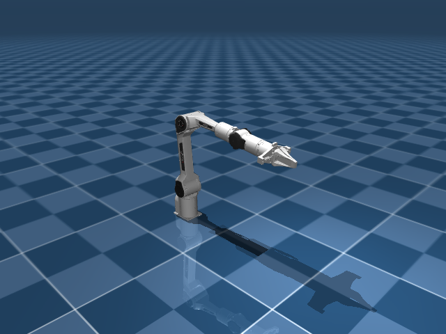

# 本次 Piper DESIGN：第 1 次调用的易读记录

**结果：DESIGN 未完成。** 这次真实模型调用用完 6 个回合，写出了能力草稿；没有生成场景 YAML，没有调用 probe_case，没有进入 driver generation 或物理验证。下列 cap 和阈值均是这次的草稿，不是已验收的最终设计。

本记录整理实际 messages、工具输入及返回。没有用以前运行的 cap 替换本次内容。

## 先看整体过程

读取 study 和任务库 → 检查真实 Piper → 查询未命名几何体 → 修正查询错误 → 写 cap 草稿 → 回合预算耗尽

| 回合 | 模型在做什么 | 工具 | 实际得到什么 |
|---|---|---|---|
| 1 | 读取任务与机器人分析 | read_file × 2 | 读取本次真实 study 和 Piper 的 20 条公开任务。 |
| 2 | 读取控制库说明，加载实际模型 | read_file + local_exec | 确认 ee_site、关节、执行器和 home；末端初始位置约 [0.49895, 0.001414, 0.36525] m。 |
| 3 | 检查关节范围与几何体名字 | local_exec | 确认关节范围；发现除了 floor，机器人几何体没有名字，影响接触测量绑定。 |
| 4 | 尝试查询几何体归属 | local_exec | 查询脚本的 MuJoCo 索引用法报错，退出码非零，没有得到期望结果。 |
| 5 | 修正查询，得到几何体归属 | local_exec | 取得 geom 0–88 对应的 body；确认 home qpos 和 nq=8。 |
| 6 | 写入 capability 草稿 | write_file | 写出 5 个 cap、6 条 criteria；尚未写 scene_cases.yaml。随后用完 6 回合预算。 |

资源使用：`{"in": 229747, "out": 10525, "cache_read": 0}`；阶段耗时约 103.1 秒。这里的 token 数包含多轮重复输入历史，不能当作独立材料字数。

## 模型实际收到的输入

- [完整 system prompt](system-prompt.txt)：能力设计、YAML 格式和测量函数说明。
- [初始 user message](initial-user-message.txt)：机器人 ID 与输入文件路径。
- [study.json](study.json)：本次真实 STUDY 的结果。
- [Piper 公开任务库](task-catalog.json)：20 条任务。
- [skeleton 说明](skeleton_context.json)：可使用的底层控制库。
- [四个工具的完整定义](tools.json)：read_file、write_file、local_exec、probe_case。
- 实际 MJCF：`AA1/assets/mjcf/piper/scene.xml`。文件内容没有预先全部复制进 user message；模型通过工具读取／加载。

## 这次写出的 5 个 cap 草稿

| cap／方法名 | 请求参数 | 草稿通过标准 |
|---|---|---|
| `ee_position` | target_xyz；可选 duration_s | 末端终点位置误差 ≤ 0.05 m |
| `ee_ordered_waypoints` | waypoints_xyz（2–4 个点）；可选 duration_s | 按顺序经过各点的最大匹配误差 ≤ 0.05 m |
| `gripper_aperture` | aperture_m；可选 duration_s | joint7 位置误差 ≤ 0.003 m |
| `wrist_roll` | angle_rad；可选 duration_s | joint6 角度误差 ≤ 0.05 rad |
| `ee_contact_push` | contact_xyz、push_xyz；可选 duration_s | 末端终点误差 ≤ 0.05 m；0.5–4.0 s 时间窗内接触法向力峰值 ≥ 0.1 N |

**阈值依据：** 草稿将位置的 0.05 m 容差关联到公开任务评分；路径、夹爪、腕部和接触阈值包含提议值。这些标准尚未经过本次独立 reference 校准。

**草稿还存在的具体问题：** 接触 cap 的效果写了“持续接触”，但使用峰值力只能证明时间窗里曾有接触，不能证明持续接触；夹爪描述提到 joint8 镜像，却还没有单独的镜像误差 criterion。场景和 measurement bindings 尚未写出，因此这些标准还不能直接交给 validation。

完整字段、request schema 和 criteria 原文见 [能力草稿 JSON](capability_design.draft.json)。

## 任务怎样关联到 cap

下表是模型声明的 task_support，不是已执行任务的成功结果。

| 公开任务 ID | 草稿关联的 cap |
|---|---|
| `mw_reach_target` | `ee_position` |
| `mw_push_to_goal` | `ee_ordered_waypoints`, `ee_contact_push` |
| `mw_pick_place` | `ee_ordered_waypoints`, `gripper_aperture`, `wrist_roll` |
| `mw_pick_place_wall` | `ee_ordered_waypoints`, `gripper_aperture`, `wrist_roll` |
| `mw_push_wall` | `ee_ordered_waypoints`, `ee_contact_push` |
| `mw_sweep_into_goal` | `ee_ordered_waypoints`, `ee_contact_push` |
| `mw_drawer_open` | `ee_ordered_waypoints`, `ee_contact_push` |
| `mw_drawer_close` | `ee_ordered_waypoints`, `ee_contact_push` |
| `mw_button_press` | `ee_ordered_waypoints`, `ee_contact_push` |
| `mw_button_press_topdown` | `ee_ordered_waypoints`, `ee_contact_push` |
| `mw_handle_press` | `ee_ordered_waypoints`, `ee_contact_push` |
| `mw_handle_pull` | `ee_ordered_waypoints`, `ee_contact_push` |
| `mw_door_open` | `ee_ordered_waypoints`, `ee_contact_push` |
| `mw_door_close` | `ee_ordered_waypoints`, `ee_contact_push` |
| `mw_faucet_open` | `ee_ordered_waypoints`, `ee_contact_push` |
| `mw_dial_turn` | `ee_ordered_waypoints`, `ee_contact_push` |
| `mw_lever_pull` | `ee_ordered_waypoints`, `ee_contact_push` |
| `mw_peg_insertion_side` | `ee_ordered_waypoints`, `gripper_aperture`, `wrist_roll` |
| `mw_bin_picking` | `ee_ordered_waypoints`, `gripper_aperture`, `wrist_roll` |
| `mw_pick_out_of_hole` | `ee_ordered_waypoints`, `gripper_aperture`, `wrist_roll` |

## 场景图片与场景产物

下面是本次真实加载的 Piper 基础模型，处于 home 初态。此次 DESIGN 没有写出场景 YAML，因此目前没有由这份草稿生成的测试物体或 cap 场景。

| 产物 | 本次是否产生 |
|---|---|
| cap／criteria 草稿 | 是 |
| scene_cases.yaml | 否 |
| 由 DESIGN 装配的 scene.xml | 否 |
| probe_case 返回 | 否 |
| driver／validation／reference 结果 | 否 |

## 每轮原始细节

以下逐轮文件保留完整 system、截至该轮的 messages、模型返回以及工具结果；可与上面的概述逐项对照。

- [第 1 轮完整记录](turn-01.json)：读取任务与机器人分析。
- [第 2 轮完整记录](turn-02.json)：读取控制库说明，加载实际模型。
- [第 3 轮完整记录](turn-03.json)：检查关节范围与几何体名字。
- [第 4 轮完整记录](turn-04.json)：尝试查询几何体归属。
- [第 5 轮完整记录](turn-05.json)：修正查询，得到几何体归属。
- [第 6 轮完整记录](turn-06.json)：写入 capability 草稿。

- [完整连续 messages JSONL](trace.messages.jsonl)
- [框架的阶段结果](capability_preparation.json)

接下来修正：提示模型在首次响应批量读取输入、限制重复探索、最迟第 3 个响应写出两份草稿；保留六回合上限。另为原模型的未命名几何体提供可追溯到原索引的场景内名称，以支持接触测量。原始失败记录保留。
