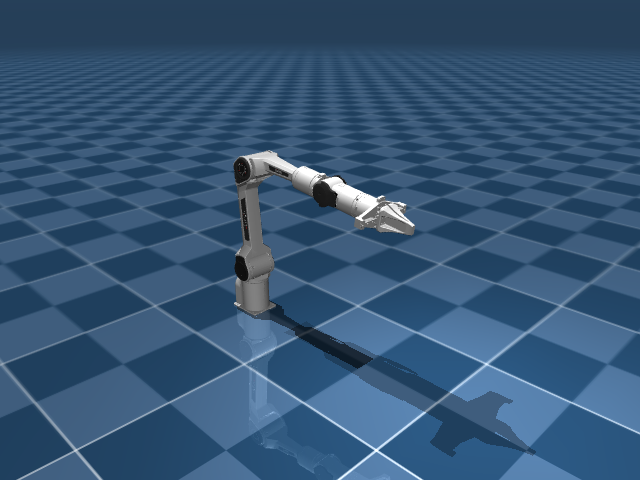
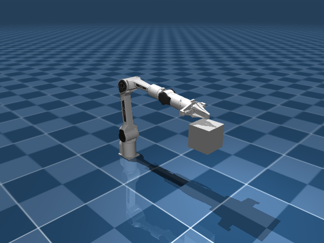

# AA1 Piper DESIGN 真实运行记录（attempt-02）

这份目录保存一次真实 Piper DESIGN 调用的原始记录、规范化输出和场景图。调用使用
30 个响应的预算，在第 18 个响应（iter 17）正常结束。目录中的
capability_design.json、criteria.json、scene_cases.yaml 和 probe_report.json
是本次调用产生并被框架接受的 canonical 输出；canonical 只表示输出边界已完成，
不表示阈值已经校准，也不表示任务或能力已经通过正式验证。

本记录只描述 DESIGN 阶段。没有把候选 driver、reference、视频或后续 validation
结果复制进来。

## 运行事实

| 项目 | 实际值 |
|---|---|
| robot_configuration_id | piper |
| 响应预算 | 30 |
| 实际响应数 | 18（iter 0–17） |
| 生成的能力 | 5 |
| criteria | 6 |
| scene cases | 6 |
| 场景 | 2 |
| task_support | 20 个不同公开 task、37 条声明关联；只是设计声明，不是 task success |
| token usage | input 1,078,794；output 21,861；cache_read 0 |
| 阶段耗时 | 234.708 秒 |
| preparation error | null |

6 个 case 都返回了 probe report 的 ok=true、probe_only=true、
compiled=true、reloaded=true、bindings_resolved=true、steps=25、errors=[]。
这里的 probe 只做场景编译、模型重新加载、绑定解析和很短的 MuJoCo 步进；
它不能推出目标可达、reference pass、数值 criterion 通过、连续接触成立或校准
完成。

## 按响应查看过程

| iter | 模型实际动作 |
|---:|---|
| 0 | 并行 read_file 读取 study、Piper task catalog 和 skeleton context。 |
| 1–3 | 用 local_exec 检查真实 MJCF 的 keyframe、ee_site、joint、actuator、body、home 状态、未命名 geom、joint8 与 joint7 的 equality constraint。 |
| 4 | 写入 5 个 capability 的 draft/capability_design.json。 |
| 5–8 | 继续用 local_exec 检查 home/floor/base 几何、若干手工关节构型的末端位置和全部 geom 名称。 |
| 9 | 第一次写 scene_cases.yaml 被 runtime 拒绝，错误为 cases[0].request.target_position schema 含 unsupported fields ['description']。 |
| 10–11 | 重新读取 capability 草稿，移除 request schema 中触发该错误的描述字段并重新写入。 |
| 12 | scene_cases.yaml 通过当前 runtime 的结构与覆盖检查。 |
| 13–16 | 对 6 个 case 调用 probe_case；其中 iter 15 和 iter 16 各批量调用两个 case。 |
| 17 | 模型以 end_turn 结束，留下两份 draft，框架重新加载最终草稿并对全部 case 重跑 probe。 |

每条原始 request、response 和 tool result 都保存在
[完整原始 messages 记录](fulltrace.messages.jsonl)。[紧凑时间线](compacttrace.jsonl)
是从相同原始记录提取的可读索引，保留实际工具名称、输入摘要、返回状态和错误；
它没有添加模型或工具消息，长内容以截断标记代替，完整内容以原始记录为准。

## 5 个 capability 与 6 条 criterion

| capability | criterion | case |
|---|---|---|
| move_to_position | ee_position_error：ee_site 到 target_position 的终点误差 ≤ 0.05 m | case_move_to_position |
| set_gripper_aperture | gripper_joint_error：joint7 到 target_opening 的终点误差 ≤ 0.003 m | case_set_gripper_aperture |
| set_wrist_roll | wrist_roll_error：joint6 到 target_angle 的终点误差 ≤ 0.05 rad | case_set_wrist_roll |
| traverse_waypoints | ordered_waypoints_error：有序轨迹匹配误差 ≤ 0.05 m（各目标按顺序匹配到实际样本，取匹配误差的最大值） | case_traverse_waypoints |
| apply_contact_displacement | tool_target_position_error：ee_site 到 tool_target_position 的终点误差 ≤ 0.05 m；contact_force_generated：窗口内峰值法向力 ≥ 0.5 N | case_apply_contact_displacement_pos；case_apply_contact_displacement_force |

完整字段和原始 source_refs 见
[capability_design.json](capability_design.json) 与 [criteria.json](criteria.json)。

### source-adapted 与 proposed

公开 Meta-World source_refs 被保留在输出中，但它们是 source-adapted 设计依据，
不是本次 Piper study 的测量结果。move_to_position 的 rationale 把
Meta-World 来源文字写成了 “actual_study”；该标签不准确，本 README 明确将它
视为公开来源适配。traverse_waypoints 和 apply_contact_displacement 的部分
阈值也引用公开 task scoring，仍然不能当作 Piper 校准。

下列阈值在输出中标为 proposed：3 mm gripper 误差、0.05 rad wrist-roll 误差、
waypoint 和 contact target 的 0.05 m 位置误差，以及 0.5 N 峰值接触力。它们是
设计提议，不是 study 观察值。

## 场景和物理边界

场景定义的完整内容见 [scene_cases.yaml](scene_cases.yaml)：

- scene_empty 没有附加物体，用于 move、gripper、wrist 和 waypoint cases。
- scene_contact_box 只有一个名为 contact_target 的 fixed box，size_m 为
  [0.05, 0.05, 0.05]，中心位置为 [0.5, 0.0, 0.28]，用于产生接触。
  接触 criterion 绑定准备场景中的 runtime alias aa1_robot_geom_84。
- contact_target 是固定接触面。这个场景没有 free object，也没有 object
  displacement、抓取或放置的 criterion；不能据此声称完成了 pick 或物体移动。

两张图来自场景初始状态在 settle 0.5 s 后的渲染，未执行候选动作。渲染元数据在
[render-record.json](render-record.json)。

scene_empty：空场景中的 Piper 初始姿态。

scene_contact_box：固定接触盒的初始姿态；图中不表示已完成接触或位移。

## 设计审阅边界

本次输出有几个必须保留的审阅结论：

1. set_gripper_aperture 的 invariants 声称 joint8 = -joint7，但只有 joint7
   的 joint_position_error measurement；镜像关系没有单独的 executable criterion。
2. apply_contact_displacement 的 prose/invariant 声称先到 contact_position、
   再到 tool_target_position，但当前 criterion 只有终点位置和窗口内峰值力；
   没有测量 contact_position 的有序到达。峰值力最多说明窗口内出现过一个力样本，
   不能证明整个窗口持续接触。
3. source study、公开 Meta-World scoring 和 proposed tolerance 在设计中用途不同；
   不能把公开来源或 proposed 数值重新解释成 study 观察或校准结果。
4. traverse_waypoints 的 metric 文本提到终点误差，但绑定的 ordered_site_targets_error
   实际检查有序经过各目标；它没有另行要求最终样本停留在最后一个目标。
5. probe report 中的 ok=true 只对应 probe-only 的编译、重载、绑定和短步进边界；
   不对应 reachability、reference pass、真实任务成功或连续物理效果。

## 目录文件

### 输入与调用 ABI

- [system-prompt.txt](system-prompt.txt)：本次调用首个 request 中的完整 system prompt。
- [initial-user-message.txt](initial-user-message.txt)：本次调用的首个 user message。
- [tools.json](tools.json)：本次调用收到的四个工具定义。
- [study.json](study.json)：实际 study 输入。
- [task-catalog.json](task-catalog.json)：实际 Piper public task catalog。
- [skeleton_context.json](skeleton_context.json)：本次提供的低层 skeleton 说明。

### DESIGN 输出

- [capability_design.json](capability_design.json)：canonical capability design。
- [criteria.json](criteria.json)：展开 criterion_index 后的 canonical criteria。
- [scene_cases.yaml](scene_cases.yaml)：canonical scene/case suite。
- [probe_report.json](probe_report.json)：6 个 probe-only runtime report。
- [capability_preparation.json](capability_preparation.json)：token、耗时、trace、
  scene 路径和 probe 路径元数据。

### 原始记录与图像

- [fulltrace.messages.jsonl](fulltrace.messages.jsonl)：完整原始 framework messages，
  未删改。
- [compacttrace.jsonl](compacttrace.jsonl)：从完整原始记录提取的可读时间线。
- [scene_empty.png](scene_empty.png)：scene_empty 初始渲染。
- [scene_contact_box.png](scene_contact_box.png)：scene_contact_box 初始渲染。
- [render-record.json](render-record.json)：两张图的实际渲染输入和模型尺寸记录。
